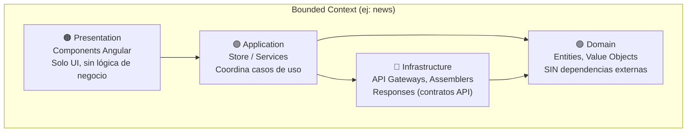

# 📘 Guía Completa de Desarrollo — CatchUp

## Aplicación de noticias con Angular, Material Design y Domain-Driven Design (DDD)

---

> [!IMPORTANT]
> Esta guía sigue un flujo de desarrollo **progresivo** usando **DDD con enfoque Outside-In** (Presentación → Application → Infrastructure → Domain), **GitFlow** con ramas `feature/`, **Conventional Commits**, y buenas prácticas de Angular. Cada paso explica QUÉ genera Angular CLI por defecto y POR QUÉ se modifica.
>
> **Convención de nombres:** todos los comandos `ng generate` de esta guía usan **kebab-case** en el argumento `<ruta>` (p. ej. `source-item`, no `SourceItem`), siguiendo la convención real usada en el [repositorio del proyecto](https://github.com/upc-pre-202620-1asi0729-7742/catch-up). Angular CLI convierte el nombre a kebab-case automáticamente para los **nombres de archivo**, pero para el **nombre de la clase TypeScript** siempre usa PascalCase (`source-item.ts` → `export class SourceItem`), así que pasar el argumento ya en kebab-case evita ambigüedad y es más explícito sobre el archivo final.

---

## Tabla de Contenidos

| Fase | Pasos | Descripción |
|:-----|:------|:------------|
| **Fase 0** | 1–4 | Configuración del proyecto, repositorio y dependencias |
| **Fase 1** | 5–8 | Shared Bounded Context — Domain (Value Objects) |
| **Fase 2** | 9 | Shared Bounded Context — Infrastructure (LogoDevApi) |
| **Fase 3** | 10–11 | News Bounded Context — Domain (Entities) |
| **Fase 4** | 12–15 | News Bounded Context — Infrastructure (Responses, Assemblers, API Gateway) |
| **Fase 5** | 16 | News Bounded Context — Application (Store) |
| **Fase 6** | 17–21 | Presentation (Components de ambos Bounded Contexts) |
| **Fase 7** | 22–23 | Documentación, Licencia y Cierre |

---

## Convenciones de la Guía

| Icono | Significado |
|:------|:------------|
| 💻 | Ejecutar comando en terminal |
| 📁 | Archivo o directorio creado |
| ✏️ | Editar / Reemplazar contenido |
| 🔀 | Realizar commit |
| 🌿 | Operación de rama (branch) |
| 💡 | Explicación de por qué se hace así |
| ⚙️ | Lo que Angular CLI genera por defecto |
| ⚠️ | Advertencia o buena práctica importante |

---

## Prerrequisitos

| Herramienta | Versión | Verificación |
|:-----------|:--------|:-------------|
| Node.js | `^22.22.3` o `^24.15.0` o `^26.0.0` | `node --version` |
| npm | 10.x+ | `npm --version` |
| Angular CLI | 22.x | `ng version` |
| Git | 2.x+ | `git --version` |
| Git Flow AVH | Disponible como `git flow` (incluido en Git for Windows) | `git flow version` |
| IDE | WebStorm / VS Code | — |

💻 Instalar Angular CLI si no lo tienes:
```bash
npm install -g @angular/cli
```

---

## Sobre el Enfoque DDD en Frontend

En DDD aplicado a frontend Angular, organizamos el código en **Bounded Contexts** (contextos delimitados), cada uno con sus capas:



**Regla de dependencias:** `Presentation → Application → Domain ← Infrastructure`

---

## Sobre GitFlow

Usaremos **GitFlow** con las siguientes ramas:

| Rama | Propósito |
|:-----|:----------|
| `main` | Código de producción |
| `develop` | Rama de integración |
| `feature/<nombre>` | Desarrollo de funcionalidades |
| `docs/doc-as-code` | Documentación como código |

---

# FASE 0 — Configuración del Proyecto

## Paso 1: Crear el Proyecto Angular

💻 Abre tu terminal, navega a tu directorio de trabajo y ejecuta:

```bash
npx --yes --package @angular/cli@22 ng new catch-up --defaults --test-runner=karma
```

💡 **¿Qué hace este comando?**
- `npx --yes --package @angular/cli@22` → usa Angular CLI 22 sin instalarlo globalmente
- `ng new catch-up` → crea un proyecto llamado `catch-up`
- `--defaults` → acepta las opciones por defecto sin preguntas interactivas
- `--test-runner=karma` → selecciona Karma y Jasmine, igual que en el proyecto final (Angular CLI 22 usa Vitest por defecto)

> [!NOTE]
> Desde Angular 17, los **standalone components** (sin NgModules) son el comportamiento por defecto de `ng new`, por lo que ya **no hace falta** pasar `--standalone=true` explícitamente. Si usas una versión de Angular CLI anterior a la 17, sí necesitarás agregarlo.

⚙️ **Angular CLI genera por defecto:**
```
catch-up/
├── src/
│   ├── app/
│   │   ├── app.ts               ← Componente raíz (antes se llamaba app.component.ts)
│   │   ├── app.html             ← Template del componente raíz
│   │   ├── app.css              ← Estilos del componente raíz
│   │   ├── app.config.ts        ← Configuración de providers
│   │   ├── app.routes.ts        ← Definición de rutas
│   │   └── app.spec.ts          ← Test del componente raíz
│   ├── index.html
│   ├── main.ts                  ← Punto de entrada (bootstrap)
│   └── styles.css               ← Estilos globales
├── angular.json
├── package.json
├── tsconfig.json
└── .gitignore
```

💻 Entra al directorio:
```bash
cd catch-up
```

---

## Paso 2: Configuración Inicial del Repositorio con GitFlow

💻 Inicializa GitFlow:
```bash
git flow init
```

> Acepta los valores por defecto. Esto crea la rama `develop` a partir de `main`.

💻 Verifica que `.gitignore` incluya los directorios del IDE:
```bash
# Si usas WebStorm y .idea/ fue commiteado, elimínalo del tracking:
git rm -r --cached .idea
```

🔀 **Commit en `develop`:**
```bash
git add .
git commit -m "chore: initial project setup with angular cli."
```

---

## Paso 3: Instalar Angular Material

> [!IMPORTANT]
> Según la [documentación oficial de Angular Material](https://material.angular.dev/guide/getting-started), la forma correcta de instalar es usando `ng add`, que ejecuta schematics que configuran automáticamente el tema, las fuentes y los estilos.

🌿 Crea una rama feature:
```bash
git flow feature start add-angular-material
```

💻 Ejecuta el schematic:
```bash
ng add @angular/material
```

⚙️ **¿Qué hace `ng add @angular/material` automáticamente?**
1. Instala los paquetes `@angular/material` y `@angular/cdk` en `package.json`
2. Crea `src/custom-theme.scss` con la configuración del tema Material 3
3. Agrega las fuentes Roboto y Material Icons en `src/index.html`
4. Agrega `src/custom-theme.scss` a la sección `styles` de `angular.json`
5. Actualiza `src/styles.css` con estilos base

💡 **¿Por qué `ng add` y no `npm install`?**
`ng add` ejecuta schematics (scripts de configuración) que automatizan la integración. `npm install` solo descarga los paquetes sin configurar nada.

✏️ Verifica que `src/custom-theme.scss` tenga esta configuración (Angular Material la genera):

```scss
// Este archivo fue generado por ng add @angular/material
// Configura el tema Material 3 usando el sistema de design tokens
@use '@angular/material' as mat;

html {
  // mat.theme() genera CSS variables (--mat-sys-*) que todos los componentes
  // Material usan para colores, tipografía y densidad
  @include mat.theme((
    color: (
      primary: mat.$azure-palette,    // Paleta azul para elementos principales
      tertiary: mat.$blue-palette,    // Paleta azul secundaria para acentos
    ),
    typography: Roboto,               // Fuente Roboto para toda la app
    density: 0,                       // Densidad estándar (0 = normal)
  ));
}

body {
  // light = tema claro. Cambiar a 'dark' para modo oscuro
  // o 'light dark' para seguir la preferencia del sistema
  color-scheme: light;

  // Usa las CSS variables del sistema Material para colores base
  background-color: var(--mat-sys-surface);
  color: var(--mat-sys-on-surface);
  font: var(--mat-sys-body-medium);

  margin: 0;
}
```

✏️ Verifica que `src/index.html` incluya las fuentes de Google (Angular Material las agrega):

```html
<!doctype html>
<html lang="en">
<head>
  <meta charset="utf-8">
  <title>CatchUp</title>
  <base href="/">
  <meta name="viewport" content="width=device-width, initial-scale=1">
  <link rel="icon" type="image/x-icon" href="favicon.ico">
  <!-- Fuente Roboto: requerida por Angular Material para tipografía -->
  <link href="https://fonts.googleapis.com/css2?family=Roboto:wght@300;400;500&display=swap" rel="stylesheet">
  <!-- Material Icons: iconos usados por mat-icon -->
  <link href="https://fonts.googleapis.com/icon?family=Material+Icons" rel="stylesheet">
</head>
<body>
  <app-root></app-root>
</body>
</html>
```

🔀 **Commit y cierre de feature:**
```bash
git add .
git commit -m "chore: add angular material dependency."
git flow feature finish add-angular-material
```

---

## Paso 4: Obtener API Keys y Configurar Entorno

🌿 Crea una rama feature:
```bash
git flow feature start configure-environments
```
> 💡 Alternativa: si prefieres un nombre de rama más genérico, puedes usar `git flow feature start project-configuration`. Elige un solo nombre y úsalo de forma consistente en tu commit y en el cierre de la rama (ver más abajo).

### 4.1 Obtener API Key de NewsAPI.org

> [!NOTE]
> Según la [documentación de NewsAPI.org](https://newsapi.org/), la API expone dos endpoints principales:
> - `GET /v2/sources` → Lista de fuentes de noticias disponibles (parámetro requerido: `apiKey`)
> - `GET /v2/top-headlines` → Artículos de una fuente específica (parámetros: `apiKey`, `sources`)

1. Ve a [https://newsapi.org/](https://newsapi.org/)
2. Clic en **"Get API Key"** → regístrate
3. Copia tu API Key

### 4.2 Obtener Publishable Key de Logo.dev

> [!NOTE]
> Según la [documentación de Logo.dev](https://logo.dev/), el endpoint para logos es:
> `https://img.logo.dev/{dominio}?token=TU_PUBLISHABLE_KEY`
> Las publishable keys (`pk_`) son seguras para uso en el frontend.

1. Ve a [https://logo.dev/](https://logo.dev/)
2. Regístrate y accede al dashboard
3. Copia tu publishable key (empieza con `pk_`)

### 4.3 Generar archivos de entorno

💻 Genera los archivos de entorno con Angular CLI:
```bash
ng g environments
```

⚙️ **¿Qué genera `ng g environments`?**
- Crea `src/environments/environment.ts` (producción)
- Crea `src/environments/environment.development.ts` (desarrollo)
- Configura `angular.json` con `fileReplacements` para que en modo development se use el archivo `.development.ts`

💡 **¿Por qué archivos de entorno separados?** Permiten tener configuraciones diferentes para desarrollo y producción. Angular automáticamente reemplaza el archivo según el modo de build.

✏️ Reemplaza `src/environments/environment.development.ts`:

```typescript
/**
 * Development environment configuration.
 *
 * Estas variables configuran los endpoints y credenciales de las APIs externas.
 * En desarrollo, Angular usa este archivo gracias al fileReplacement en angular.json.
 */
export const environment = {
  production: false,
  // NewsAPI.org - Base URL del proveedor de noticias (ver: https://newsapi.org/docs)
  newsProviderApiBaseUrl: 'https://newsapi.org/v2',
  // Endpoint para obtener artículos principales de una fuente
  newsProviderNewsEndpointPath: '/top-headlines',
  // Endpoint para obtener la lista de fuentes disponibles
  newsProviderSourcesEndpointPath: '/sources',
  // Tu API Key de NewsAPI.org (reemplazar con la tuya)
  newsProviderApiKey: 'TU_API_KEY_AQUI',
  // Logo.dev - Base URL para obtener logos de fuentes (ver: https://logo.dev/)
  logoProviderApiBaseUrl: 'https://img.logo.dev/',
  // Tu Publishable Key de Logo.dev (reemplazar con la tuya)
  logoProviderPublishableKey: 'TU_PUBLISHABLE_KEY_AQUI'
};
```

✏️ Reemplaza `src/environments/environment.ts` con los mismos valores pero `production: true`.

⚠️ **Buena práctica de seguridad — no commitees claves reales.** Los archivos de entorno se incorporan al bundle del navegador durante el build. Por tanto, una clave de NewsAPI puesta en Angular queda visible para quien descargue la aplicación, aunque no se commitee el archivo fuente. No uses una clave privada en el frontend publicado; para producción, coloca NewsAPI detrás de un backend propio. La clave `pk_` de Logo.dev es publicable. Además, cualquier secreto ya commiteado debe revocarse/rotarse, no solo borrarse del archivo. Antes de hacer el commit de este paso:
- Mantén `TU_API_KEY_AQUI` / `TU_PUBLISHABLE_KEY_AQUI` (u otro valor de relleno) en los archivos que vayas a commitear, y guarda tus claves reales solo en tu copia local sin commitear ese cambio, **o**
- Agrega ambos archivos de entorno a `.gitignore` y provee un `environment.ts.example` como plantilla para el equipo, **o**
- Si el proyecto es exclusivamente educativo y las claves son gratuitas/de prueba (como en este caso con NewsAPI.org y Logo.dev), puedes optar conscientemente por commitearlas, pero es una decisión que debe tomarse explícitamente, no por omisión.

### 4.4 Configurar Internacionalización (i18n)

💻 Instala ngx-translate:
```bash
npm i @ngx-translate/core @ngx-translate/http-loader
```

💡 **¿Por qué ngx-translate?** Permite cambiar el idioma de la aplicación en runtime sin recargar la página. Angular tiene i18n nativo, pero requiere builds separados por idioma. ngx-translate es más flexible para apps SPA.

📁 Crea `public/i18n/en.json`:

```json
{
  "app": {
    "title": "CatchUp News"
  },
  "sources": {
    "title": "News Sources"
  },
  "articles": {
    "title": "Top Headlines"
  },
  "article": {
    "read-more": "Read more",
    "published-at": "Published on",
    "about-source": "About {{sourceName}}",
    "by-author": "By {{authorName}}"
  },
  "source": {
    "close": "Close",
    "visit-website": "Visit Website"
  }
}
```

📁 Crea `public/i18n/es.json`:

```json
{
  "app": {
    "title": "CatchUp News"
  },
  "sources": {
    "title": "Fuentes de Noticias"
  },
  "articles": {
    "title": "Titulares Principales"
  },
  "article": {
    "read-more": "Leer más",
    "published-at": "Publicado el",
    "about-source": "Acerca de {{sourceName}}",
    "by-author": "Por {{authorName}}"
  },
  "source": {
    "close": "Cerrar",
    "visit-website": "Visitar Sitio Web"
  }
}
```

✏️ Reemplaza `src/app/app.config.ts`:

```typescript
import {ApplicationConfig, provideBrowserGlobalErrorListeners, provideZoneChangeDetection} from '@angular/core';
import {provideHttpClient, withXhr} from '@angular/common/http';
import {provideTranslateService} from '@ngx-translate/core';
import {provideTranslateHttpLoader} from '@ngx-translate/http-loader';

/**
 * Root-level Angular providers for HTTP, i18n and global runtime behavior.
 *
 * provideHttpClient(withXhr()) → Habilita HttpClient para hacer peticiones HTTP
 * provideTranslateService()    → Configura ngx-translate con carga de archivos JSON
 */
export const appConfig: ApplicationConfig = {
  providers: [
    provideBrowserGlobalErrorListeners(),
    provideZoneChangeDetection({eventCoalescing: true}),
    provideHttpClient(withXhr()),
    provideTranslateService({
      loader: provideTranslateHttpLoader({prefix: './i18n/', suffix: '.json'}),
      fallbackLang: 'en'
    })

  ]
};
```

💡 **¿Por qué `provideTranslateHttpLoader` y no factory function?** En ngx-translate v18+ esta es la forma simplificada y recomendada. Reemplaza la antigua configuración con `TranslateHttpLoader` + `useFactory`.

🔀 **Commit y cierre de feature:**
```bash
git add .
git commit -m "feat(i18n): configure environment variables and internationalization."
git flow feature finish configure-environments
```

---

# FASE 1 — Shared Bounded Context: Domain Layer

> [!IMPORTANT]
> **¿Por qué empezamos por Domain?** En DDD, la capa Domain es el **corazón** de la aplicación. Contiene Value Objects y Entities que son puros TypeScript SIN dependencias de Angular. Los creamos primero en Shared porque serán usados por múltiples Bounded Contexts.

🌿 Crea una rama feature:
```bash
git flow feature start shared-domain
```

## Paso 5: Crear Value Object `Url`

💻 Genera la clase con Angular CLI:
```bash
ng g cl shared/domain/model/url --skip-tests
```

⚙️ **¿Qué genera `ng g cl` (alias de `ng g class`)?**
```
CREATE src/app/shared/domain/model/url.ts         ← Clase vacía: export class Url { }
CREATE src/app/shared/domain/model/url.ts (sin archivo de prueba gracias a `--skip-tests`)
```

💡 **¿Por qué `ng g cl` y no crear el archivo manualmente?** Angular CLI crea el archivo con el nombre y la ruta indicados. Como usamos `--skip-tests`, no genera un archivo de prueba separado. Nota que aunque pasamos el argumento `url` en minúsculas, la clase generada dentro del archivo siempre se llama en PascalCase (`export class Url`), porque esa es la convención de TypeScript para nombres de clase — el kebab-case solo aplica al **nombre del archivo**.

✏️ Reemplaza `src/app/shared/domain/model/url.ts` con:

```typescript
/**
 * Value object representing a URL.
 *
 * En DDD, un Value Object es un objeto que se define por sus atributos,
 * no por su identidad. Dos Url con el mismo string son iguales.
 * Encapsula la validación para garantizar que solo URLs válidas
 * circulen por el dominio.
 */
export class Url {
  private readonly url: string;

  /**
   * Creates a new Url instance.
   *
   * @param value - The URL string.
   * @throws Error if the URL structure is invalid.
   */
  constructor(value: string) {
    // Permitimos cadena vacía como caso especial (campos opcionales)
    if (!value) {
      this.url = '';
      return;
    }
    if (!Url.isValid(value)) {
      throw new Error(`Invalid URL: ${value}`);
    }
    this.url = value;
  }

  /**
   * Checks if a string is a valid URL.
   * Usa el constructor nativo URL() del browser como validador.
   */
  public static isValid(value: string): boolean {
    try {
      new URL(value);
      return true;
    } catch (e) {
      return false;
    }
  }

  /** Returns the URL string. */
  toString(): string {
    return this.url;
  }
}
```

💡 **¿Por qué un Value Object Url y no un simple `string`?**
- **Validación centralizada**: si usamos `string`, cualquier texto inválido podría asignarse como URL
- **Semántica**: el tipo `Url` comunica la intención, un `string` no
- **DDD**: los Value Objects encapsulan reglas de negocio en el dominio

---

## Paso 6: Crear Value Object `DateTime`

💻 Genera la clase:
```bash
ng g cl shared/domain/model/date-time --skip-tests
```

⚙️ **Genera:** `src/app/shared/domain/model/date-time.ts` (clase vacía)

✏️ Reemplaza `src/app/shared/domain/model/date-time.ts`:

```typescript
/**
 * Value object representing a date and time.
 *
 * Encapsula un Date nativo para proporcionar una API consistente
 * y tipada en todo el dominio. Evita que se pasen strings crudos
 * de fecha por la aplicación.
 */
export class DateTime {
  private readonly date: Date;

  /**
   * Creates a new DateTime instance.
   * @param value - ISO-8601 string or Date object. Si no se pasa, usa la fecha actual.
   */
  constructor(value?: string | Date) {
    this.date = value ? new Date(value) : new Date();
  }

  /** Returns the ISO-8601 string representation. */
  toString(): string {
    return this.date.toISOString();
  }

  /** Returns the locale-specific date string. */
  toLocaleDateString(): string {
    return this.date.toLocaleDateString();
  }

  /** Returns the locale-specific time string. */
  toLocaleTimeString(): string {
    return this.date.toLocaleTimeString();
  }

  /** Returns the underlying Date object. */
  toDate(): Date {
    return this.date;
  }
}
```

🔀 **Commit y cierre de feature:**
```bash
git add .
git commit -m "feat(shared): add url and datetime value objects to shared domain."
git flow feature finish shared-domain
```

---

# FASE 2 — Shared Bounded Context: Infrastructure Layer

🌿 **Rama feature:**
```bash
git flow feature start shared-infrastructure
```

## Paso 7: Crear el servicio `LogoDevApi`

> [!NOTE]
> Según la [documentación de Logo.dev](https://logo.dev/), para obtener el logo de una empresa se usa:
> `https://img.logo.dev/{hostname}?token={publishable_key}`
> Por ejemplo: `https://img.logo.dev/bbc.co.uk?token=pk_xxx`

💻 Genera el servicio:
```bash
ng g s shared/infrastructure/logo-dev-api --skip-tests
```

⚙️ **¿Qué genera `ng g s` (alias de `ng g service`)?**
```
CREATE src/app/shared/infrastructure/logo-dev-api.ts       ← Servicio con @Injectable({providedIn: 'root'})
CREATE src/app/shared/infrastructure/logo-dev-api.ts (sin archivo de prueba gracias a `--skip-tests`)
```

💡 **¿Por qué `ng g s` y no `ng g cl`?** Porque este es un **servicio Angular** que necesita `@Injectable` para participar en la inyección de dependencias. `ng g s` lo genera con `@Injectable({providedIn: 'root'})` automáticamente.

⚙️ **Angular CLI genera por defecto:**
```typescript
import { Injectable } from '@angular/core';

@Injectable({
  providedIn: 'root'
})
export class LogoDevApi {
  constructor() { }
}
```

> [!NOTE]
> Desde Angular v20, el CLI **ya no agrega sufijos** (`Service`, `Component`, etc.) al nombre de la clase ni del archivo por defecto, salvo que se configure explícitamente. Por eso `ng g s shared/infrastructure/logo-dev-api --skip-tests` genera directamente `export class LogoDevApi` (no `LogoDevApiService`), sin necesidad de renombrar nada manualmente.

✏️ Reemplaza con:

```typescript
import {Injectable} from '@angular/core';
import {environment} from '../../../environments/environment';

@Injectable({
  providedIn: 'root'
})
/**
 * Infrastructure gateway for generating source logo URLs using logo.dev.
 *
 * Este servicio NO hace llamadas HTTP. Solo construye la URL del logo
 * siguiendo el formato de Logo.dev: https://img.logo.dev/{hostname}?token={key}
 * El browser hace la petición GET al usar la URL en un tag .
 */
export class LogoDevApi {
  /** Base URL de la API de Logo.dev (ej: 'https://img.logo.dev/') */
  baseUrl = environment.logoProviderApiBaseUrl;
  /** Publishable key para autenticación con Logo.dev */
  apiKey = environment.logoProviderPublishableKey;

  constructor() {
  }

  /**
   * Builds the logo URL for a source website.
   *
   * Extrae el hostname de la URL (ej: 'https://bbc.co.uk/news' → 'bbc.co.uk')
   * y construye la URL del logo: 'https://img.logo.dev/bbc.co.uk?token=pk_xxx'
   *
   * @param url - URL completa del sitio web de la fuente.
   */
  getUrlToLogo(url: string): string {
    return `${this.baseUrl}${new URL(url).hostname}?token=${this.apiKey}`;
  }
}
```

💡 **¿Por qué está en Infrastructure y no en Domain?** Porque depende de una API externa (Logo.dev) y de variables de entorno. En DDD, toda comunicación con sistemas externos pertenece a Infrastructure.

🔀 **Commit y cierre de feature:**
```bash
git add .
git commit -m "feat(shared): add logo.dev api gateway to shared infrastructure."
git flow feature finish shared-infrastructure
```

---

# FASE 3 — News Bounded Context: Domain Layer

🌿 **Rama feature:**
```bash
git flow feature start news-domain
```

## Paso 8: Crear la entidad `Source`

💻 Genera la clase con tipo `entity`:
```bash
ng g cl news/domain/model/source --type=entity --skip-tests
```

⚙️ **¿Qué hace `--type=entity`?** Agrega el sufijo al nombre del archivo separado por un punto: `source.entity.ts` en lugar de `source.ts`. Esto es una convención DDD para distinguir entidades de otros tipos.

⚙️ **Angular CLI genera:**
```
CREATE src/app/news/domain/model/source.entity.ts      ← export class Source { }
CREATE src/app/news/domain/model/source.entity.ts (sin archivo de prueba gracias a `--skip-tests`)
```

✏️ Reemplaza `src/app/news/domain/model/source.entity.ts`:

```typescript
import {Url} from '../../../shared/domain/model/url';

/**
 * Represents a news source in the News bounded context.
 *
 * En DDD, una Entity tiene identidad (id) que la hace única.
 * Dos Sources con el mismo id son la misma entidad, aunque difieran en otros campos.
 * Usa Value Objects (Url) en lugar de strings crudos para campos con semántica de URL.
 */
export class Source {
  /** Stable identifier returned by the upstream provider. */
  id: string;
  /** Human-readable source name shown in the UI. */
  name: string;
  /** Optional description of the source. */
  description: string;
  /** Canonical source website URL. Usa Url (Value Object) en lugar de string. */
  url: Url;
  /** Resolved logo URL generated from the provider domain. */
  urlToLogo: Url;
  /** The category of the source (ej: 'technology', 'business'). */
  category: string;
  /** The language of the source (ej: 'en', 'es'). */
  language: string;
  /** The country of the source (ej: 'us', 'gb'). */
  country: string;

  /**
   * Getters que exponen las URLs como string para uso en templates HTML.
   * Los templates Angular no pueden llamar .toString() directamente en Url.
   */
  get urlAsString(): string {
    return this.url.toString();
  }

  get urlToLogoAsString(): string {
    return this.urlToLogo.toString();
  }

  /**
   * Creates an empty source placeholder.
   * La capa de Infrastructure (Assemblers) llena estos campos después.
   */
  constructor() {
    this.id = '';
    this.name = '';
    this.description = '';
    this.url = new Url('');
    this.urlToLogo = new Url('');
    this.category = '';
    this.language = '';
    this.country = '';
  }
}
```

---

## Paso 9: Crear la entidad `Article`

💻 Genera la clase:
```bash
ng g cl news/domain/model/article --type=entity --skip-tests
```

⚙️ **Genera:** `src/app/news/domain/model/article.entity.ts`

✏️ Reemplaza `src/app/news/domain/model/article.entity.ts`:

```typescript
import {Source} from './source.entity';
import {DateTime} from '../../../shared/domain/model/date-time';
import {Url} from '../../../shared/domain/model/url';

/**
 * Represents a published article in the News bounded context.
 *
 * Nota cómo esta entidad compone un Source (relación de agregación).
 * Usa Value Objects: Url para URLs, DateTime para fechas.
 */
export class Article {
  author: string;
  /** Article headline used as the primary title in presentation components. */
  title: string;
  /** Optional summary text. */
  description: string;
  /** Absolute URL to the article content. */
  url: Url;
  /** Optional image URL for article cards. */
  urlToImage: Url;
  /** Publication timestamp. */
  publishedAt: DateTime;
  /** Source that published the article. */
  source: Source;

  get urlAsString(): string {
    return this.url.toString();
  }

  get urlToImageAsString(): string {
    return this.urlToImage.toString();
  }

  constructor() {
    this.author = '';
    this.title = '';
    this.description = '';
    this.url = new Url('');
    this.urlToImage = new Url('');
    this.publishedAt = new DateTime();
    this.source = new Source();
  }

  /**
   * Updates source information on the article.
   *
   * Este método de dominio enriquece el artículo con datos completos de la fuente.
   * Se usa en la capa Application después de cargar los artículos.
   */
  public updateSourceInformation = (source: Source): void => {
    this.source.urlToLogo = source.urlToLogo;
    this.source.url = source.url;
    this.source.description = source.description;
    this.source.category = source.category;
    this.source.language = source.language;
    this.source.country = source.country;
  };
}
```

🔀 **Commit y cierre de feature:**
```bash
git add .
git commit -m "feat(news): add source and article domain entities."
git flow feature finish news-domain
```

---

# FASE 4 — News Bounded Context: Infrastructure Layer

🌿 **Rama feature:**
```bash
git flow feature start news-infrastructure
```

## Paso 10: Crear interfaces de Response (contratos API)

> [!IMPORTANT]
> Estas interfaces representan el contrato usado por el proyecto objetivo. Son tipos de infraestructura, NO entidades de dominio. Los Assemblers se encargarán de transformarlas.

💻 Genera la interface para Sources, usando directamente el nombre de archivo final en kebab-case:
```bash
ng g i news/infrastructure/sources-response
```

⚙️ **¿Qué genera `ng g i` (alias de `ng g interface`)?**
```
CREATE src/app/news/infrastructure/sources-response.ts  ← export interface SourcesResponse { }
```

> [!WARNING]
> Aquí **no** usamos la bandera `--type=response`. Si la usaras (`ng g i news/infrastructure/sources-response --type=response`), Angular CLI generaría el sufijo separado por un **punto** (`sources-response.response.ts`), porque el separador de tipo por defecto es `.`, no un guion — y ese no es el nombre de archivo que usa este proyecto. Como aquí ya incluimos `-response` como parte del nombre, no hace falta la bandera `--type`. Esto es distinto a los `--type=entity` de los Pasos 8 y 9, donde sí queremos el sufijo con punto (`source.entity.ts`) y por eso ahí sí usamos la bandera.

💡 Las interfaces no generan archivos de prueba porque no contienen lógica ejecutable.

✏️ Reemplaza `src/app/news/infrastructure/sources-response.ts`:

```typescript
/**
 * Raw response contract for the news provider sources endpoint.
 */
export interface SourcesResponse {
  /** Provider response status (for example, "ok"). */
  status: string;
  /** Collection of raw source resources returned by the provider. */
  sources: SourceResource[];
}

/**
 * Raw source resource returned by the provider.
 */
export interface SourceResource {
  /** Provider source identifier. */
  id: string;
  /** Name of the source. */
  name: string;
  /** Optional description of the source. */
  description: string;
  /** Source website URL. */
  url: string;
  /** Optional upstream logo URL when present in provider payloads. */
  urlToLogo: string;
  /** Optional category of the source. */
  category: string;
  /** Optional language of the source. */
  language: string;
  /** Optional country of the source. */
  country: string;
}
```

---

## Paso 11: Crear interface `TopHeadlinesResponse`

💻 Genera la interface:
```bash
ng g i news/infrastructure/top-headlines-response
```

✏️ Reemplaza `src/app/news/infrastructure/top-headlines-response.ts`:

```typescript
/**
 * Raw response contract for the NewsAPI.org top-headlines endpoint.
 * GET https://newsapi.org/v2/top-headlines?apiKey=xxx&sources=bbc-news
 */
export interface TopHeadlinesResponse {
  status: string;
  totalResults: number;
  articles: ArticleResource[];
}

/**
 * Raw article resource from NewsAPI.org.
 * Nota: varios campos son nullable (la API puede devolver null).
 */
export interface ArticleResource {
  author: string | null;
  source: { id: string | null; name: string };
  title: string;
  description: string | null;
  url: string;
  urlToImage: string | null;
  publishedAt: string;
}
```

🔀 **Commit:**
```bash
git add .
git commit -m "feat(news): add api response contracts for sources and top-headlines."
```

---

## Paso 12: Crear `SourceAssembler`

💡 **¿Qué es un Assembler?** Es un patrón DDD que transforma datos de infraestructura (Resources/DTOs) en entidades de dominio. Separa la representación externa (API) de la interna (Domain).

💻 Genera la clase:
```bash
ng g cl news/infrastructure/source-assembler --skip-tests
```

⚙️ **Genera:** `src/app/news/infrastructure/source-assembler.ts` (clase vacía)

✏️ Reemplaza `src/app/news/infrastructure/source-assembler.ts`:

```typescript
import {SourceResource, SourcesResponse} from './sources-response';
import {LogoDevApi} from '../../shared/infrastructure/logo-dev-api';
import {Source} from '../domain/model/source.entity';
import {Url} from '../../shared/domain/model/url';
import {inject, Injectable} from '@angular/core';

/**
 * Maps source resources from the news API into Source domain entities.
 *
 * Usa @Injectable para recibir LogoDevApi por inyección de dependencias.
 * Esto es mejor que métodos estáticos porque permite testing y desacoplamiento.
 */
@Injectable({providedIn: 'root'})
export class SourceAssembler {
  /** Se inyecta el servicio de logos para construir las URLs de logo */
  private logoApi = inject(LogoDevApi);

  /**
   * Convierte un resource (JSON crudo) en una entidad Source del dominio.
   * Aquí ocurre la "traducción" de infraestructura → dominio.
   */
  toEntityFromResource(resource: SourceResource): Source {
    let source = new Source();
    source.id = resource.id;
    source.name = resource.name;
    source.description = resource.description || '';
    source.url = new Url(resource.url || '');
    source.category = resource.category || '';
    source.language = resource.language || '';
    source.country = resource.country || '';
    // Usa LogoDevApi para construir la URL del logo a partir del dominio
    source.urlToLogo = new Url(this.logoApi.getUrlToLogo(resource.url));
    return source;
  }

  /** Convierte toda la respuesta de la API en un array de entidades. */
  toEntitiesFromResponse(response: SourcesResponse): Source[] {
    return response.sources.map(source => this.toEntityFromResource(source));
  }
}
```

---

## Paso 13: Crear `ArticleAssembler`

💻 Genera la clase:
```bash
ng g cl news/infrastructure/article-assembler --skip-tests
```

✏️ Reemplaza `src/app/news/infrastructure/article-assembler.ts`:

```typescript
import {ArticleResource, TopHeadlinesResponse} from './top-headlines-response';
import {Article} from '../domain/model/article.entity';
import {LogoDevApi} from '../../shared/infrastructure/logo-dev-api';
import {DateTime} from '../../shared/domain/model/date-time';
import {Url} from '../../shared/domain/model/url';
import {Source} from '../domain/model/source.entity';
import {inject, Injectable} from '@angular/core';

/**
 * Maps article resources from the news API into Article domain entities.
 */
@Injectable({providedIn: 'root'})
export class ArticleAssembler {
  private logoApi = inject(LogoDevApi);

  /**
   * Convierte un resource de artículo en una entidad Article del dominio.
   * Nota: maneja campos nullable de la API con || '' (defaults seguros).
   */
  toEntityFromResource(resource: ArticleResource): Article {
    let article = new Article();
    article.author = resource.author || '';
    article.source = new Source();
    article.source.id = resource.source.id || '';
    article.source.name = resource.source.name;
    article.source.url = new Url('');
    article.source.urlToLogo = new Url(this.logoApi.getUrlToLogo(resource.url));
    article.title = resource.title;
    article.description = resource.description || '';
    article.url = new Url(resource.url);
    article.urlToImage = new Url(resource.urlToImage || '');
    // Convierte el string ISO-8601 de la API en nuestro Value Object DateTime
    article.publishedAt = new DateTime(resource.publishedAt);
    return article;
  }

  toEntitiesFromResponse(response: TopHeadlinesResponse): Article[] {
    return response.articles.map(article => this.toEntityFromResource(article));
  }
}
```

🔀 **Commit:**
```bash
git add .
git commit -m "feat(news): add source and article assemblers for api-to-domain mapping."
```

---

## Paso 14: Crear el servicio `NewsApi`

💻 Genera el servicio:
```bash
ng g s news/infrastructure/news-api --skip-tests
```

⚙️ **Genera:** servicio con `@Injectable({providedIn: 'root'})`

✏️ Reemplaza `src/app/news/infrastructure/news-api.ts`:

```typescript
import {inject, Injectable} from '@angular/core';
import {environment} from '../../../environments/environment';
import {HttpClient} from '@angular/common/http';
import {map, Observable} from 'rxjs';
import {Source} from '../domain/model/source.entity';
import {SourcesResponse} from './sources-response';
import {SourceAssembler} from './source-assembler';
import {Article} from '../domain/model/article.entity';
import {TopHeadlinesResponse} from './top-headlines-response';
import {ArticleAssembler} from './article-assembler';

@Injectable({providedIn: 'root'})
/**
 * Infrastructure gateway to the NewsAPI.org external API.
 *
 * Este servicio es el único punto de contacto con la API externa.
 * Retorna entidades de dominio (Source[], Article[]) gracias a los Assemblers.
 * La capa de presentación NUNCA ve los Resources crudos de la API.
 *
 * Flujo: HTTP Response → SourcesResponse/TopHeadlinesResponse → Assembler → Source[]/Article[]
 */
export class NewsApi {
  private baseUrl = environment.newsProviderApiBaseUrl;
  private newsEndpoint = environment.newsProviderNewsEndpointPath;
  private sourcesEndpoint = environment.newsProviderSourcesEndpointPath;
  private apiKey = environment.newsProviderApiKey;
  private http = inject(HttpClient);
  private sourceAssembler = inject(SourceAssembler);
  private articleAssembler = inject(ArticleAssembler);

  /**
   * GET /v2/sources?apiKey=xxx
   * Obtiene todas las fuentes disponibles y las mapea a entidades Source.
   */
  getSources(): Observable<Source[]> {
    return this.http.get<SourcesResponse>(`${this.baseUrl}${this.sourcesEndpoint}`, {
      params: { apiKey: this.apiKey }
    }).pipe(
      map(response => this.sourceAssembler.toEntitiesFromResponse(response))
    );
  }

  /**
   * GET /v2/top-headlines?apiKey=xxx&sources=bbc-news
   * Obtiene artículos de una fuente específica.
   */
  getArticlesBySourceId(sourceId: string): Observable<Article[]> {
    return this.http.get<TopHeadlinesResponse>(`${this.baseUrl}${this.newsEndpoint}`, {
      params: { apiKey: this.apiKey, sources: sourceId }
    }).pipe(
      map(response => this.articleAssembler.toEntitiesFromResponse(response))
    );
  }
}
```

🔀 **Commit y cierre de feature:**
```bash
git add .
git commit -m "feat(news): add news api gateway for sources and articles."
git flow feature finish news-infrastructure
```

---

# FASE 5 — News Bounded Context: Application Layer

🌿 **Rama feature:**
```bash
git flow feature start news-application
```

## Paso 15: Crear el `NewsStore`

💡 **¿Qué es la capa Application?** Coordina los casos de uso. Aquí usamos un **Store** basado en Angular Signals para manejar el estado reactivo.

💻 Genera el servicio usando `--type=store`, para obtener el sufijo `.store` separado por punto (igual que hicimos con `--type=entity` en la capa Domain):
```bash
ng g s news/application/news --type=store --skip-tests
```

⚙️ **Genera:** `src/app/news/application/news.store.ts` con `@Injectable({providedIn: 'root'})` y la clase `export class NewsStore { }`

💡 **¿Por qué `--type=store` y no simplemente `ng g s news/application/news-store`?** Ambas formas producen una clase `NewsStore` funcionalmente idéntica, pero difieren en el **nombre del archivo**: sin la bandera obtendrías `news-store.ts` (todo con guiones); con `--type=store` obtienes `news.store.ts`, que es el nombre que usa este proyecto para remarcar visualmente el "tipo" del artefacto (igual que `.entity.ts` o `.response.ts`), separándolo del resto del nombre descriptivo.

✏️ Reemplaza `src/app/news/application/news.store.ts`:

```typescript
import {computed, inject, Injectable, signal} from '@angular/core';
import {Source} from '../domain/model/source.entity';
import {Article} from '../domain/model/article.entity';
import {NewsApi} from '../infrastructure/news-api';
import {LogoDevApi} from '../../shared/infrastructure/logo-dev-api';
import {Url} from '../../shared/domain/model/url';

@Injectable({providedIn: 'root'})
/**
 * Application service that coordinates read models for the News bounded-context.
 *
 * @remarks
 * This store owns source and article state and exposes it through Angular signals
 * consumed by presentation components.
 */
export class NewsStore {


  /** Internal signal containing all available sources. */
  private sourcesSignal = signal<Source[]>([]);
  /** Internal signal indexed by source id with preloaded article lists. */
  private articlesSignal = signal<Record<string, Article[]>>({});
  private newsApi = inject(NewsApi);
  private logoApi = inject(LogoDevApi);

  /** Read-only projection of available news sources. */
  readonly sources = computed(() => this.sourcesSignal());
  /** Read-only projection of the article cache keyed by source id. */
  readonly articles = computed(() => this.articlesSignal());
  /** Reactive list of articles for the currently selected source. */
  public currentSourceArticles = computed(() => this.articlesSignal()[this.currentSource?.id] ?? []);
  /** Currently selected source used as an aggregate navigation focus. */
  private _currentSource!: Source;

  /**
   * Loads available sources at once and initializes the current source selection.
   */
  loadSources() {
    if (this.sourcesSignal().length === 0) {
      this.newsApi.getSources().subscribe(sources => {
        sources.forEach(source => source.urlToLogo = new Url(this.logoApi.getUrlToLogo(source.urlAsString)));
        this.sourcesSignal.set(sources);
        this.currentSource = sources[0];
        this.loadArticlesForCurrentSource();
      });
    }
  }

  /**
   * Loads articles for the selected source when they are not already cached.
   */
  loadArticlesForCurrentSource() {
    console.log(this.currentSource);
    const current = this.articlesSignal() ?? {};
    const source = this._currentSource;
    if (!current[source.id]) {
      this.newsApi.getArticlesBySourceId(source.id).subscribe(articles => {
        articles.forEach(article => {
          article.updateSourceInformation(source);
        });
        this.articlesSignal.set({ ...current, [source.id]: articles });
      });
    }
  }

  /** Gets the currently selected source. */
  get currentSource(): Source {
    return this._currentSource;
  }

  /**
   * Updates the current source and triggers article loading for that source.
   */
  set currentSource(value: Source) {
    this._currentSource = value;
    this.loadArticlesForCurrentSource();
  }

}
```

> [!NOTE]
> Este bloque reproduce el código del repositorio objetivo tal como está, incluido su `console.log(this.currentSource);`. Se conserva para que el resultado de la guía coincida con ese snapshot.

🔀 **Commit y cierre de feature:**
```bash
git add .
git commit -m "feat(news): add news store as application service with signal-based state."
git flow feature finish news-application
```

---

# FASE 6 — Presentation Layer (Ambos Bounded Contexts)

🌿 **Rama feature:**
```bash
git flow feature start presentation-components
```

## Paso 16: Crear `SourceItem` Component

💻 Genera el componente:
```bash
ng g c news/presentation/components/source-item --skip-tests
```

⚙️ **¿Qué genera `ng g c` (alias de `ng g component`)?**
```
CREATE src/app/news/presentation/components/source-item/source-item.ts
CREATE src/app/news/presentation/components/source-item/source-item.html
CREATE src/app/news/presentation/components/source-item/source-item.css
```

⚙️ **El componente generado por defecto (Angular 22):**
```typescript
// Angular genera esto por defecto:
import { ChangeDetectionStrategy, Component } from '@angular/core';

@Component({
  selector: 'app-source-item',
  imports: [],
  templateUrl: './source-item.html',
  changeDetection: ChangeDetectionStrategy.OnPush,
  styleUrl: './source-item.css'
})
export class SourceItem { }
```

> [!NOTE]
> Desde **Angular v22**, `OnPush` es la estrategia de detección de cambios por defecto para todo componente nuevo generado con `ng generate component` (antes de v22 se usaba `Default`, renombrada `Eager`). Este proyecto, sin embargo, **sobreescribe explícitamente `changeDetection: ChangeDetectionStrategy.Eager` en todos sus componentes** (lo verás repetido en cada paso de esta fase). Esto es una decisión deliberada, no un descuido: `OnPush` exige que cada componente reciba sus datos por `input()`/signals y evite mutaciones no detectadas, lo cual es ideal en producción pero añade una curva de aprendizaje. Para esta guía, que prioriza enseñar los conceptos de DDD y Angular Material sin que la detección de cambios se interponga, se usa `Eager` (el comportamiento "clásico", que reacciona a cualquier evento del navegador) de forma consistente en todo el árbol de componentes. Si luego migras el proyecto a `OnPush`, deberás asegurarte de que todos los inputs sean inmutables y de usar signals para el estado interno.

💡 **¿Qué modificamos y por qué?**
- Sobreescribimos `changeDetection` a `ChangeDetectionStrategy.Eager` (ver nota arriba)
- Agregamos `input.required<Source>()` → API moderna de Angular (v17.1+) para inputs tipados con signals
- Agregamos `output<Source>()` → API moderna para outputs (reemplaza `@Output()` + `EventEmitter`)
- Importamos `MatListItem` → componente Material para renderizar items en listas

✏️ Reemplaza `source-item.ts`:

```typescript
import {ChangeDetectionStrategy, Component, input, output} from '@angular/core';
import {Source} from '../../../domain/model/source.entity';
import {MatListItem} from '@angular/material/list';

@Component({
  selector: 'app-source-item',
  imports: [
    MatListItem
  ],
  templateUrl: './source-item.html',
  changeDetection: ChangeDetectionStrategy.Eager,
  styleUrl: './source-item.css'
})
/**
 * Presentation component for one source entry in the navigation list.
 */
export class SourceItem {
  /** Input source displayed by this item. */
  source = input.required<Source>();
  /** Output event emitted when the user selects the source. */
  sourceSelected = output<Source>();

  /** Emits the selected source to parent components. */
  emitSourceSelectedEvent() {
    this.sourceSelected.emit(this.source());
  }
}
```

✏️ Reemplaza `source-item.html`:

```html
<mat-list-item (click)="emitSourceSelectedEvent()" class="source-row">
  
  <p matListItemLine><span>{{ source().name }}</span></p>
</mat-list-item>
```

✏️ Reemplaza `source-item.css`:

```css
.avatar {
  width: 36px;
  height: 36px;
  border-radius: 50%;
  margin-right: 10px;
}

.source-row {
  margin: 10px;
  padding: 10px;
  cursor: pointer;
  align-items: center;
}
```

---

## Paso 17: Crear `SourceList` Component

💻 Genera el componente:
```bash
ng g c news/presentation/components/source-list --skip-tests
```

✏️ Reemplaza `source-list.ts`:

```typescript
import {ChangeDetectionStrategy, Component, input, output} from '@angular/core';
import {Source} from '../../../domain/model/source.entity';
import {MatNavList} from '@angular/material/list';
import {SourceItem} from '../source-item/source-item';

@Component({
  selector: 'app-source-list',
  imports: [
    MatNavList,
    SourceItem
  ],
  templateUrl: './source-list.html',
  changeDetection: ChangeDetectionStrategy.Eager,
  styleUrl: './source-list.css'
})
/**
 * Presentation component that renders the list of available news sources.
 */
export class SourceList {
  /** Input source collection supplied by the application state. */
  sources = input<Source[]>();
  /** Output event emitted when one source is chosen. */
  sourceSelected = output<Source>();

  /**
   * Relays source selection events from child items to parent containers.
   *
   * @param source - Selected source.
   */
  emitSourceSelectedEvent(source: Source) {
    this.sourceSelected.emit(source);
  }
}
```

✏️ Reemplaza `source-list.html`:

```html
<mat-nav-list>
  @for (source of sources(); track source.name) {
    <app-source-item (sourceSelected)="emitSourceSelectedEvent($event);"
                     [source]="source"/>
  }
</mat-nav-list>
```

💡 `source-list.css` queda vacío: este componente no necesita estilos propios, ya que delega la presentación visual a `app-source-item` y a `MatNavList`.

---

## Paso 18: Crear `ArticleItem` Component

💻 Genera el componente:
```bash
ng g c news/presentation/components/article-item --skip-tests
```

💡 **¿Por qué inyecta `MatSnackBar` y `MatDialog`?** `MatSnackBar` muestra retroalimentación tras compartir un artículo (éxito/error). `MatDialog` abre el componente `SourceSummary` (Paso 20) como modal con la información completa de la fuente.

✏️ Reemplaza `article-item.ts`:

```typescript
import {ChangeDetectionStrategy, Component, inject, input} from '@angular/core';
import {Article} from '../../../domain/model/article.entity';
import {MatSnackBar} from '@angular/material/snack-bar';
import {MatDialog} from '@angular/material/dialog';
import {SourceSummary} from '../source-summary/source-summary';
import {
  MatCard,
  MatCardActions,
  MatCardAvatar,
  MatCardContent,
  MatCardHeader,
  MatCardImage,
  MatCardTitle
} from '@angular/material/card';
import {DatePipe} from '@angular/common';
import {MatButton, MatIconButton} from '@angular/material/button';
import {TranslatePipe} from '@ngx-translate/core';
import {MatIcon} from '@angular/material/icon';

@Component({
  selector: 'app-article-item',
  imports: [
    MatCard,
    MatCardHeader,
    MatCardTitle,
    DatePipe,
    MatCardContent,
    MatCardActions,
    MatButton,
    MatCardImage,
    TranslatePipe,
    MatIconButton,
    MatIcon,
    MatCardAvatar
  ],
  templateUrl: './article-item.html',
  changeDetection: ChangeDetectionStrategy.Eager,
  styleUrl: './article-item.css'
})
/**
 * Presentation component responsible for rendering and sharing one article.
 */
export class ArticleItem {
  private snackBar = inject(MatSnackBar);
  private dialog = inject(MatDialog);
  /** Input article view model from the application state. */
  article = input.required<Article>();

  /**
   * Shares the current article through the Web Share API or clipboard fallback.
   */
  async shareArticle() {
    const articleShareInfo = {
      title: this.article()?.title,
      url: this.article()?.urlAsString
    };

    if (navigator.share) {
      try {
        await navigator.share(articleShareInfo);
        this.snackBar.open('Article shared successfully!', 'Close', { duration: 3000 });
      } catch (error) {
        this.snackBar.open('Sharing failed.', 'Close', { duration: 3000 });
      }
    } else {
      try {
        if (articleShareInfo.url) {
          await navigator.clipboard.writeText(articleShareInfo.url);
          this.snackBar.open('Article URL copied to clipboard!', 'Close', { duration: 3000 });
        }
      } catch (error) {
        this.snackBar.open('Failed to copy URL.', 'Close', { duration: 3000 });
      }
    }
  }

  async showSourceSummary() {
    this.dialog.open(SourceSummary, {
      data: this.article().source
    });
  }
}
```

✏️ Reemplaza `article-item.html`:

```html
<mat-card class="article-card">
  <mat-card-header>
    
    <mat-card-title>{{ article().source.name }}</mat-card-title>
  </mat-card-header>
  
  <mat-card-header>
    <mat-card-title>{{ article().title }}</mat-card-title>
  </mat-card-header>
  <mat-card-content>
    <p>
      <b>
        {{ 'article.by-author' | translate:{authorName: article().author} }}
      </b>
    </p>
    <p>
      <i>
        {{ 'article.published-at' | translate }} {{ article().publishedAt.toString() | date:'medium' }}
      </i>
    </p>
    <p> {{ article().description }}</p>
  </mat-card-content>
  <mat-card-actions class="actions-section">
    <a [href]="article().urlAsString" class="action-button" color="primary"
       mat-button
       target="_blank">{{ 'article.read-more' | translate }}</a>
    <span class="default-spacer"></span>
    <button mat-button (click)="showSourceSummary()" class="action-button" aria-label="Source Summary">
      {{ 'article.about-source'  | translate:{sourceName: article().source.name} }}
    </button>
    <button aria-label="Comments" color="white" mat-icon-button>
      <mat-icon>comment</mat-icon>
    </button>
    <button (click)="shareArticle()" aria-label="Share Article" color="white" mat-icon-button>
      <mat-icon>share</mat-icon>
    </button>
  </mat-card-actions>
</mat-card>
```

✏️ Reemplaza `article-item.css`:

```css
.article-card {
  margin: 4px;
}

.actions-section {
  padding-top: 10px;
  display: flex;
}

.action-button {
  font-size: large;
}

.default-spacer {
  flex: 1 1 auto;
}

.avatar {
  width: 36px;
  height: 36px;
  border-radius: 50%;
  margin-right: 10px;
}
```

---

## Paso 19: Crear `ArticleList` Component

💻 Genera el componente:
```bash
ng g c news/presentation/components/article-list --skip-tests
```

✏️ Reemplaza `article-list.ts`:

```typescript
import {ChangeDetectionStrategy, Component, input} from '@angular/core';
import {Article} from '../../../domain/model/article.entity';
import {ArticleItem} from '../article-item/article-item';

@Component({
  selector: 'app-article-list',
  imports: [
    ArticleItem
  ],
  templateUrl: './article-list.html',
  changeDetection: ChangeDetectionStrategy.Eager,
  styleUrl: './article-list.css'
})
/**
 * Presentation component that renders a list of article cards.
 */
export class ArticleList {
  /** Input collection of articles to display. */
  articles = input.required<Array<Article>>();
}
```

✏️ Reemplaza `article-list.html`:

```html
@for (article of articles(); track article.title) {
  <app-article-item [article]="article"/>
}
```

💡 `article-list.css` queda vacío por la misma razón que `source-list.css`: la presentación visual vive en `app-article-item`.

---

## Paso 20: Crear `SourceSummary` Component (Dialog)

💻 Genera el componente:
```bash
ng g c news/presentation/components/source-summary --skip-tests
```

💡 **¿Por qué un Dialog?** Este componente se abre como modal con `MatDialog.open()` (ver `ArticleItem.showSourceSummary()` en el Paso 18). Usa `MAT_DIALOG_DATA` para recibir los datos de la fuente inyectados por el servicio de dialog, en lugar de recibirlos por `input()` como los demás componentes — así es como Angular Material pasa datos a un componente abierto dinámicamente como diálogo.

✏️ Reemplaza `source-summary.ts`:

```typescript
import {Component, inject} from '@angular/core';
import {
  MAT_DIALOG_DATA,
  MatDialogActions,
  MatDialogClose,
  MatDialogContent,
  MatDialogTitle
} from '@angular/material/dialog';
import {Source} from '../../../domain/model/source.entity';
import {MatButton} from '@angular/material/button';
import {TranslatePipe} from '@ngx-translate/core';
import {MatIcon} from '@angular/material/icon';

@Component({
  imports: [
    MatDialogTitle,
    MatDialogContent,
    MatDialogActions,
    MatButton,
    MatDialogClose,
    TranslatePipe,
    MatIcon
  ],
  selector: 'app-source-summary',
  styleUrl: './source-summary.css',
  templateUrl: './source-summary.html',
})
export class SourceSummary {
  /** Source data injected by the dialog service. */
  source: Source = inject(MAT_DIALOG_DATA);
}
```

> [!NOTE]
> Este componente no declara `changeDetection`. Como no recibe estado reactivo por `input()` sino un valor fijo inyectado una sola vez vía `MAT_DIALOG_DATA` al abrirse, no necesita re-renderizarse ante cambios posteriores del padre, así que se deja con el valor por defecto de Angular 22 (`OnPush`).

✏️ Reemplaza `source-summary.html`:

```html
<h2 mat-dialog-title>{{ source.name }}</h2>
<mat-dialog-content>
  <div class="source-summary-container">
    
    <p><b>{{ source.name }}</b></p>
    <p>{{ source.description }}</p>
    <p>
      <span class="source-attribute"><mat-icon aria-hidden="false" [aria-label]="source.category" fontIcon="bookmark"/>
        {{ source.category.toUpperCase() }}</span>
      <span class="source-attribute"><mat-icon aria-hidden="false" [aria-label]="source.language" fontIcon="language"/>
        {{ source.language.toUpperCase() }}</span>
      <span class="source-attribute"><mat-icon aria-hidden="false" [aria-label]="source.country" fontIcon="place"/>
        {{ source.country.toUpperCase() }}</span>
    </p>
  </div>
</mat-dialog-content>
<mat-dialog-actions>
  <button mat-button mat-dialog-close>{{ 'source.close' | translate }}</button>
  <a mat-button [href]="source.urlAsString" target="_blank">{{ 'source.visit-website' | translate }}</a>
</mat-dialog-actions>
```

✏️ Reemplaza `source-summary.css`:

```css
.source-summary-container {
  display: flex;
  flex-direction: column;
  align-items: start;
  gap: 16px;
  padding: 16px 0;
}

.source-logo {
  max-width: 128px;
  max-height: 128px;
  object-fit: contain;
}

.source-attribute {
  margin-right: 16px;
  display: inline-flex;
  vertical-align: middle;
}
```

🔀 **Commit:**
```bash
git add .
git commit -m "feat(news): add source and article presentation components."
```

---

## Paso 21: Crear componentes compartidos (Footer, LanguageSwitcher, Layout)

💻 Genera los componentes:
```bash
ng g c shared/presentation/components/footer --skip-tests
ng g c shared/presentation/components/language-switcher --skip-tests
ng g c shared/presentation/components/layout --skip-tests
```

✏️ Reemplaza `footer.ts`:

```typescript
import {ChangeDetectionStrategy, Component} from '@angular/core';

@Component({
  selector: 'app-footer',
  imports: [],
  templateUrl: './footer.html',
  changeDetection: ChangeDetectionStrategy.Eager,
  styleUrl: './footer.css'
})
/**
 * Shared presentation component rendering the application footer.
 */
export class Footer {
}
```

✏️ Reemplaza `footer.html`:

```html
<div class="footer-content">
  <p>Copyright &copy; 2026 ACME Studio. All rights reserved.</p>
  <p>Powered by <a href="https://www.newsapi.org">NewsAPI.org</a> and <a href="https://logo.dev">Logo.dev Logo API</a> </p>
</div>
```

✏️ Reemplaza `footer.css`:

```css
.footer-content {
  bottom: 0;
  width: 100%;
  height: 80px;
  background-color: #3f51b5;
  color: white;
  text-align: center;
  margin: 0;
  padding: 5px;
}
```

💡 **Sobre la atribución ética:** este footer cumple con los términos de uso de NewsAPI.org y Logo.dev, que requieren dar crédito visible al usar sus datos gratuitamente. No lo omitas si vas a desplegar el proyecto públicamente.

✏️ Reemplaza `language-switcher.ts`:

```typescript
import {ChangeDetectionStrategy, Component} from '@angular/core';
import {TranslateService} from '@ngx-translate/core';
import {MatButtonToggle, MatButtonToggleGroup} from '@angular/material/button-toggle';

@Component({
  selector: 'app-language-switcher',
  imports: [
    MatButtonToggleGroup,
    MatButtonToggle
  ],
  templateUrl: './language-switcher.html',
  changeDetection: ChangeDetectionStrategy.Eager,
  styleUrl: './language-switcher.css'
})
/**
 * Presentation component that switches the active UI language.
 */
export class LanguageSwitcher {
  /** Currently selected language code in the toggle group. */
  currentLang = 'en';
  /** Supported language codes available to users. */
  languages = ['en', 'es'];

  /**
   * @param translate - Translation service managing runtime locale state.
   */
  constructor(private translate: TranslateService) {
    this.currentLang = translate.currentLang() || 'en';
  }

  /**
   * Changes the active application language.
   *
   * @param language - Locale code to activate.
   */
  useLanguage(language: string) {
    this.translate.use(language);
  }
}
```

✏️ Reemplaza `language-switcher.html`:

```html
<mat-button-toggle-group [value]="currentLang" appearance="standard" aria-label="Preferred Language" name="language">
  @for (language of languages; track language) {
    <mat-button-toggle (click)="useLanguage(language)"
                       [aria-label]="language"
                       [value]="language">{{ language.toUpperCase() }}
    </mat-button-toggle>
  }
</mat-button-toggle-group>
```

💡 `language-switcher.css` queda vacío: `MatButtonToggleGroup` ya trae su propio estilo Material y este componente no necesita overrides.

💡 **Sobre el Layout:**
- Es el **orquestador principal** de la UI
- Conecta el `NewsStore` (Application) con los componentes de presentación
- Usa `inject(NewsStore)` para acceder al estado
- Expone `sources` y `articles` como signals reactivas

✏️ Reemplaza `layout.ts`:

```typescript
import {ChangeDetectionStrategy, Component, inject, OnInit} from '@angular/core';
import {NewsStore} from '../../../../news/application/news.store';
import {Source} from '../../../../news/domain/model/source.entity';
import {MatSidenav, MatSidenavContainer, MatSidenavContent} from '@angular/material/sidenav';
import {MatToolbar} from '@angular/material/toolbar';
import {SourceList} from '../../../../news/presentation/components/source-list/source-list';
import {MatIcon} from '@angular/material/icon';
import {LanguageSwitcher} from '../language-switcher/language-switcher';
import {ArticleList} from '../../../../news/presentation/components/article-list/article-list';
import {Footer} from '../footer/footer';
import {MatIconButton} from '@angular/material/button';

@Component({
  selector: 'app-layout',
  imports: [
    MatSidenavContainer,
    MatToolbar,
    MatSidenav,
    SourceList,
    MatSidenavContent,
    MatIcon,
    LanguageSwitcher,
    ArticleList,
    Footer,
    MatIconButton
  ],
  templateUrl: './layout.html',
  changeDetection: ChangeDetectionStrategy.Eager,
  styleUrl: './layout.css'
})
/**
 * Main shell component that orchestrates source navigation and article content.
 */
export class Layout implements OnInit {

  /** Injected application store for the News bounded context. */
  protected store = inject(NewsStore);
  /** Reactive source list consumed by source navigation UI. */
  protected readonly sources = this.store.sources;
  /** Reactive article list for the currently selected source. */
  protected readonly articles = this.store.currentSourceArticles;


  /** Initializes source and article data when the layout is mounted. */
  ngOnInit(): void {
    this.store.loadSources();
    this.store.loadArticlesForCurrentSource();
  }

  /**
   * Updates source selection and triggers article loading.
   *
   * @param source - Source selected by the user.
   */
  updateArticlesBySource(source: Source): void {
    this.store.currentSource = source;
    this.store.loadArticlesForCurrentSource();
  }
}
```

✏️ Reemplaza `layout.html`:

```html
<mat-sidenav-container class="sidenav-container">
  <mat-sidenav #drawer class="sidenav" fixedInViewport>
    <mat-toolbar>Sources</mat-toolbar>
    <app-source-list (sourceSelected)="updateArticlesBySource($event);drawer.toggle();" [sources]="sources()"/>
  </mat-sidenav>
  <mat-sidenav-content>
    <mat-toolbar color="primary">
      <button (click)="drawer.toggle()"
              aria-label="Toggle sidenav"
              mat-icon-button
              type="button">
        <mat-icon aria-label="Sidenav toggle icon">menu</mat-icon>
      </button>
      <span>CatchUp</span>
      <span class="spacer"></span>
      <span>
        <app-language-switcher/>
      </span>
    </mat-toolbar>
    <app-article-list [articles]="articles()"/>
    <app-footer/>
  </mat-sidenav-content>
</mat-sidenav-container>
```

✏️ Reemplaza `layout.css`:

```css
.sidenav-container {
  height: 100%;
}

.sidenav {
  width: 300px;
}

.sidenav .mat-toolbar {
  background: inherit;
}

.mat-toolbar.mat-primary {
  position: sticky;
  top: 0;
  z-index: 1;
}

.spacer {
  flex: 1 1 auto;
}
```

✏️ Reemplaza `src/app/app.ts`:
```typescript
import {ChangeDetectionStrategy, Component, signal} from '@angular/core';
import {Layout} from './shared/presentation/components/layout/layout';

@Component({
  selector: 'app-root',
  imports: [Layout],
  templateUrl: './app.html',
  changeDetection: ChangeDetectionStrategy.Eager,
  styleUrl: './app.css'
})
export class App {
  protected readonly title = signal('catch-up');
}
```

✏️ Reemplaza `src/app/app.html`:
```html
<app-layout/>
```

✏️ Reemplaza `src/app/app.spec.ts` para quitar la aserción del contenido inicial de Angular CLI (que ya no corresponde al template CatchUp):
```typescript
import {TestBed} from '@angular/core/testing';
import {App} from './app';
import {provideTranslateService} from '@ngx-translate/core';

describe('App', () => {
  beforeEach(async () => {
    await TestBed.configureTestingModule({
      imports: [App],
      providers: [provideTranslateService()]
    }).compileComponents();
  });

  it('should create the app', () => {
    const fixture = TestBed.createComponent(App);
    const app = fixture.componentInstance;
    expect(app).toBeTruthy();
  });

  it('should render title', () => {
    const fixture = TestBed.createComponent(App);
    fixture.detectChanges();
    const compiled = fixture.nativeElement as HTMLElement;
    expect(compiled.querySelector('h1')?.textContent).toContain('Hello, catch-up');
  });
});
```

🔀 **Commit y cierre de feature:**
```bash
git add .
git commit -m "feat(shared): add layout, footer, and language switcher components."
git flow feature finish presentation-components
```

---

# FASE 7 — Documentación y Cierre

## Paso 22: Primera Ejecución y Verificación

💻 Ejecuta la aplicación:
```bash
npm start
```

Abre `http://localhost:4200/`. Verifica:

| ✅ | Funcionalidad |
|:--|:-------------|
| ☐ | Toolbar con "CatchUp" y botón menú |
| ☐ | Sidebar con fuentes y logos |
| ☐ | Artículos cargados automáticamente |
| ☐ | Seleccionar fuente carga sus artículos |
| ☐ | Share copia URL al clipboard |
| ☐ | "About source" abre dialog con info |
| ☐ | Toggle EN/ES cambia idioma |
| ☐ | Footer con atribuciones |

> Este procedimiento reproduce el snapshot existente, incluidos sus defectos: el test raíz conserva la aserción inicial de Angular y `Layout` solicita artículos antes de que termine la carga de fuentes. Por eso esta guía no presenta las pruebas ni la carga inicial como exitosas. El build puede advertir que supera 500 kB; falla solo si supera el límite de error de 1 MB.

💻 Adicionalmente, antes de dar la fase por cerrada, corre las pruebas unitarias y un build de producción para detectar errores que `ng serve` no siempre muestra:
```bash
npm test -- --watch=false
npm run build
```

| ✅ | Verificación |
|:--|:-------------|
| — | `npm test -- --watch=false`: el test actual no está alineado con el template y puede fallar al inicializar Layout |
| ☐ | `npm run build` compila; puede emitir la advertencia de presupuesto de 500 kB |

---

## Paso 23: Documentación (Doc-as-Code)

🌿 **Rama de documentación:**
```bash
git checkout develop
git checkout -b docs/doc-as-code
```

Crea las carpetas `docs/` si no existen y crea o reemplaza los cinco archivos siguientes con el contenido exacto que usa el proyecto final. No copies claves privadas a estos archivos.

### `docs/class-diagram.puml`

```puml
@startuml

package "app" {
  class App <<component>> {
    title: Signal<string>
  }
}

package "news.application" {
  class NewsStore {
    - sourcesSignal: Signal<Source[]>
    - articlesSignal: Signal<Record<string, Article[]>>
    - newsApi: NewsApi
    - logoApi: LogoDevApi
    - _currentSource: Source
    + sources: Signal<Source[]>
    + articles: Signal<Record<string, Article[]>>
    + currentSourceArticles: Signal<Article[]>
    + loadSources()
    + loadArticlesForCurrentSource()
    + get currentSource(): Source
    + set currentSource(Source)
  }
}

package "shared.domain.model" {
  class DateTime {
    - date: Date
    + toString(): string
    + toLocaleDateString(): string
    + toLocaleTimeString(): string
    + toDate(): Date
  }
  class Url {
    - url: string
    + {static} isValid(value: string): boolean
    + toString(): string
  }
}

package "news.domain.model" {
  class Article {
    author: string
    title: string
    description: string
    url: Url
    urlToImage: Url
    urlAsString: string
    urlToImageAsString: string
    publishedAt: DateTime
    source: Source
    + updateSourceInformation(source: Source)
  }
  class Source {
    id: string
    name: string
    description: string
    url: Url
    urlToLogo: Url
    category: string
    language: string
    country: string
    urlAsString: string
    urlToLogoAsString: string
  }
}

package "news.infrastructure" {
  class NewsApi {
    - baseUrl: string
    - newsEndpoint: string
    - sourcesEndpoint: string
    - apiKey: string
    - http: HttpClient
    - sourceAssembler: SourceAssembler
    - articleAssembler: ArticleAssembler
    + getSources(): Observable<Source[]>
    + getArticlesBySourceId(sourceId: string): Observable<Article[]>
  }
  class ArticleAssembler {
    - logoApi: LogoDevApi
    + toEntityFromResource(resource: ArticleResource): Article
    + toEntitiesFromResponse(response: TopHeadlinesResponse): Article[]
  }
  class SourceAssembler {
    - logoApi: LogoDevApi
    + toEntityFromResource(resource: SourceResource): Source
    + toEntitiesFromResponse(response: SourcesResponse): Source[]
  }
  interface TopHeadlinesResponse {
    status: string
    totalResults: number
    articles: ArticleResource[]
  }
  interface ArticleResource {
    source: { id: string | null; name: string }
    author: string | null
    title: string
    description: string | null
    url: string
    urlToImage: string | null
    publishedAt: string
  }
  interface SourcesResponse {
    status: string
    sources: SourceResource[]
  }
  interface SourceResource {
    id: string
    name: string
    description: string
    url: string
    urlToLogo: string
    category: string
    language: string
    country: string
  }
}

package "news.presentation.components" {
  class ArticleItem <<component>> {
    article: Article (input)
    + shareArticle()
  }
  class ArticleList <<component>> {
    articles: Article[] (input)
  }
  class SourceItem <<component>> {
    source: Source (input)
    sourceSelected: Source (output)
    + emitSourceSelectedEvent()
  }
  class SourceList <<component>> {
    sources: Source[] (input)
    sourceSelected: Source (output)
    + emitSourceSelectedEvent(source: Source)
  }
  class SourceSummary <<component>> {
    source: Source
  }
}

package "shared.infrastructure" {
  class LogoDevApi {
    baseUrl: string
    + getUrlToLogo(url: string)
  }
}

package "shared.presentation.components" {
  class Layout <<component>> {
    store: NewsStore
    sources: Signal<Source[]>
    articles: Signal<Article[]>
    + ngOnInit()
    + updateArticlesBySource(source: Source)
  }
  class LanguageSwitcher <<component>> {
    currentLang: string
    languages: string[]
    + useLanguage(language: string)
  }
  class Footer <<component>> {
  }
}

' Relationships
App --> Layout : «composes»
Layout --> SourceList : «composes»
Layout --> ArticleList : «composes»
Layout --> LanguageSwitcher : «composes»
Layout --> Footer : «composes»
SourceList --> SourceItem : «composes»
ArticleList --> ArticleItem : «composes»
NewsStore --> NewsApi : «uses»
NewsStore --> LogoDevApi : «uses»
NewsStore --> Source : «uses»
NewsStore --> Article : «uses»
NewsApi --> SourceAssembler : «uses»
NewsApi --> ArticleAssembler : «uses»
NewsApi --> Source : «uses»
NewsApi --> Article : «uses»
ArticleAssembler --> LogoDevApi : «uses»
SourceAssembler --> LogoDevApi : «uses»
ArticleAssembler --> Article : «creates»
ArticleAssembler ..> ArticleResource : «transforms»
ArticleAssembler ..> TopHeadlinesResponse : «transforms»
SourceAssembler --> Source : «creates»
SourceAssembler ..> SourceResource : «transforms»
SourceAssembler ..> SourcesResponse : «transforms»
ArticleItem --> Article : «input»
ArticleItem ..> SourceSummary : «opens»
ArticleList --> Article : «input»
SourceItem --> Source : «input»
SourceList --> Source : «input»
SourceSummary --> Source : «uses»
Layout --> NewsStore : «uses»
Layout --> Source : «uses»
Layout --> Article : «uses»

@enduml
```



### `docs/user-stories.md`

```md
# User Stories

## Overview
This document contains user stories for the CatchUp application, which is a news reader app that allows users to browse news sources, view articles, and engage with ethical and inclusive features. The user stories are structured to capture the needs and goals of the users, as well as the acceptance criteria for each story.

## Requirement Traceability Matrix

| User Story                                        | Bounded Context | Implementation Elements                                                             |
|:--------------------------------------------------|:----------------|:------------------------------------------------------------------------------------|
| US001: Browse News Sources                        | News            | `NewsStore`, `NewsApi`, `SourceAssembler`, `Source`, `SourceList`, `SourceItem`     |
| US002: View Articles                              | News            | `NewsStore`, `NewsApi`, `ArticleAssembler`, `Article`, `ArticleList`, `ArticleItem` |
| US003: Engage with Ethical and Inclusive Features | Shared          | `LanguageSwitcher`, `Footer`, `LogoDevApi`                                          |
| US004: Interact with Articles and Sources         | News            | `ArticleItem`, `SourceSummary`, `Web Share API`, `Clipboard API`, `Url`             |

## User Stories for CatchUp

### US001: Browse News Sources
**As a** User, **I want to** browse available news sources, **so that** I can choose a source to access its articles.
- **Given** the User accesses the CatchUp application, **when** the news sources are retrieved from the provider, **then** the User can access the available news sources, including their names, and the first source is chosen by default.
- **Given** the User is browsing news sources, **when** the User chooses a different source, **then** the chosen source is indicated as active.

### US002: View Articles
**As a** User, **I want to** access articles from a chosen source, **so that** I can read news content.
- **Given** the User accesses the CatchUp application, **when** the news sources are retrieved and the first source is chosen, **then** the User can access articles for the first source, including their titles and summaries.
- **Given** the User chooses a different source, **when** the articles for that source are retrieved, **then** the User can access articles for the chosen source, including their titles and summaries.

### US003: Engage with Ethical and Inclusive Features
**As a** User, **I want to** engage with features that promote inclusivity and transparency, **so that** I can interact with the application in my preferred language and understand its data sources.
- **Given** the User is using the CatchUp application, **when** the User chooses a language (English or Spanish), **then** the User experiences the application in the chosen language.
- **Given** the User accesses the CatchUp application, **when** the User seeks attribution information, **then** the User is presented with attributions for NewsAPI.org and Logo.dev Logo API.

### US004: Interact with Articles and Sources
**As a** User, **I want to** share articles, access their original source, or view detailed source information, **so that** I can distribute news, read full content, or understand the news provider better.
- **Given** the User accesses an article, **when** the User initiates sharing the article, **then** the User can share the article’s title and URL via a sharing mechanism if supported.
- **Given** the User initiates sharing and the sharing mechanism is not supported, **when** the User opts to copy the article’s URL, **then** the article’s URL is copied for sharing.
- **Given** the User completes sharing or copying the article, **when** the action is finalized, **then** the User receives confirmation of the action.
- **Given** the User accesses an article, **when** the User chooses to visit the article’s original source, **then** the User is directed to the article’s original URL.
- **Given** the User accesses an article, **when** the User chooses to view the source information, **then** the User is presented with a summary including the source's logo, name, description, category, language, and country, with an option to visit the source's website.
```

### `LICENSE.md`

```md
# MIT License

Copyright © 2026 Open-Source Applications Development Team

Permission is hereby granted, free of charge, to any person obtaining a copy
of this software and associated documentation files (the "Software"), to deal
in the Software without restriction, including without limitation the rights
to use, copy, modify, merge, publish, distribute, sublicense, and/or sell
copies of the Software, and to permit persons to whom the Software is
furnished to do so, subject to the following conditions:

The above copyright notice and this permission notice shall be included in all
copies or substantial portions of the Software.

THE SOFTWARE IS PROVIDED "AS IS", WITHOUT WARRANTY OF ANY KIND, EXPRESS OR
IMPLIED, INCLUDING BUT NOT LIMITED TO THE WARRANTIES OF MERCHANTABILITY,
FITNESS FOR A PARTICULAR PURPOSE AND NONINFRINGEMENT. IN NO EVENT SHALL THE
AUTHORS OR COPYRIGHT HOLDERS BE LIABLE FOR ANY CLAIM, DAMAGES OR OTHER
LIABILITY, WHETHER IN AN ACTION OF CONTRACT, TORT OR OTHERWISE, ARISING FROM,
OUT OF OR IN CONNECTION WITH THE SOFTWARE OR THE USE OR OTHER DEALINGS IN THE
SOFTWARE.
```

### `README.md`

```md
# CatchUp (catch-up)

## Overview
This project is a news application that allows users to catch up on the latest news.

## Features
- **Browse News Sources**: Fetch and select from a wide variety of news providers.
- **View Articles**: Display the latest top headlines for the selected news source.
- **Source Insights**: View detailed information about news sources, including description, category, language, country, and logo.
- **Article Details**: Each article shows its title, description, image, author, and source attribution.
- **Smart Sharing**: Share articles via the Web Share API or copy the URL to the clipboard as a fallback.
- **Multilingual Support**: Switch between English and Spanish seamlessly.
- **Ethical Attribution**: Clear attribution to NewsAPI.org and Logo.dev.

## Technologies
- Angular framework.
- Typescript language.
- Angular Material UI Component Library.
- Angular HTTP client.
- Angular Signals.
- Angular reactive state management.
- NGX-Translate library.
- NewsAPI.org service client.
- Logo.dev Logo service client.

## Documentation
- **User Stories & RTM**: Detailed requirements and the Requirement Traceability Matrix can be found in [docs/user-stories.md](docs/user-stories.md).
- **Class Diagram**: The architectural overview is available in [docs/class-diagram.puml](docs/class-diagram.puml).
- **Changelog**: Follow the project's evolution in [CHANGELOG.md](CHANGELOG.md).

# Environment Variables
To run this project, you need to set up the following environment variables:
- `newsProviderApiKey`: Your API key for the NewsAPI.org service. You can obtain an API key by signing up at [NewsAPI.org](https://newsapi.org/).
- `logoProviderPublishableKey`: Your API key for the Logo.dev service. You can obtain an API key by signing up at [Logo.dev](https://logo.dev/).

## Development server

To start a local development server, run:

```bash
ng serve
```

Once the server is running, open your browser and navigate to `http://localhost:4200/`. The application will automatically reload whenever you modify any of the source files.

## Code scaffolding

Angular CLI includes powerful code scaffolding tools. To generate a new component, run:

```bash
ng generate component component-name
```

For a complete list of available schematics (such as `components`, `directives`, or `pipes`), run:

```bash
ng generate --help
```

## Building

To build the project run:

```bash
ng build
```

This will compile your project and store the build artifacts in the `dist/` directory. By default, the production build optimizes your application for performance and speed.

## Running unit tests

To execute unit tests with the [Karma](https://karma-runner.github.io) test runner, use the following command:

```bash
ng test
```

## Running end-to-end tests

For end-to-end (e2e) testing, run:

```bash
ng e2e
```

Angular CLI does not come with an end-to-end testing framework by default. You can choose one that suits your needs.

## Additional Resources

For more information on using the Angular CLI, including detailed command references, visit the [Angular CLI Overview and Command Reference](https://angular.dev/tools/cli) page.
```

### `CHANGELOG.md`

```md
# Changelog

All notable changes to this project will be documented in this file.

The format is based on [Keep a Changelog](https://keepachangelog.com/en/1.0.0/),
and this project adheres to [Semantic Versioning](https://semver.org/spec/v2.0.0.html).

## [1.0.0] - 2026-09-11

### Added
- Requirement Traceability Matrix (RTM) in `docs/user-stories.md` to map user stories to implementation elements.
- `SourceSummary` component to display detailed news source information (logo, description, category, language, country).
- Interaction in `ArticleItem` to open the `SourceSummary` dialog.
- Author field to `Article` domain entity and `ArticleResource` interface.
- Category, language, and country fields to `Source` domain entity and `SourceResource` interface.
- Documentation for `SourceSummary` in `docs/class-diagram.puml`.

### Changed
- Refactored `SourceAssembler` and `ArticleAssembler` from static classes to `@Injectable` instances using Angular's dependency injection.
- Updated `NewsApi` to use injected assembler instances instead of static methods.
- Modified `Article` and `Source` entities to use `Url` value objects for web and logo links.
- Updated `docs/user-stories.md` to include source information interaction in US004.
- Synchronized `docs/class-diagram.puml` with the current codebase structure and DI patterns.
- Enhanced `ArticleItem` sharing mechanism to support Web Share API with clipboard fallback.
- Improved accessibility and UI layout in `ArticleItem`.

### Fixed
- Missing `SourceSummary` component in the project's class diagram.
- Outdated field definitions in `SourceResource` and `ArticleResource` interfaces.
- Static dependency on `LogoDevApi` in assemblers, now properly injected.

## [0.1.0] - 2026-09-10
### Added
- Initial project setup with the Angular framework.
- Basic domain entities: `Article` and `Source`.
- Basic resource interfaces: `ArticleResource` and `SourceResource`.
- Initial implementation of `NewsApi` service to fetch articles and sources.
- Basic UI components: `ArticleItem` and `SourceSummary`.
- Initial documentation for user stories and class diagrams.
```

🔀 **Commit y merge:**
```bash
git add .
git commit -m "docs: add class diagram, user stories, license, readme, and changelog."
git checkout develop
git merge docs/doc-as-code
```

---

## Resumen de Commits (Conventional Commits)

| # | Rama | Commit | Tipo |
|:--|:-----|:-------|:-----|
| 1 | `develop` | `chore: initial project setup with angular cli.` | chore |
| 2 | `feature/add-angular-material` | `chore: add angular material dependency.` | chore |
| 3 | `feature/configure-environments` | `feat(i18n): configure environment variables and internationalization.` | feat |
| 4 | `feature/shared-domain` | `feat(shared): add url and datetime value objects to shared domain.` | feat |
| 5 | `feature/shared-infrastructure` | `feat(shared): add logo.dev api gateway to shared infrastructure.` | feat |
| 6 | `feature/news-domain` | `feat(news): add source and article domain entities.` | feat |
| 7 | `feature/news-infrastructure` | `feat(news): add api response contracts for sources and top-headlines.` | feat |
| 8 | `feature/news-infrastructure` | `feat(news): add source and article assemblers for api-to-domain mapping.` | feat |
| 9 | `feature/news-infrastructure` | `feat(news): add news api gateway for sources and articles.` | feat |
| 10 | `feature/news-application` | `feat(news): add news store as application service with signal-based state.` | feat |
| 11 | `feature/presentation-components` | `feat(news): add source and article presentation components.` | feat |
| 12 | `feature/presentation-components` | `feat(shared): add layout, footer, and language switcher components.` | feat |
| 13 | `docs/doc-as-code` | `docs: add class diagram, user stories, license, readme, and changelog.` | docs |

> [!NOTE]
> El mensaje de la fila 2 ahora coincide exactamente con el del Paso 3 (`chore: add angular material dependency.`), corrigiendo la discrepancia que existía antes entre ese paso (que decía `feat(ui) : add Angular Material`, con un espacio inválido antes de los dos puntos) y esta tabla resumen.

---

## Estructura Final del Proyecto

```
catch-up/
├── docs/
│   ├── class-diagram.puml              ← Diagrama de clases PlantUML
│   └── user-stories.md                 ← User Stories + RTM
├── public/
│   ├── favicon.ico
│   └── i18n/
│       ├── en.json                     ← Traducciones inglés
│       └── es.json                     ← Traducciones español
├── src/
│   ├── app/
│   │   ├── news/                       ← 📦 NEWS BOUNDED CONTEXT
│   │   │   ├── domain/
│   │   │   │   └── model/
│   │   │   │       ├── article.entity.ts    ← ng g cl ... --type=entity
│   │   │   │       └── source.entity.ts     ← ng g cl ... --type=entity
│   │   │   ├── infrastructure/
│   │   │   │   ├── article-assembler.ts     ← ng g cl (+ @Injectable manual)
│   │   │   │   ├── news-api.ts              ← ng g s
│   │   │   │   ├── source-assembler.ts      ← ng g cl (+ @Injectable manual)
│   │   │   │   ├── sources-response.ts      ← ng g i (nombre completo, sin --type)
│   │   │   │   └── top-headlines-response.ts ← ng g i (nombre completo, sin --type)
│   │   │   ├── application/
│   │   │   │   └── news.store.ts            ← ng g s ... --type=store
│   │   │   └── presentation/
│   │   │       └── components/
│   │   │           ├── article-item/        ← ng g c
│   │   │           ├── article-list/        ← ng g c
│   │   │           ├── source-item/         ← ng g c
│   │   │           ├── source-list/         ← ng g c
│   │   │           └── source-summary/      ← ng g c
│   │   ├── shared/                     ← 📦 SHARED BOUNDED CONTEXT
│   │   │   ├── domain/
│   │   │   │   └── model/
│   │   │   │       ├── date-time.ts         ← ng g cl
│   │   │   │       └── url.ts               ← ng g cl
│   │   │   ├── infrastructure/
│   │   │   │   └── logo-dev-api.ts          ← ng g s
│   │   │   └── presentation/
│   │   │       └── components/
│   │   │           ├── footer/              ← ng g c
│   │   │           ├── language-switcher/   ← ng g c
│   │   │           └── layout/              ← ng g c
│   │   ├── app.config.ts
│   │   ├── app.css
│   │   ├── app.html
│   │   ├── app.routes.ts
│   │   └── app.ts
│   ├── environments/
│   │   ├── environment.development.ts   ← ng g environments
│   │   └── environment.ts               ← ng g environments
│   ├── custom-theme.scss               ← ng add @angular/material
│   ├── index.html
│   ├── main.ts
│   └── styles.css
├── angular.json
├── CHANGELOG.md
├── LICENSE.md
├── package.json
├── README.md
└── tsconfig.json
```

---

## Referencia Rápida: Comandos Angular CLI usados

| Comando | Alias | Qué genera | Cuándo usar |
|:--------|:------|:-----------|:------------|
| `ng g component <ruta-kebab-case> --skip-tests` | `ng g c` | .ts + .html + .css | Componentes de UI |
| `ng g service <ruta-kebab-case> --skip-tests` | `ng g s` | .ts (con @Injectable) | Servicios con DI |
| `ng g class <ruta-kebab-case> --skip-tests` | `ng g cl` | .ts | Clases puras (entities, VOs) |
| `ng g class <ruta> --type=entity --skip-tests` | `ng g cl --type=entity` | .entity.ts | Entidades DDD |
| `ng g service <ruta> --type=store --skip-tests` | `ng g s --type=store` | .store.ts | Application Stores DDD |
| `ng g interface <ruta-kebab-case>` | `ng g i` | .ts (solo interface) | Contratos/interfaces, usando ya el nombre final completo |
| `ng g environments` | — | environment.ts + .development.ts | Variables de entorno |
| `ng add @angular/material` | — | Tema + fuentes + configuración | Instalar Material |

> [!WARNING]
> Ojo con `--type=<sufijo>`: agrega el sufijo **separado por un punto** (`.`), no por guion. Úsalo solo cuando quieras ese formato (`source.entity.ts`, `news.store.ts`). Si el nombre de archivo que necesitas ya usa guiones en vez de punto (como `sources-response.ts`), no uses `--type`: simplemente incluye el sufijo directamente en el nombre que le pasas al comando (`ng g i news/infrastructure/sources-response`).

---

## Referencia: APIs Externas

### NewsAPI.org — [https://newsapi.org/docs](https://newsapi.org/docs)

| Endpoint | Método | Parámetros | Descripción |
|:---------|:-------|:-----------|:------------|
| `/v2/sources` | GET | `apiKey` (requerido) | Lista de fuentes disponibles |
| `/v2/top-headlines` | GET | `apiKey`, `sources` | Artículos de una fuente |

### Logo.dev — [https://logo.dev/](https://logo.dev/)

| Endpoint | Formato | Ejemplo |
|:---------|:--------|:--------|
| `https://img.logo.dev/{hostname}` | `?token={pk_key}` | `https://img.logo.dev/bbc.co.uk?token=pk_xxx` |
