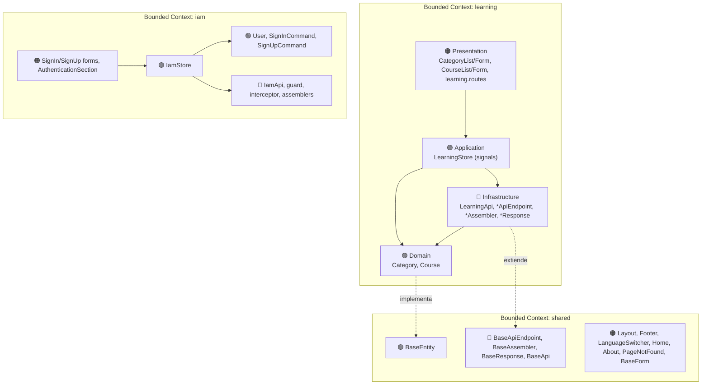

# 📘 Guía Completa de Desarrollo — Learning Center

## Aplicación de gestión de Categorías y Cursos con Angular 21, Angular Material y Domain-Driven Design (DDD)

---

> [!IMPORTANT]
> Esta guía reconstruye **desde cero** el proyecto `learning-center` (ACME Learning Center) siguiendo un flujo **progresivo**: cada paso deja el proyecto compilando y cada bloque termina en un commit. Usa **DDD por Bounded Contexts** (`shared`, `learning`, `iam`), orden **Domain → Infrastructure → Application → Presentation**, **GitFlow** con ramas `feature/`, **Conventional Commits** y las APIs modernas de Angular (standalone, signals, `inject()`, control flow `@if/@for`).
>
> Esta guía es la parte **"CÓMO"** (comandos + código). El **"POR QUÉ"** de cada archivo, patrón y decisión está en el documento hermano: [`learning-center-explanation-guide-claude.md`](./learning-center-explanation-guide-claude.md). Cada paso indica la sección de esa guía que lo explica (📖).
>
> **Convención de nombres:** los `ng generate` usan **kebab-case** en la ruta (`category-list`, no `CategoryList`). Angular CLI convierte el nombre a PascalCase para la **clase** (`export class CategoryList`).

---

## Tabla de Contenidos

| Fase | Pasos | Descripción |
|:-----|:------|:------------|
| **Fase 0** | 1–6 | Proyecto Angular, GitFlow, Material, entornos, i18n, API falsa (json-server) |
| **Fase 1** | 7–11 | Shared Bounded Context — contratos base (Domain + Infrastructure) |
| **Fase 2** | 12–13 | Learning — Domain (entidades `Category`, `Course`) |
| **Fase 3** | 14–17 | Learning — Infrastructure (Resources, Assemblers, Endpoints, `LearningApi`) |
| **Fase 4** | 18 | Learning — Application (`LearningStore` con signals) |
| **Fase 5** | 19–23 | Learning — Presentation (listas, formularios, rutas) |
| **Fase 6** | 24–29 | Shared — Presentation (shell: layout, footer, idioma, vistas, rutas raíz) |
| **Fase 7** | 30–38 | IAM Bounded Context (commands, API, store, guard, interceptor, formularios) |
| **Fase 8** | 39–40 | Documentación, licencia y cierre |

---

## Convenciones de la Guía

| Icono | Significado |
|:------|:------------|
| 💻 | Ejecutar comando en terminal |
| 📁 | Archivo o directorio creado |
| ✏️ | Editar / reemplazar contenido |
| 🔀 | Realizar commit |
| 🌿 | Operación de rama (branch) |
| 💡 | Explicación breve de por qué se hace así |
| ⚙️ | Lo que Angular CLI genera por defecto |
| ⚠️ | Advertencia o buena práctica importante |
| ✅ | Punto de verificación (el proyecto debe compilar/funcionar) |
| 📖 | Sección de la guía de explicación donde se detalla el porqué |

---

## Prerrequisitos

| Herramienta | Versión | Verificación |
|:-----------|:--------|:-------------|
| Node.js | 20.19+ / 22.12+ / 24+ (lo que exija Angular 21) | `node --version` |
| npm | 10.x+ (el proyecto usa `npm@11`) | `npm --version` |
| Angular CLI | 21.x | `ng version` |
| Git | 2.x+ | `git --version` |
| Git Flow AVH | `git flow` (incluido en Git for Windows) | `git flow version` |
| IDE | WebStorm / VS Code | — |

💻 Instalar Angular CLI (opcional, también se puede usar `npx`):
```bash
npm install -g @angular/cli@21
```

---

## Mapa de Arquitectura (lo que vas a construir)



**Regla de dependencias:** `Presentation → Application → Domain ← Infrastructure`. Domain no importa nada de Angular.

**Estructura final (referencia rápida):**
```
src/app/
├── shared/   {domain/model, infrastructure, presentation/{components,views}}
├── learning/ {domain/model, infrastructure, application, presentation/{views, learning.routes.ts}}
└── iam/      {domain/model, infrastructure, application, presentation/{components,views, iam.routes.ts}}
```

---

## Sobre GitFlow

| Rama | Propósito |
|:-----|:----------|
| `main` | Producción |
| `develop` | Integración |
| `feature/<nombre>` | Una funcionalidad o capa |
| `docs/doc-as-code` | Documentación como código |

Patrón que se repite en toda la guía:
```bash
git flow feature start <nombre>      # 🌿 abrir rama
# ... trabajar ...
git add .
git commit -m "tipo(alcance): mensaje."   # 🔀
git flow feature finish <nombre>     # 🌿 integrar en develop
```

---

# FASE 0 — Configuración del Proyecto

## Paso 1: Crear el proyecto Angular

💻
```bash
npx --yes --package @angular/cli@21 ng new learning-center --defaults
cd learning-center
```

💡 `--defaults` acepta CSS, routing y sin SSR. En Angular 21 los componentes son **standalone** y **zoneless** por defecto, y el runner de tests es **Vitest**.

⚙️ **Genera por defecto** (lo relevante):
```
learning-center/
├── src/
│   ├── app/{app.ts, app.html, app.css, app.config.ts, app.routes.ts, app.spec.ts}
│   ├── index.html · main.ts · styles.css
├── public/favicon.ico
├── angular.json · package.json · tsconfig*.json · .editorconfig · .prettierrc
```

📖 Explicación: sección 3.1.

---

## Paso 2: Inicializar GitFlow

💻
```bash
git init            # si "ng new" no lo hizo (normalmente ya inicializa git)
git flow init -d    # -d = valores por defecto (main + develop)
```

🔀 **Commit en `develop`:**
```bash
git add .
git commit -m "chore: initial project setup with angular cli."
```

---

## Paso 3: Instalar Angular Material

🌿
```bash
git flow feature start add-angular-material
```

💻
```bash
ng add @angular/material
```
> Responde: tema **Azure/Blue** (o el que prefieras), **sí** a tipografía global, **sí** a animaciones.

⚙️ **`ng add @angular/material` hace:** instala `@angular/material` + `@angular/cdk`, crea `src/material-theme.scss`, la agrega a `styles` en `angular.json`, y añade Roboto + Material Icons a `index.html`.

✏️ `src/material-theme.scss` (versión final del proyecto; el `:root` con `toolbar-overrides` es lo único añadido a mano):
```scss
@use '@angular/material' as mat;
@include mat.core();

:root {
  @include mat.toolbar-overrides((container-background-color: slategray, container-text-color: white));
}

html {
  height: 100%;
  @include mat.theme(
    (
      color: (
        primary: mat.$azure-palette,
        tertiary: mat.$blue-palette,
      ),
      typography: Roboto,
      density: 0,
    )
  );
}

body {
  color-scheme: light;
  background-color: var(--mat-sys-surface);
  color: var(--mat-sys-on-surface);
  font: var(--mat-sys-body-medium);
  margin: 0;
  height: 100%;
}
```

✏️ `src/styles.css`:
```css
html, body {
  height: 100%;
}

body {
  margin: 0;
  font-family: Roboto, "Helvetica Neue", sans-serif;
}

.container-with-spacing {
  margin: 10px;
}
```

✏️ `src/index.html` (título, favicon y fuentes):
```html
<!doctype html>
<html lang="en">
  <head>
    <meta charset="utf-8" />
    <title>Learning Center</title>
    <base href="/" />
    <meta name="viewport" content="width=device-width, initial-scale=1" />
    <link rel="icon" type="image/svg+xml" href="/acme-logo.svg">
    <link rel="preconnect" href="https://fonts.googleapis.com" />
    <link rel="preconnect" href="https://fonts.gstatic.com" crossorigin />
    <link href="https://fonts.googleapis.com/css2?family=Roboto:wght@300;400;500&display=swap" rel="stylesheet" />
    <link href="https://fonts.googleapis.com/icon?family=Material+Icons" rel="stylesheet" />
  </head>
  <body>
    <app-root></app-root>
  </body>
</html>
```

📁 Coloca en `public/` tu logo `acme-logo.svg` (cualquier SVG sirve; lo usan `index.html` y la vista About).

🔀
```bash
git add .
git commit -m "chore: add angular material dependency and global theme."
git flow feature finish add-angular-material
```

---

## Paso 4: Entornos (environments)

🌿
```bash
git flow feature start configure-environments
```

💻
```bash
ng g environments
```

⚙️ Crea `src/environments/environment.ts` (producción) y `environment.development.ts`, y añade `fileReplacements` a la configuración `development` de `angular.json` (build sustituye uno por otro).

✏️ `src/environments/environment.development.ts`:
```typescript
export const environment = {
  production: false,
  platformProviderApiBaseUrl: 'http://localhost:3000/api/v1',
  platformProviderCategoriesEndpointPath: '/categories',
  platformProviderCoursesEndpointPath: '/courses',
  platformProviderSignInEndpointPath: '/authentication/sign-in',
  platformProviderSignUpEndpointPath: '/authentication/sign-up',
  logoProviderApiBaseUrl: 'https://img.logo.dev/',
};
```

✏️ `src/environments/environment.ts`:
```typescript
export const environment = {
  production: true,
  platformProviderApiBaseUrl: 'https://<tu-mockapi-o-backend>/api/v1',
  platformProviderCategoriesEndpointPath: '/categories',
  platformProviderCoursesEndpointPath: '/courses',
  platformProviderSignInEndpointPath: '/authentication/sign-in',
  platformProviderSignUpEndpointPath: '/authentication/sign-up',
  logoProviderApiBaseUrl: 'https://img.logo.dev/',
};
```

> [!NOTE]
> El proyecto terminado usa `http://localhost:8080/api/v1` en *development* (pensado para un backend Spring Boot) y un MockAPI en *production*; su README, en cambio, dice que el fake API corre en el puerto **3000**. Esta guía usa **3000** en desarrollo para que coincida con `json-server` (Paso 6) y funcione sin backend. `logoProviderApiBaseUrl` no se usa en este proyecto (es un resto de la plantilla CatchUp); puedes omitirlo.

🔀
```bash
git add .
git commit -m "chore: add environment files for api configuration."
git flow feature finish configure-environments
```

---

## Paso 5: Internacionalización (ngx-translate) y HttpClient

🌿
```bash
git flow feature start configure-i18n-http
```

💻
```bash
npm i @ngx-translate/core @ngx-translate/http-loader
```

📁 `public/i18n/en.json`:
```json
{
  "option": {
    "home": "Home",
    "about": "About Us",
    "categories": "Categories",
    "courses": "Courses"
  },
  "about": {
    "title": "About us",
    "content": "ACME Learning Center is an Education Platform, part of ACME Corporation."
  },
  "home": {
    "title": "Welcome",
    "content": "Welcome to ACME Learning Center."
  },
  "page-not-found": {
    "title": "Page not found",
    "content": "The path <strong>{{ invalid_path }}</strong> is not valid.",
    "go-home": "Go Home"
  },
  "footer": {
    "rights": "All rights reserved.",
    "powered-by": "Powered by",
    "and": "and"
  },
  "categories": {
    "list-title": "Categories",
    "id": "ID",
    "name": "Name",
    "actions": "Actions",
    "new": "New Category",
    "edit": "Edit",
    "delete": "Delete"
  },
  "category": {
    "new-title": "Create New Category",
    "edit-title": "Edit Category",
    "name": "Name",
    "create": "Create Category",
    "update": "Update Category",
    "cancel": "Cancel",
    "error": {
      "name-required": "Name is required"
    }
  },
  "courses": {
    "list-title": "Courses",
    "id": "ID",
    "title": "Title",
    "description": "Description",
    "category": "Category",
    "actions": "Actions",
    "new": "New Course",
    "edit": "Edit",
    "delete": "Delete"
  },
  "course": {
    "new-title": "Create New Course",
    "edit-title": "Edit Course",
    "title": "Title",
    "description": "Description",
    "category": "Category",
    "create": "Create Course",
    "update": "Update Course",
    "cancel": "Cancel",
    "error": {
      "title-required": "Title is required",
      "description-required": "Description is required",
      "category-required": "Category is required"
    }
  }
}
```

📁 `public/i18n/es.json`:
```json
{
  "option": {
    "home": "Inicio",
    "about": "Acerca de",
    "categories": "Categorías",
    "courses": "Cursos"
  },
  "about": {
    "title": "Acerca de nosotros",
    "content": "ACME Learning Center es una plataforma educativa, parte de ACME Corporation."
  },
  "home": {
    "title": "Bienvenido",
    "content": "Bienvenido a ACME Learning Center."
  },
  "page-not-found": {
    "title": "Página no encontrada",
    "content": "La ruta <strong>{{ invalid_path }}</strong> es inválida.",
    "go-home": "Ir a Inicio"
  },
  "footer": {
    "rights": "Todos los derechos reservados.",
    "powered-by": "Desarrollado con",
    "and": "y"
  },
  "categories": {
    "list-title": "Categorías",
    "id": "ID",
    "name": "Nombre",
    "actions": "Acciones",
    "new": "Nueva Categoría",
    "edit": "Editar",
    "delete": "Eliminar"
  },
  "category": {
    "new-title": "Crear Nueva Categoría",
    "edit-title": "Editar Categoría",
    "name": "Nombre",
    "create": "Crear Categoría",
    "update": "Actualizar Categoría",
    "cancel": "Cancelar",
    "error": {
      "name-required": "El nombre es obligatorio"
    }
  },
  "courses": {
    "list-title": "Cursos",
    "id": "ID",
    "title": "Título",
    "description": "Descripción",
    "category": "Categoría",
    "actions": "Acciones",
    "new": "Nuevo Curso",
    "edit": "Editar",
    "delete": "Eliminar"
  },
  "course": {
    "new-title": "Crear Nuevo Curso",
    "edit-title": "Editar Curso",
    "title": "Título",
    "description": "Descripción",
    "category": "Categoría",
    "create": "Crear Curso",
    "update": "Actualizar Curso",
    "cancel": "Cancelar",
    "error": {
      "title-required": "El título es obligatorio",
      "description-required": "La descripción es obligatoria",
      "category-required": "La categoría es obligatoria"
    }
  }
}
```

> [!WARNING]
> El proyecto original tiene en `es.json` el placeholder `{{ invalidPath }}` mientras `en.json` y el componente usan `invalid_path`. Resultado: en español el path no se interpola. Aquí ya se corrige a `invalid_path` en ambos.

✏️ `src/app/app.config.ts` (versión de esta fase; el interceptor IAM se añade en el Paso 37):
```typescript
import { ApplicationConfig, provideBrowserGlobalErrorListeners } from '@angular/core';
import { provideRouter } from '@angular/router';
import { provideHttpClient, withFetch } from '@angular/common/http';
import { provideTranslateService } from '@ngx-translate/core';
import { provideTranslateHttpLoader } from '@ngx-translate/http-loader';

import { routes } from './app.routes';

export const appConfig: ApplicationConfig = {
  providers: [
    provideBrowserGlobalErrorListeners(),
    provideRouter(routes),
    provideHttpClient(withFetch()),
    provideTranslateService({
      loader: provideTranslateHttpLoader({ prefix: './i18n/', suffix: '.json' }),
      fallbackLang: 'en'
    })
  ]
};
```

✅ `npm run build` debe compilar.

🔀
```bash
git add .
git commit -m "feat(i18n): configure http client and ngx-translate with en/es resources."
git flow feature finish configure-i18n-http
```

---

## Paso 6: API falsa con json-server

🌿
```bash
git flow feature start fake-api
```

💻
```bash
npm i -D json-server@0.17.4
```

📁 `server/routes.json` — reescribe `/api/v1/...` → `/...` para que la URL del frontend parezca una API real:
```json
{
  "/api/v1/:*": "/:$1"
}
```

📁 `server/db.json`:
```json
{
  "categories": [
    { "id": 1, "name": "Java" },
    { "id": 2, "name": "Spring Boot" },
    { "id": 3, "name": "TypeScript" },
    { "id": 4, "name": "Angular" },
    { "id": 5, "name": "RESTful" }
  ],
  "courses": [
    { "id": 1,  "title": "Java for Beginners", "description": "An introductory course to Java programming language.", "categoryId": 1 },
    { "id": 2,  "title": "Advanced Java Concepts", "description": "A deep dive into advanced Java programming topics.", "categoryId": 1 },
    { "id": 3,  "title": "Spring Boot Fundamentals", "description": "Learn the basics of Spring Boot framework.", "categoryId": 2 },
    { "id": 4,  "title": "Building RESTful APIs with Spring Boot", "description": "Create robust RESTful APIs using Spring Boot.", "categoryId": 2 },
    { "id": 5,  "title": "TypeScript Essentials", "description": "Get started with TypeScript and its features.", "categoryId": 3 },
    { "id": 6,  "title": "Advanced TypeScript", "description": "Explore advanced concepts in TypeScript programming.", "categoryId": 3 },
    { "id": 7,  "title": "Angular for Beginners", "description": "An introductory course to Angular framework.", "categoryId": 4 },
    { "id": 8,  "title": "Building SPAs with Angular", "description": "Learn how to build Single Page Applications using Angular.", "categoryId": 4 },
    { "id": 9,  "title": "RESTful Web Services", "description": "Understand the principles of RESTful web services.", "categoryId": 5 },
    { "id": 10, "title": "Consuming RESTful APIs", "description": "Learn how to consume RESTful APIs in your applications.", "categoryId": 5 },
    { "id": 11, "title": "Full-Stack Development with Java and Angular", "description": "Combine Java backend with Angular frontend for full-stack development.", "categoryId": 1 },
    { "id": 12, "title": "Microservices with Spring Boot", "description": "Build microservices architecture using Spring Boot.", "categoryId": 2 }
  ]
}
```

📁 `server/start.sh` (opcional, se ejecuta desde dentro de `server/`):
```bash
json-server --watch db.json --routes routes.json
```

💻 Arranque (desde la raíz del proyecto):
```bash
npx json-server --watch server/db.json --routes server/routes.json --port 3000
```

✅ Prueba: abre `http://localhost:3000/api/v1/categories` → debe devolver el arreglo JSON de categorías.

🔀
```bash
git add .
git commit -m "chore: add json-server fake api with categories and courses."
git flow feature finish fake-api
```

---

# FASE 1 — Shared Bounded Context: contratos base

> [!IMPORTANT]
> **¿Por qué `shared` primero?** Porque `learning` e `iam` heredan de estas piezas. Aquí se define el "contrato" para que cualquier entidad pueda tener un CRUD completo escribiendo muy poco código. 📖 Sección 4.

🌿
```bash
git flow feature start shared-base-contracts
```

## Paso 7: `BaseEntity` (Domain)

💻
```bash
ng g interface shared/domain/model/base-entity
```
✏️ `src/app/shared/domain/model/base-entity.ts`:
```typescript
/**
 * Base contract for domain entities across bounded contexts.
 *
 * @remarks
 * This type belongs to the domain layer and captures identity semantics.
 */
export interface BaseEntity {
  id: number;
}
```

## Paso 8: `BaseResponse` y `BaseResource` (Infrastructure)

💻
```bash
ng g interface shared/infrastructure/base-response
```
✏️ `src/app/shared/infrastructure/base-response.ts`:
```typescript
/**
 * Marker contract for HTTP response envelopes in the infrastructure layer.
 */
export interface BaseResponse {}

/**
 * Base shape for infrastructure resources exchanged with remote APIs.
 */
export interface BaseResource {
  id: number;
}
```

## Paso 9: `BaseAssembler`

💻
```bash
ng g interface shared/infrastructure/base-assembler
```
✏️ `src/app/shared/infrastructure/base-assembler.ts`:
```typescript
import { BaseEntity } from '../domain/model/base-entity';
import { BaseResource, BaseResponse } from './base-response';

/**
 * Infrastructure mapper between domain entities and external API contracts.
 *
 * @typeParam TEntity - Domain entity type.
 * @typeParam TResource - Infrastructure resource contract returned/sent to APIs.
 * @typeParam TResponse - Infrastructure response envelope contract.
 */
export interface BaseAssembler<TEntity extends BaseEntity,
  TResource extends BaseResource,
  TResponse extends BaseResponse> {
  /** Maps one infrastructure resource to a domain entity. */
  toEntityFromResource(resource: TResource): TEntity;
  /** Maps one domain entity to an infrastructure resource contract. */
  toResourceFromEntity(entity: TEntity): TResource;
  /** Maps a response envelope to a domain entity collection. */
  toEntitiesFromResponse(response: TResponse): TEntity[];
}
```

## Paso 10: `BaseApiEndpoint` (CRUD genérico)

💻
```bash
ng g class shared/infrastructure/base-api-endpoint --skip-tests
```
✏️ `src/app/shared/infrastructure/base-api-endpoint.ts`:
```typescript
import { BaseEntity } from '../domain/model/base-entity';
import { BaseResource, BaseResponse } from './base-response';
import { BaseAssembler } from './base-assembler';
import { HttpClient, HttpErrorResponse } from '@angular/common/http';
import { catchError, map, Observable, throwError } from 'rxjs';

/**
 * Reusable infrastructure endpoint for CRUD interactions with remote APIs.
 *
 * @typeParam TEntity - Domain entity returned to upper layers.
 * @typeParam TResource - Infrastructure resource contract for single records.
 * @typeParam TResponse - Infrastructure response envelope contract.
 * @typeParam TAssembler - Mapper between domain entities and infrastructure contracts.
 */
export abstract class BaseApiEndpoint<
  TEntity extends BaseEntity,
  TResource extends BaseResource,
  TResponse extends BaseResponse,
  TAssembler extends BaseAssembler<TEntity, TResource, TResponse>> {
  protected constructor(
    protected http: HttpClient,
    protected endpointUrl: string,
    protected assembler: TAssembler
  ) {}

  /** Loads all records from the endpoint and maps them to domain entities. */
  getAll(): Observable<TEntity[]> {
    return this.http.get<TResponse | TResource[]>(this.endpointUrl).pipe(
      map(response => {
        if (Array.isArray(response)) {
          return response.map(resource => this.assembler.toEntityFromResource(resource));
        }
        return this.assembler.toEntitiesFromResponse(response as TResponse);
      }),
      catchError(this.handleError('Failed to fetch entities'))
    );
  }

  /** Builds an operation-scoped HTTP error mapper. */
  protected handleError(operation: string) {
    return (error: HttpErrorResponse): Observable<never> => {
      let errorMessage = operation;
      if (error.status === 404) {
        errorMessage = `${operation}: Resource not found`;
      } else if (error.error instanceof ErrorEvent) {
        errorMessage = `${operation}: ${error.error.message}`;
      } else {
        errorMessage = `${operation}: ${error.status || 'Unexpected error'}`;
      }
      return throwError(() => new Error(errorMessage));
    };
  }

  /** Loads one record by identifier and maps it to a domain entity. */
  getById(id: number): Observable<TEntity> {
    return this.http.get<TResource>(`${this.endpointUrl}/${id}`).pipe(
      map(resource => this.assembler.toEntityFromResource(resource)),
      catchError(this.handleError('Failed to fetch entity')));
  }

  /** Persists a new domain entity through the infrastructure endpoint. */
  create(entity: TEntity): Observable<TEntity> {
    const resource = this.assembler.toResourceFromEntity(entity);
    return this.http.post<TResource>(this.endpointUrl, resource).pipe(
      map(created => this.assembler.toEntityFromResource(created)),
      catchError(this.handleError('Failed to create entity')));
  }

  /** Persists changes of a domain entity identified by `id`. */
  update(entity: TEntity, id: number): Observable<TEntity> {
    const resource = this.assembler.toResourceFromEntity(entity);
    return this.http.put<TResource>(`${this.endpointUrl}/${id}`, resource).pipe(
      map(updated => this.assembler.toEntityFromResource(updated)),
      catchError(this.handleError('Failed to update entity')));
  }

  /** Deletes one record by identifier. */
  delete(id: number): Observable<void> {
    return this.http.delete<void>(`${this.endpointUrl}/${id}`).pipe(
      catchError(this.handleError('Failed to delete entity')));
  }
}
```

> [!NOTE]
> El original tenía `` `${error.status} || 'Unexpected error'` `` dentro del template string (el `||` quedaba como texto). Aquí se corrige a `${error.status || 'Unexpected error'}`.

## Paso 11: `BaseApi`

💻
```bash
ng g class shared/infrastructure/base-api --skip-tests
```
✏️ `src/app/shared/infrastructure/base-api.ts`:
```typescript
/**
 * Marker base type for infrastructure API facades.
 *
 * @remarks
 * Concrete `*-api` services live in the infrastructure layer and coordinate
 * endpoint clients plus contract mappers.
 */
export abstract class BaseApi {

}
```

✅ `npm run build`.

🔀
```bash
git add .
git commit -m "feat(shared): add base entity, resource, assembler and crud endpoint contracts."
git flow feature finish shared-base-contracts
```

---

# FASE 2 — Learning Bounded Context: Domain

🌿
```bash
git flow feature start learning-domain
```

## Paso 12: Entidad `Category`

💻
```bash
ng g class learning/domain/model/category --type=entity --skip-tests
```
⚙️ `--type=entity` → archivo `category.entity.ts` (separador con **punto**).

✏️ `src/app/learning/domain/model/category.entity.ts`:
```typescript
import { BaseEntity } from '../../../shared/domain/model/base-entity';

/**
 * Category entity in the Learning bounded context.
 */
export class Category implements BaseEntity {
  private _id: number;
  private _name: string;

  /**
   * Creates a category entity instance.
   * @param props - Identity and name values.
   */
  constructor(props: { id: number; name: string }) {
    this._id = props.id;
    this._name = props.name;
  }

  get id(): number { return this._id; }
  set id(value: number) { this._id = value; }

  get name(): string { return this._name; }
  set name(value: string) { this._name = value; }
}
```

## Paso 13: Entidad `Course` (aggregate root)

💻
```bash
ng g class learning/domain/model/course --type=entity --skip-tests
```

> [!NOTE]
> En el proyecto original el archivo se llama `couse.entity.ts` (typo). Esta guía lo llama `course.entity.ts`. Si comparas con el original, ajusta los imports.

✏️ `src/app/learning/domain/model/course.entity.ts`:
```typescript
import { Category } from './category.entity';

/**
 * Aggregate root representing a course in the Learning bounded context.
 */
export class Course {
  private _id: number;
  private _title: string;
  private _description: string;
  private _categoryId: number;
  /** Category object resolved by the application layer; null when not set. */
  private _category: Category | null;

  /**
   * Creates a new instance of the Course class.
   * @param course - Initial values. `category` is optional.
   */
  constructor(course: {
    id: number;
    title: string;
    description: string;
    categoryId: number;
    category?: Category | null;
  }) {
    this._id = course.id;
    this._title = course.title;
    this._description = course.description;
    this._categoryId = course.categoryId;
    this._category = course.category ?? null;
  }

  get id(): number { return this._id; }
  set id(value: number) { this._id = value; }

  get title(): string { return this._title; }
  set title(value: string) { this._title = value; }

  get description(): string { return this._description; }
  set description(value: string) { this._description = value; }

  get categoryId(): number { return this._categoryId; }
  set categoryId(value: number) { this._categoryId = value; }

  get category(): Category | null { return this._category; }
  set category(value: Category | null) { this._category = value; }
}
```

> [!NOTE]
> `Course` **no** declara `implements BaseEntity` en el original, pero cumple el contrato (tiene `id: number`) por tipado estructural. Por eso `BaseApiEndpoint<Course, ...>` compila. Puedes añadirlo si quieres hacerlo explícito.

✅ `npm run build`.

🔀
```bash
git add .
git commit -m "feat(learning): add category and course domain entities."
git flow feature finish learning-domain
```

---

# FASE 3 — Learning Bounded Context: Infrastructure

🌿
```bash
git flow feature start learning-infrastructure
```

## Paso 14: Contratos de la API (Resources / Responses)

💻
```bash
ng g interface learning/infrastructure/categories-response
ng g interface learning/infrastructure/courses-response
```

✏️ `src/app/learning/infrastructure/categories-response.ts`:
```typescript
import { BaseResource, BaseResponse } from '../../shared/infrastructure/base-response';

/** Infrastructure resource contract for category payloads. */
export interface CategoryResource extends BaseResource {
  id: number;
  name: string;
}

/** Infrastructure response envelope used by category collection queries. */
export interface CategoriesResponse extends BaseResponse {
  categories: CategoryResource[];
}
```

✏️ `src/app/learning/infrastructure/courses-response.ts`:
```typescript
import { BaseResource, BaseResponse } from '../../shared/infrastructure/base-response';

/** Infrastructure resource contract representing a course record. */
export interface CourseResource extends BaseResource {
  id: number;
  title: string;
  description: string;
  /** Identifier for the category this course belongs to. */
  categoryId: number;
}

/** Infrastructure response envelope for course collection queries. */
export interface CoursesResponse extends BaseResponse {
  courses: CourseResource[];
}
```

## Paso 15: Assemblers

💻
```bash
ng g class learning/infrastructure/category-assembler --skip-tests
ng g class learning/infrastructure/course-assembler --skip-tests
```

✏️ `category-assembler.ts`:
```typescript
import { BaseAssembler } from '../../shared/infrastructure/base-assembler';
import { Category } from '../domain/model/category.entity';
import { CategoriesResponse, CategoryResource } from './categories-response';

/** Maps category infrastructure contracts to domain entities and back. */
export class CategoryAssembler implements BaseAssembler<Category, CategoryResource, CategoriesResponse> {
  toEntitiesFromResponse(response: CategoriesResponse): Category[] {
    return response.categories.map(resource => this.toEntityFromResource(resource));
  }

  toEntityFromResource(resource: CategoryResource): Category {
    return new Category({ id: resource.id, name: resource.name });
  }

  toResourceFromEntity(entity: Category): CategoryResource {
    return { id: entity.id, name: entity.name } as CategoryResource;
  }
}
```

✏️ `course-assembler.ts`:
```typescript
import { CourseResource, CoursesResponse } from './courses-response';
import { Course } from '../domain/model/course.entity';
import { BaseAssembler } from '../../shared/infrastructure/base-assembler';

/** Maps course domain entities to and from infrastructure contracts. */
export class CourseAssembler implements BaseAssembler<Course, CourseResource, CoursesResponse> {
  toEntitiesFromResponse(response: CoursesResponse): Course[] {
    return response.courses.map(resource => this.toEntityFromResource(resource));
  }

  toEntityFromResource(resource: CourseResource): Course {
    return new Course({
      id: resource.id,
      title: resource.title,
      description: resource.description,
      categoryId: resource.categoryId
    });
  }

  toResourceFromEntity(entity: Course): CourseResource {
    return {
      id: entity.id,
      title: entity.title,
      description: entity.description,
      categoryId: entity.categoryId
    } as CourseResource;
  }
}
```

💡 Los assemblers **no** son `@Injectable`: los instancian los endpoints con `new`. Son mapeadores puros, sin dependencias.

## Paso 16: Endpoints concretos

💻
```bash
ng g class learning/infrastructure/categories-api-endpoint --skip-tests
ng g class learning/infrastructure/courses-api-endpoint --skip-tests
```

✏️ `categories-api-endpoint.ts`:
```typescript
import { BaseApiEndpoint } from '../../shared/infrastructure/base-api-endpoint';
import { CategoriesResponse, CategoryResource } from './categories-response';
import { Category } from '../domain/model/category.entity';
import { CategoryAssembler } from './category-assembler';
import { HttpClient } from '@angular/common/http';
import { environment } from '../../../environments/environment';

const categoriesEndpointUrl =
  `${environment.platformProviderApiBaseUrl}${environment.platformProviderCategoriesEndpointPath}`;

/** Infrastructure endpoint client for category CRUD integration. */
export class CategoriesApiEndpoint extends
  BaseApiEndpoint<Category, CategoryResource, CategoriesResponse, CategoryAssembler> {
  constructor(http: HttpClient) {
    super(http, categoriesEndpointUrl, new CategoryAssembler());
  }
}
```

✏️ `courses-api-endpoint.ts`:
```typescript
import { BaseApiEndpoint } from '../../shared/infrastructure/base-api-endpoint';
import { Course } from '../domain/model/course.entity';
import { CourseResource, CoursesResponse } from './courses-response';
import { CourseAssembler } from './course-assembler';
import { HttpClient } from '@angular/common/http';
import { environment } from '../../../environments/environment';

/** Infrastructure endpoint client for course CRUD integration. */
export class CoursesApiEndpoint extends
  BaseApiEndpoint<Course, CourseResource, CoursesResponse, CourseAssembler> {
  constructor(http: HttpClient) {
    super(
      http,
      `${environment.platformProviderApiBaseUrl}${environment.platformProviderCoursesEndpointPath}`,
      new CourseAssembler()
    );
  }
}
```

## Paso 17: Fachada `LearningApi`

💻
```bash
ng g service learning/infrastructure/learning-api --skip-tests
```
✏️ `src/app/learning/infrastructure/learning-api.ts`:
```typescript
import { Injectable } from '@angular/core';
import { HttpClient } from '@angular/common/http';
import { Observable } from 'rxjs';
import { BaseApi } from '../../shared/infrastructure/base-api';
import { CategoriesApiEndpoint } from './categories-api-endpoint';
import { CoursesApiEndpoint } from './courses-api-endpoint';
import { Category } from '../domain/model/category.entity';
import { Course } from '../domain/model/course.entity';

/**
 * Infrastructure facade exposing Learning bounded-context endpoint operations.
 */
@Injectable({ providedIn: 'root' })
export class LearningApi extends BaseApi {
  private readonly categoriesEndpoint: CategoriesApiEndpoint;
  private readonly coursesEndpoint: CoursesApiEndpoint;

  constructor(http: HttpClient) {
    super();
    this.coursesEndpoint = new CoursesApiEndpoint(http);
    this.categoriesEndpoint = new CategoriesApiEndpoint(http);
  }

  getCourses(): Observable<Course[]> { return this.coursesEndpoint.getAll(); }
  getCourse(id: number): Observable<Course> { return this.coursesEndpoint.getById(id); }
  createCourse(course: Course): Observable<Course> { return this.coursesEndpoint.create(course); }
  updateCourse(course: Course): Observable<Course> { return this.coursesEndpoint.update(course, course.id); }
  deleteCourse(id: number): Observable<void> { return this.coursesEndpoint.delete(id); }

  getCategories(): Observable<Category[]> { return this.categoriesEndpoint.getAll(); }
  getCategory(id: number): Observable<Category> { return this.categoriesEndpoint.getById(id); }
  createCategory(category: Category): Observable<Category> { return this.categoriesEndpoint.create(category); }
  updateCategory(category: Category): Observable<Category> { return this.categoriesEndpoint.update(category, category.id); }
  deleteCategory(id: number): Observable<void> { return this.categoriesEndpoint.delete(id); }
}
```

✅ `npm run build`.

🔀
```bash
git add .
git commit -m "feat(learning): add resources, assemblers, endpoints and learning api facade."
git flow feature finish learning-infrastructure
```

---

# FASE 4 — Learning Bounded Context: Application

🌿
```bash
git flow feature start learning-application
```

## Paso 18: `LearningStore`

💻
```bash
ng g service learning/application/learning --type=store --skip-tests
```
⚙️ `--type=store` → `learning.store.ts` con `export class LearningStore`.

✏️ `src/app/learning/application/learning.store.ts`:
```typescript
import { computed, Injectable, Signal, signal } from '@angular/core';
import { takeUntilDestroyed } from '@angular/core/rxjs-interop';
import { retry } from 'rxjs';
import { Category } from '../domain/model/category.entity';
import { Course } from '../domain/model/course.entity';
import { LearningApi } from '../infrastructure/learning-api';

/**
 * Application-layer store that orchestrates Learning use cases.
 *
 * Coordinates infrastructure calls and projects results into reactive UI state.
 */
@Injectable({ providedIn: 'root' })
export class LearningStore {
  private readonly coursesSignal = signal<Course[]>([]);
  private readonly categoriesSignal = signal<Category[]>([]);
  private readonly loadingSignal = signal<boolean>(false);
  private readonly errorSignal = signal<string | null>(null);

  /** Readonly projections consumed by the presentation layer. */
  readonly courses = this.coursesSignal.asReadonly();
  readonly categories = this.categoriesSignal.asReadonly();
  readonly loading = this.loadingSignal.asReadonly();
  readonly error = this.errorSignal.asReadonly();

  /** Derived counters. */
  readonly courseCount = computed(() => this.courses().length);
  readonly categoryCount = computed(() => this.categories().length);

  /** Loads initial data as soon as the store is first injected. */
  constructor(private learningApi: LearningApi) {
    this.loadCategories();
    this.loadCourses();
  }

  getCategoryById(id: number): Signal<Category | undefined> {
    return computed(() => (id ? this.categories().find((c) => c.id === id) : undefined));
  }

  getCourseById(id: number): Signal<Course | undefined> {
    return computed(() => (id ? this.courses().find((c) => c.id === id) : undefined));
  }

  // ---------- Courses ----------

  addCourse(course: Course): void {
    this.loadingSignal.set(true);
    this.errorSignal.set(null);
    this.learningApi.createCourse(course).pipe(retry(2)).subscribe({
      next: (createdCourse) => {
        const enriched = this.assignCategoryToCourse(createdCourse);
        this.coursesSignal.update((courses) => [...courses, enriched]);
        this.loadingSignal.set(false);
      },
      error: (err) => {
        this.errorSignal.set(this.formatError(err, 'Failed to create course'));
        this.loadingSignal.set(false);
      },
    });
  }

  updateCourse(updatedCourse: Course): void {
    this.loadingSignal.set(true);
    this.errorSignal.set(null);
    this.learningApi.updateCourse(updatedCourse).pipe(retry(2)).subscribe({
      next: (course) => {
        course = this.assignCategoryToCourse(course);
        this.coursesSignal.update((courses) => courses.map((c) => (c.id === course.id ? course : c)));
        this.loadingSignal.set(false);
      },
      error: (err) => {
        this.errorSignal.set(this.formatError(err, 'Failed to update course'));
        this.loadingSignal.set(false);
      },
    });
  }

  deleteCourse(id: number): void {
    this.loadingSignal.set(true);
    this.errorSignal.set(null);
    this.learningApi.deleteCourse(id).pipe(retry(2)).subscribe({
      next: () => {
        this.coursesSignal.update((courses) => courses.filter((c) => c.id !== id));
        this.loadingSignal.set(false);
      },
      error: (err) => {
        this.errorSignal.set(this.formatError(err, 'Failed to delete course'));
        this.loadingSignal.set(false);
      },
    });
  }

  // ---------- Categories ----------

  addCategory(category: Category): void {
    this.loadingSignal.set(true);
    this.errorSignal.set(null);
    this.learningApi.createCategory(category).pipe(retry(2)).subscribe({
      next: (createdCategory) => {
        this.categoriesSignal.update((categories) => [...categories, createdCategory]);
        this.loadingSignal.set(false);
      },
      error: (err) => {
        this.errorSignal.set(this.formatError(err, 'Failed to create category'));
        this.loadingSignal.set(false);
      },
    });
  }

  updateCategory(updatedCategory: Category): void {
    this.loadingSignal.set(true);
    this.errorSignal.set(null);
    this.learningApi.updateCategory(updatedCategory).pipe(retry(2)).subscribe({
      next: (category) => {
        this.categoriesSignal.update((categories) =>
          categories.map((c) => (c.id === category.id ? category : c)),
        );
        this.loadingSignal.set(false);
      },
      error: (err) => {
        this.errorSignal.set(this.formatError(err, 'Failed to update category'));
        this.loadingSignal.set(false);
      },
    });
  }

  deleteCategory(id: number): void {
    this.loadingSignal.set(true);
    this.errorSignal.set(null);
    this.learningApi.deleteCategory(id).pipe(retry(2)).subscribe({
      next: () => {
        this.categoriesSignal.update((categories) => categories.filter((c) => c.id !== id));
        this.loadingSignal.set(false);
        this.errorSignal.set(null);
      },
      error: (err) => {
        this.errorSignal.set(this.formatError(err, 'Failed to delete category'));
        this.loadingSignal.set(false);
      },
    });
  }

  // ---------- Private helpers ----------

  private loadCourses(): void {
    this.loadingSignal.set(true);
    this.errorSignal.set(null);
    this.learningApi.getCourses().pipe(takeUntilDestroyed()).subscribe({
      next: (courses) => {
        this.coursesSignal.set(courses);
        this.loadingSignal.set(false);
        this.errorSignal.set(null);
        this.assignCategoriesToCourses();
      },
      error: (err) => {
        this.errorSignal.set(this.formatError(err, 'Failed to load courses'));
        this.loadingSignal.set(false);
      },
    });
  }

  private loadCategories(): void {
    this.loadingSignal.set(true);
    this.errorSignal.set(null);
    this.learningApi.getCategories().pipe(takeUntilDestroyed()).subscribe({
      next: (categories) => {
        this.categoriesSignal.set(categories);
        this.loadingSignal.set(false);
        this.errorSignal.set(null);
      },
      error: (err) => {
        this.errorSignal.set(this.formatError(err, 'Failed to load categories'));
        this.loadingSignal.set(false);
      },
    });
  }

  private assignCategoriesToCourses(): void {
    this.coursesSignal.update((courses) => courses.map((course) => this.assignCategoryToCourse(course)));
  }

  /** Enriches a course entity with its associated category entity. */
  private assignCategoryToCourse(course: Course): Course {
    const categoryId = course.categoryId ?? 0;
    course.category = categoryId ? (this.getCategoryById(categoryId)() ?? null) : null;
    return course;
  }

  /** Normalizes unknown errors into a display-friendly message. */
  private formatError(error: any, fallback: string): string {
    if (error instanceof Error) {
      return error.message.includes('Resource not found') ? `${fallback}: Not found` : error.message;
    }
    return fallback;
  }
}
```

> [!WARNING]
> **Diferencia deliberada con el original:** en `addCourse` el original hacía `createdCourse = this.assignCategoryToCourse(course)` (usaba el curso **enviado**, con `id: 0`, en vez del **devuelto** por la API). Eso deja en la lista un curso con id 0 hasta recargar. Aquí se usa el curso creado (`createdCourse`), que trae el `id` real asignado por el servidor.

✅ `npm run build`.

🔀
```bash
git add .
git commit -m "feat(learning): add learning store as application service with signal-based state."
git flow feature finish learning-application
```

---

# FASE 5 — Learning Bounded Context: Presentation

🌿
```bash
git flow feature start learning-presentation
```

> [!NOTE]
> Los `ng g c` generan `.ts`, `.html` y `.css` **sin sufijo `Component`** (Angular ≥ 20). Angular 21 no fija `changeDetection`, por eso el código del proyecto no lo declara. Todos son standalone: cada uno lista en `imports: [...]` lo que usa su template.

## Paso 19: `CategoryList`

💻
```bash
ng g c learning/presentation/views/category-list --skip-tests
```

✏️ `category-list.ts`:
```typescript
import { AfterViewChecked, Component, computed, inject, ViewChild } from '@angular/core';
import { Router } from '@angular/router';
import { MatButtonModule } from '@angular/material/button';
import { MatTableDataSource, MatTableModule } from '@angular/material/table';
import { MatError } from '@angular/material/form-field';
import { MatProgressSpinner } from '@angular/material/progress-spinner';
import { MatIcon } from '@angular/material/icon';
import { MatPaginator } from '@angular/material/paginator';
import { MatSort, MatSortHeader } from '@angular/material/sort';
import { TranslatePipe } from '@ngx-translate/core';
import { LearningStore } from '../../../application/learning.store';

/** Displays the category collection with table actions. */
@Component({
  selector: 'app-category-list',
  imports: [MatTableModule, MatButtonModule, MatError, MatProgressSpinner, TranslatePipe, MatIcon, MatPaginator, MatSort, MatSortHeader],
  templateUrl: './category-list.html',
  styleUrl: './category-list.css'
})
export class CategoryList implements AfterViewChecked {
  readonly store = inject(LearningStore);
  protected router = inject(Router);

  displayedColumns: string[] = ['id', 'name', 'actions'];

  @ViewChild(MatSort) sort!: MatSort;
  @ViewChild(MatPaginator) paginator!: MatPaginator;

  /** Recomputed whenever the store's categories signal changes. */
  dataSource = computed(() => {
    const source = new MatTableDataSource(this.store.categories());
    source.sort = this.sort;
    source.paginator = this.paginator;
    return source;
  });

  editCategory(id: number) {
    this.router.navigate(['learning/categories', id, 'edit']).then();
  }

  deleteCategory(id: number) {
    this.store.deleteCategory(id);
  }

  navigateToNew() {
    this.router.navigate(['learning/categories/new']).then();
  }

  /** Re-attaches paginator and sort after the view exists / the data source changes. */
  ngAfterViewChecked() {
    if (this.dataSource().paginator !== this.paginator) {
      this.dataSource().paginator = this.paginator;
    }
    if (this.dataSource().sort !== this.sort) {
      this.dataSource().sort = this.sort;
    }
  }
}
```

✏️ `category-list.html`:
```html
<h1 class="title">{{ 'categories.list-title' | translate }}</h1>
@if (store.loading()) {
  <mat-spinner diameter="40"></mat-spinner>
}
@if (store.error()) {
  <mat-error>{{ store.error() }}</mat-error>
}
<table mat-table [dataSource]="dataSource()" class="mat-elevation-z8" matSort matSortActive="id" matSortDirection="asc" matSortDisableClear>
  <!-- ID Column -->
  <ng-container matColumnDef="id">
    <th mat-header-cell *matHeaderCellDef mat-sort-header>{{ 'categories.id' | translate }}</th>
    <td mat-cell *matCellDef="let category"> {{ category.id }} </td>
  </ng-container>

  <!-- Name Column -->
  <ng-container matColumnDef="name">
    <th mat-header-cell *matHeaderCellDef mat-sort-header> {{ 'categories.name' | translate }} </th>
    <td mat-cell *matCellDef="let category"> {{ category.name }} </td>
  </ng-container>

  <!-- Actions Column -->
  <ng-container matColumnDef="actions">
    <th mat-header-cell *matHeaderCellDef> {{ 'categories.actions' | translate }}</th>
    <td mat-cell *matCellDef="let category">
      <button mat-icon-button aria-label="{{ 'categories.edit' | translate }}" (click)="editCategory(category.id)"><mat-icon>edit</mat-icon></button>
      <button mat-icon-button aria-label="{{ 'categories.delete' | translate }}" (click)="deleteCategory(category.id)"><mat-icon>delete</mat-icon></button>
    </td>
  </ng-container>

  <tr mat-header-row *matHeaderRowDef="displayedColumns"></tr>
  <tr mat-row *matRowDef="let row; columns: displayedColumns;"></tr>
</table>
<mat-paginator [pageSizeOptions]="[5, 10, 20]" showFirstLastButtons></mat-paginator>

<button mat-raised-button color="primary" (click)="navigateToNew()">{{ 'categories.new' | translate }}</button>
```

✏️ `category-list.css`:
```css
.title {
  margin: 16px;
}

.mat-table {
  width: 100%;
  margin-bottom: 16px;
}
```

## Paso 20: `CategoryForm`

💻
```bash
ng g c learning/presentation/views/category-form --skip-tests
```

✏️ `category-form.ts`:
```typescript
import { Component, inject } from '@angular/core';
import { FormBuilder, FormControl, ReactiveFormsModule, Validators } from '@angular/forms';
import { ActivatedRoute, Router } from '@angular/router';
import { MatButtonModule } from '@angular/material/button';
import { MatFormFieldModule } from '@angular/material/form-field';
import { MatInputModule } from '@angular/material/input';
import { TranslatePipe } from '@ngx-translate/core';
import { LearningStore } from '../../../application/learning.store';
import { Category } from '../../../domain/model/category.entity';

/** Creates and edits category entities. */
@Component({
  selector: 'app-category-form',
  imports: [MatFormFieldModule, MatInputModule, MatButtonModule, ReactiveFormsModule, TranslatePipe],
  templateUrl: './category-form.html',
  styleUrl: './category-form.css'
})
export class CategoryForm {
  private fb = inject(FormBuilder);
  private route = inject(ActivatedRoute);
  private router = inject(Router);
  private store = inject(LearningStore);

  form = this.fb.group({
    name: new FormControl<string>('', { nonNullable: true, validators: [Validators.required] })
  });

  isEdit = false;
  categoryId: number | null = null;

  /** Reads the `:id` route param; if present, switches to edit mode and pre-fills the form. */
  constructor() {
    this.route.params.subscribe(params => {
      this.categoryId = params['id'] ? +params['id'] : null;
      this.isEdit = !!this.categoryId;
      if (this.isEdit && this.categoryId) {
        const category = this.store.getCategoryById(this.categoryId)();
        if (category) {
          this.form.patchValue({ name: category.name });
        }
      }
    });
  }

  submit() {
    if (this.form.invalid) return;

    const category: Category = new Category({
      id: this.categoryId ?? 0,
      name: this.form.value.name!
    });

    if (this.isEdit) {
      this.store.updateCategory(category);
    } else {
      this.store.addCategory(category);
    }

    this.router.navigate(['learning/categories']).then();
  }
}
```

✏️ `category-form.html`:
```html
<h1 class="title">{{ (isEdit ? 'category.edit-title' : 'category.new-title') | translate }}</h1>
<form [formGroup]="form" (ngSubmit)="submit()">
  <mat-form-field>
    <mat-label>{{ 'category.name' | translate }}</mat-label>
    <input matInput formControlName="name" required>
    @if (form.get('name')!.touched && form.get('name')!.hasError('required')) {
      <mat-error>{{ 'category.error.name-required' | translate }}</mat-error>
    }
  </mat-form-field>
  <button mat-raised-button color="primary" type="submit" [disabled]="form.invalid">
    {{ (isEdit ? 'category.update' : 'category.create') | translate }}
  </button>
</form>
```

✏️ `category-form.css`:
```css
.title {
  margin: 16px;
}
form {
  display: flex;
  flex-direction: column;
  gap: 16px;
  max-width: 600px;
  margin: 16px;
}
```

## Paso 21: `CourseList`

💻
```bash
ng g c learning/presentation/views/course-list --skip-tests
```

✏️ `course-list.ts`:
```typescript
import { AfterViewChecked, Component, computed, inject, ViewChild } from '@angular/core';
import { Router } from '@angular/router';
import { MatError } from '@angular/material/form-field';
import {
  MatCell, MatCellDef, MatColumnDef, MatHeaderCell, MatHeaderCellDef, MatHeaderRow,
  MatHeaderRowDef, MatRow, MatRowDef, MatTable, MatTableDataSource
} from '@angular/material/table';
import { MatButton, MatIconButton } from '@angular/material/button';
import { MatProgressSpinner } from '@angular/material/progress-spinner';
import { MatIcon } from '@angular/material/icon';
import { MatSort, MatSortHeader } from '@angular/material/sort';
import { MatPaginator } from '@angular/material/paginator';
import { TranslatePipe } from '@ngx-translate/core';
import { LearningStore } from '../../../application/learning.store';

/** Displays the course collection with table actions. */
@Component({
  selector: 'app-course-list',
  imports: [
    MatError, MatTable, MatHeaderCellDef, MatCellDef, MatColumnDef, MatHeaderCell, MatCell,
    MatHeaderRowDef, MatRowDef, MatButton, MatHeaderRow, MatRow, MatProgressSpinner,
    TranslatePipe, MatIcon, MatIconButton, MatSort, MatSortHeader, MatPaginator
  ],
  templateUrl: './course-list.html',
  styleUrl: './course-list.css'
})
export class CourseList implements AfterViewChecked {
  readonly store = inject(LearningStore);
  protected router = inject(Router);

  displayedColumns: string[] = ['id', 'title', 'description', 'category', 'actions'];

  @ViewChild(MatSort) sort!: MatSort;
  @ViewChild(MatPaginator) paginator!: MatPaginator;

  dataSource = computed(() => {
    const source = new MatTableDataSource(this.store.courses());
    source.sort = this.sort;
    source.paginator = this.paginator;
    return source;
  });

  editCourse(id: number) {
    this.router.navigate(['learning/courses', id, 'edit']).then();
  }

  deleteCourse(id: number) {
    this.store.deleteCourse(id);
  }

  navigateToNew() {
    this.router.navigate(['learning/courses/new']).then();
  }

  ngAfterViewChecked() {
    if (this.dataSource().paginator !== this.paginator) {
      this.dataSource().paginator = this.paginator;
    }
    if (this.dataSource().sort !== this.sort) {
      this.dataSource().sort = this.sort;
    }
  }
}
```

✏️ `course-list.html`:
```html
<h1 class="title">{{ 'courses.list-title' | translate }}</h1>
@if (store.loading()) {
  <mat-spinner diameter="40"></mat-spinner>
}
@if (store.error()) {
  <mat-error>{{ store.error() }}</mat-error>
}
<table mat-table [dataSource]="dataSource()" class="mat-elevation-z8" matSort matSortActive="id" matSortDirection="asc" matSortDisableClear>
  <!-- ID Column -->
  <ng-container matColumnDef="id">
    <th mat-header-cell *matHeaderCellDef mat-sort-header>{{ 'courses.id' | translate }}</th>
    <td mat-cell *matCellDef="let course"> {{ course.id }} </td>
  </ng-container>

  <!-- Title Column -->
  <ng-container matColumnDef="title">
    <th mat-header-cell *matHeaderCellDef mat-sort-header>{{ 'courses.title' | translate }}</th>
    <td mat-cell *matCellDef="let course"> {{ course.title }} </td>
  </ng-container>

  <!-- Description Column -->
  <ng-container matColumnDef="description">
    <th mat-header-cell *matHeaderCellDef mat-sort-header> {{ 'courses.description' | translate }} </th>
    <td mat-cell *matCellDef="let course"> {{ course.description }} </td>
  </ng-container>

  <!-- Category Column -->
  <ng-container matColumnDef="category">
    <th mat-header-cell *matHeaderCellDef mat-sort-header> {{ 'courses.category' | translate }} </th>
    <td mat-cell *matCellDef="let course"> {{ course.category?.name ?? 'None' }} </td>
  </ng-container>

  <!-- Actions Column -->
  <ng-container matColumnDef="actions">
    <th mat-header-cell *matHeaderCellDef> {{ 'courses.actions' | translate }} </th>
    <td mat-cell *matCellDef="let course">
      <button mat-icon-button aria-label="{{ 'courses.edit' | translate }}" (click)="editCourse(course.id)"><mat-icon>edit</mat-icon></button>
      <button mat-icon-button aria-label="{{ 'courses.delete' | translate }}" (click)="deleteCourse(course.id)"><mat-icon>delete</mat-icon></button>
    </td>
  </ng-container>

  <tr mat-header-row *matHeaderRowDef="displayedColumns"></tr>
  <tr mat-row *matRowDef="let row; columns: displayedColumns;"></tr>
</table>

<mat-paginator [pageSizeOptions]="[5, 10, 20]" showFirstLastButtons></mat-paginator>

<button mat-raised-button color="primary" (click)="navigateToNew()">{{ 'courses.new' | translate }}</button>
```

✏️ `course-list.css`: igual que `category-list.css` (`.title { margin: 16px; }` y `.mat-table { width: 100%; margin-bottom: 16px; }`).

## Paso 22: `CourseForm`

💻
```bash
ng g c learning/presentation/views/course-form --skip-tests
```

✏️ `course-form.ts`:
```typescript
import { Component, inject } from '@angular/core';
import { FormBuilder, FormControl, ReactiveFormsModule, Validators } from '@angular/forms';
import { ActivatedRoute, Router } from '@angular/router';
import { MatFormFieldModule } from '@angular/material/form-field';
import { MatSelectModule } from '@angular/material/select';
import { MatButtonModule } from '@angular/material/button';
import { MatInput } from '@angular/material/input';
import { TranslatePipe } from '@ngx-translate/core';
import { LearningStore } from '../../../application/learning.store';
import { Course } from '../../../domain/model/course.entity';

/** Creates and edits course entities. */
@Component({
  selector: 'app-course-form',
  imports: [ReactiveFormsModule, MatFormFieldModule, MatSelectModule, MatButtonModule, MatInput, TranslatePipe],
  templateUrl: './course-form.html',
  styleUrl: './course-form.css'
})
export class CourseForm {
  private fb = inject(FormBuilder);
  private route = inject(ActivatedRoute);
  private router = inject(Router);
  private store = inject(LearningStore);

  form = this.fb.group({
    title: new FormControl<string>('', { nonNullable: true, validators: [Validators.required] }),
    description: new FormControl<string>('', { nonNullable: true, validators: [Validators.required] }),
    categoryId: new FormControl<number | null>(null)
  });

  /** Signal of categories used to fill the <mat-select>. */
  categories = this.store.categories;

  isEdit = false;
  courseId: number | null = null;

  constructor() {
    this.route.params.subscribe(params => {
      this.courseId = params['id'] ? +params['id'] : null;
      this.isEdit = !!this.courseId;
      if (this.isEdit && this.courseId) {
        const course = this.store.getCourseById(this.courseId)();
        if (course) {
          this.form.patchValue({
            title: course.title,
            description: course.description,
            categoryId: course.categoryId
          });
        }
      }
    });
  }

  submit() {
    if (this.form.invalid) return;
    const course: Course = new Course({
      id: this.courseId ?? 0,
      title: this.form.value.title!,
      description: this.form.value.description!,
      categoryId: this.form.value.categoryId ?? 0
    });

    if (this.isEdit) {
      this.store.updateCourse(course);
    } else {
      this.store.addCourse(course);
    }

    this.router.navigate(['learning/courses']).then();
  }
}
```

✏️ `course-form.html`:
```html
<h1 class="title">{{ (isEdit ? 'course.edit-title' : 'course.new-title') | translate }}</h1>
<form [formGroup]="form" (ngSubmit)="submit()">
  <mat-form-field>
    <mat-label>{{ 'course.title' | translate }}</mat-label>
    <input matInput formControlName="title" required>
    @if (form.get('title')?.touched && form.get('title')!.hasError('required')) {
      <mat-error>{{ 'course.error.title-required' | translate }}</mat-error>
    }
  </mat-form-field>

  <mat-form-field>
    <mat-label>{{ 'course.description' | translate }}</mat-label>
    <input matInput formControlName="description" required>
    @if (form.get('description')?.touched && form.get('description')!.hasError('required')) {
      <mat-error>{{ 'course.error.description-required' | translate }}</mat-error>
    }
  </mat-form-field>

  <mat-form-field>
    <mat-label>{{ 'course.category' | translate }}</mat-label>
    <mat-select formControlName="categoryId">
      <mat-option [value]="null">None</mat-option>
      @for (category of categories(); track category.id) {
        <mat-option [value]="category.id">{{ category.name }}</mat-option>
      }
    </mat-select>
  </mat-form-field>

  <button mat-raised-button color="primary" type="submit" [disabled]="form.invalid">
    {{ (isEdit ? 'course.update' : 'course.create') | translate }}
  </button>
</form>
```

✏️ `course-form.css`: igual que `category-form.css`.

## Paso 23: Rutas del contexto `learning`

💻
```bash
ng g class learning/presentation/learning.routes --skip-tests
```
> Genera una clase vacía; **reemplaza todo el contenido** (es solo para crear el archivo con la ruta correcta; también puedes crearlo a mano).

✏️ `src/app/learning/presentation/learning.routes.ts`:
```typescript
import { Routes } from '@angular/router';

const courseList = () => import('./views/course-list/course-list').then(m => m.CourseList);
const courseForm = () => import('./views/course-form/course-form').then(m => m.CourseForm);
const categoryList = () => import('./views/category-list/category-list').then(m => m.CategoryList);
const categoryForm = () => import('./views/category-form/category-form').then(m => m.CategoryForm);

/** Route tree for learning presentation views (lazy-loaded). */
export const learningRoutes: Routes = [
  { path: 'courses',             loadComponent: courseList },
  { path: 'courses/new',         loadComponent: courseForm },
  { path: 'courses/:id/edit',    loadComponent: courseForm },
  { path: 'categories',          loadComponent: categoryList },
  { path: 'categories/new',      loadComponent: categoryForm },
  { path: 'categories/:id/edit', loadComponent: categoryForm }
];
```

✅ `npm run build`. (Aún no se ve nada en el navegador: falta el shell.)

🔀
```bash
git add .
git commit -m "feat(learning): add category and course list/form views with lazy routes."
git flow feature finish learning-presentation
```

---

# FASE 6 — Shared Bounded Context: Presentation (el shell)

🌿
```bash
git flow feature start shared-presentation
```

## Paso 24: Vistas `Home`, `About`, `PageNotFound`

💻
```bash
ng g c shared/presentation/views/home --skip-tests
ng g c shared/presentation/views/about --skip-tests
ng g c shared/presentation/views/page-not-found --skip-tests
```

✏️ `home.ts`:
```typescript
import { Component } from '@angular/core';
import { TranslatePipe } from '@ngx-translate/core';

/** Home view for the shared presentation context. */
@Component({
  selector: 'app-home',
  imports: [TranslatePipe],
  templateUrl: './home.html',
  styleUrl: './home.css'
})
export class Home {}
```
✏️ `home.html`:
```html
<div class="container-with-spacing">
  <h1>{{ 'home.title' | translate }}</h1>
  <p>{{ 'home.content' | translate }}</p>
</div>
```

✏️ `about.ts`:
```typescript
import { Component } from '@angular/core';
import { TranslatePipe } from '@ngx-translate/core';

/** About view for the shared presentation context. */
@Component({
  selector: 'app-about',
  imports: [TranslatePipe],
  templateUrl: './about.html',
  styleUrl: './about.css'
})
export class About {}
```
✏️ `about.html`:
```html
<div class="container-with-spacing">
  <h1>{{ 'about.title' | translate }}</h1>
  
  <p>{{ 'about.content' | translate }}</p>
</div>
```
✏️ `about.css`:
```css
.logo {
  height: 10em;
}
```

✏️ `page-not-found.ts`:
```typescript
import { Component, inject, OnInit } from '@angular/core';
import { ActivatedRoute, Router } from '@angular/router';
import { MatButton } from '@angular/material/button';
import { TranslatePipe } from '@ngx-translate/core';

/** Displays fallback content for unknown routes. */
@Component({
  selector: 'app-page-not-found',
  imports: [MatButton, TranslatePipe],
  templateUrl: './page-not-found.html',
  styleUrl: './page-not-found.css'
})
export class PageNotFound implements OnInit {
  protected invalidPath: string = '';
  private route: ActivatedRoute = inject(ActivatedRoute);
  private router: Router = inject(Router);

  ngOnInit() {
    this.invalidPath = this.route.snapshot.url.map(url => url.path).join('/');
  }

  protected navigateToHome() {
    this.router.navigate(['home']).then();
  }
}
```
✏️ `page-not-found.html`:
```html
<div class="container-with-spacing">
  <h1>{{ 'page-not-found.title' | translate }}</h1>
  <div [innerHTML]="'page-not-found.content' | translate: { invalid_path: invalidPath }"></div>
</div>
<button mat-button (click)="navigateToHome()">{{ 'page-not-found.go-home' | translate }}</button>
```

## Paso 25: `LanguageSwitcher`

💻
```bash
ng g c shared/presentation/components/language-switcher --skip-tests
```
✏️ `language-switcher.ts`:
```typescript
import { Component, inject } from '@angular/core';
import { MatButtonToggleModule } from '@angular/material/button-toggle';
import { TranslateService } from '@ngx-translate/core';

/** Switches the active locale used by the translation service. */
@Component({
  selector: 'app-language-switcher',
  imports: [MatButtonToggleModule],
  templateUrl: './language-switcher.html',
  styleUrl: './language-switcher.css'
})
export class LanguageSwitcher {
  protected currentLang: string = 'en';
  protected languages: string[];
  private translate: TranslateService;

  constructor() {
    this.translate = inject(TranslateService);
    this.currentLang = this.translate.getCurrentLang();
    this.languages = [...this.translate.getLangs()];
  }

  useLanguage(language: string) {
    this.translate.use(language);
    this.currentLang = language;
  }
}
```
✏️ `language-switcher.html`:
```html
<mat-button-toggle-group [value]="currentLang" appearance="standard" aria-label="Preferred language" name="language">
  @for (language of languages; track language) {
    <mat-button-toggle [value]="language" [aria-label]="language" (click)="useLanguage(language)">
      {{ language.toUpperCase() }}
    </mat-button-toggle>
  }
</mat-button-toggle-group>
```

## Paso 26: `FooterContent`

💻
```bash
ng g c shared/presentation/components/footer-content --skip-tests
```
✏️ `footer-content.ts`:
```typescript
import { Component } from '@angular/core';
import { TranslatePipe } from '@ngx-translate/core';

/** Displays localized footer text. */
@Component({
  selector: 'app-footer-content',
  imports: [TranslatePipe],
  templateUrl: './footer-content.html',
  styleUrl: './footer-content.css'
})
export class FooterContent {}
```
✏️ `footer-content.html`:
```html
<div class="footer-content">
  <p>Copyright &copy; 2026 ACME Studios. {{ 'footer.rights' | translate }}</p>
  <p>{{ 'footer.powered-by' | translate }} <a href="https://material.angular.dev/" target="_blank">Angular Material</a> {{ 'footer.and' | translate }}
    <a href="https://ngx-translate.org/" target="_blank">ngx-translate</a> </p>
</div>
```
✏️ `footer-content.css`:
```css
.footer-content {
  position: absolute;
  bottom: 0;
  width: 100%;
  height: 80px;
  background-color: slategray;
  color: white;
  text-align: center;
  margin: 0;
  padding: 5px;
}
```

## Paso 27: `Layout`

💻
```bash
ng g c shared/presentation/components/layout --skip-tests
```
✏️ `layout.ts` (sin `AuthenticationSection` todavía; se añade en el Paso 38):
```typescript
import { Component, signal } from '@angular/core';
import { RouterLink, RouterLinkActive, RouterOutlet } from '@angular/router';
import { MatToolbarModule } from '@angular/material/toolbar';
import { MatButtonModule } from '@angular/material/button';
import { TranslatePipe } from '@ngx-translate/core';
import { LanguageSwitcher } from '../language-switcher/language-switcher';
import { FooterContent } from '../footer-content/footer-content';

/** Main shell component that hosts top-level navigation and routed content. */
@Component({
  selector: 'app-layout',
  imports: [RouterOutlet, RouterLink, MatToolbarModule, MatButtonModule, RouterLinkActive, TranslatePipe, LanguageSwitcher, FooterContent],
  templateUrl: './layout.html',
  styleUrl: './layout.css'
})
export class Layout {
  /** Navigation options for the application's menu (label = i18n key). */
  options = signal([
    { link: '/home', label: 'option.home' },
    { link: '/about', label: 'option.about' },
    { link: '/learning/categories', label: 'option.categories' },
    { link: '/learning/courses', label: 'option.courses' }
  ]);
}
```
✏️ `layout.html`:
```html
<mat-toolbar>
  <mat-toolbar-row>
    <h1>ACME Learning Center</h1>
    <div class="mat-spacer"></div>
    @for (option of options(); track option.label) {
      <a mat-button [routerLink]="option.link" routerLinkActive="active">{{ option.label | translate }}</a>
    }
    <app-language-switcher/>
  </mat-toolbar-row>
</mat-toolbar>
<router-outlet/>
<app-footer-content/>
```
✏️ `layout.css`:
```css
.mat-spacer {
  flex: 1 1 auto;
}
```

## Paso 28: Componente raíz `App` y rutas raíz

✏️ `src/app/app.ts`:
```typescript
import { Component, inject, signal } from '@angular/core';
import { TranslateService } from '@ngx-translate/core';
import { Layout } from './shared/presentation/components/layout/layout';

@Component({
  selector: 'app-root',
  imports: [Layout],
  templateUrl: './app.html',
  styleUrl: './app.css',
})
export class App {
  protected readonly title = signal('learning-center');
  private translate: TranslateService;

  /** Registers the available languages and selects English by default. */
  constructor() {
    this.translate = inject(TranslateService);
    this.translate.addLangs(['en', 'es']);
    this.translate.use('en');
  }
}
```
✏️ `src/app/app.html` (una sola línea):
```html
<app-layout/>
```

✏️ `src/app/app.routes.ts` (versión **pública**, sin IAM; en el Paso 38 se le añaden guards):
```typescript
import { Routes } from '@angular/router';
import { Home } from './shared/presentation/views/home/home';

const about = () => import('./shared/presentation/views/about/about').then((m) => m.About);
const pageNotFound = () =>
  import('./shared/presentation/views/page-not-found/page-not-found').then((m) => m.PageNotFound);
const learningRoutes = () =>
  import('./learning/presentation/learning.routes').then((m) => m.learningRoutes);
const baseTitle = 'ACME Learning Center';

/** Root route configuration that composes bounded-context routes. */
export const routes: Routes = [
  { path: 'home',     component: Home,               title: `${baseTitle} - Home` },
  { path: 'about',    loadComponent: about,          title: `${baseTitle} - About` },
  { path: 'learning', loadChildren: learningRoutes },
  { path: '',         redirectTo: '/home', pathMatch: 'full' },
  { path: '**',       loadComponent: pageNotFound,   title: `${baseTitle} - Page Not Found` },
];
```

## Paso 29: Arreglar el test por defecto y verificar en ejecución

✏️ `src/app/app.spec.ts` — el test generado espera "Hello, learning-center" y **falla** tras reemplazar `app.html`. Déjalo así:
```typescript
import { TestBed } from '@angular/core/testing';
import { App } from './app';

describe('App', () => {
  beforeEach(async () => {
    await TestBed.configureTestingModule({ imports: [App] }).compileComponents();
  });

  it('should create the app', () => {
    const fixture = TestBed.createComponent(App);
    expect(fixture.componentInstance).toBeTruthy();
  });
});
```
Si quieres el test de `Layout`, no uses `--skip-tests` en el Paso 27; el spec generado (`should create`) sirve tal cual.

✅ **Verificación completa** — dos terminales:
```bash
# Terminal 1 — API falsa
npx json-server --watch server/db.json --routes server/routes.json --port 3000
# Terminal 2 — Angular
npm start
```
Abre `http://localhost:4200`. Debes poder: navegar Home/About, ver la tabla de Categorías y Cursos (con la categoría en cada curso), ordenar/paginar, crear/editar/borrar y cambiar idioma EN/ES. Una URL inválida muestra la página "Page not found".

💻 Build y tests:
```bash
npm run build
npm test
```

🔀
```bash
git add .
git commit -m "feat(shared): add layout, footer, language switcher, base views and root routes."
git flow feature finish shared-presentation
```

---

# FASE 7 — IAM Bounded Context (autenticación)

> [!WARNING]
> `json-server` **no** implementa `/authentication/sign-in` ni `/authentication/sign-up`. El código IAM funciona contra un backend real (el proyecto apunta a `localhost:8080/api/v1` en desarrollo, ej. Spring Boot) que responda:
> - `POST /authentication/sign-up` con `{username, password}` → `{id, username}`
> - `POST /authentication/sign-in` con `{username, password}` → `{id, username, token}`
>
> Para desarrollar sin backend puedes dejar el Paso 38 sin activar guards (rutas públicas) o simular esos endpoints con MockAPI. 📖 Sección 9.

🌿
```bash
git flow feature start iam-context
```

## Paso 30: Domain — `User`, `SignInCommand`, `SignUpCommand`

💻
```bash
ng g class iam/domain/model/user --type=entity --skip-tests
ng g class iam/domain/model/sign-in --type=command --skip-tests
ng g class iam/domain/model/sign-up --type=command --skip-tests
```
⚙️ Generan `user.entity.ts`, `sign-in.command.ts`, `sign-up.command.ts`.

✏️ `user.entity.ts`:
```typescript
import { BaseEntity } from '../../../shared/domain/model/base-entity';

/** Domain entity representing an account in the IAM bounded context. */
export class User implements BaseEntity {
  private _id: number;
  private _username: string;

  constructor(props: { id: number; username: string }) {
    this._id = props.id;
    this._username = props.username;
  }

  get id(): number { return this._id; }
  set id(value: number) { this._id = value; }

  get username(): string { return this._username; }
  set username(value: string) { this._username = value; }
}
```

✏️ `sign-in.command.ts`:
```typescript
/** Domain command carrying credentials for IAM authentication. */
export class SignInCommand {
  private _username: string;
  private _password: string;

  constructor(props: { username: string; password: string }) {
    this._username = props.username;
    this._password = props.password;
  }

  get username(): string { return this._username; }
  set username(value: string) { this._username = value; }

  get password(): string { return this._password; }
  set password(value: string) { this._password = value; }
}
```

✏️ `sign-up.command.ts`: idéntico a `SignInCommand`, cambiando el nombre de la clase a `SignUpCommand` y el comentario a "account registration".

## Paso 31: Infrastructure — base de errores, Request y Response

💻
```bash
ng g class shared/infrastructure/error-handling-enabled-base-type --skip-tests
ng g interface iam/infrastructure/sign-in.request
ng g interface iam/infrastructure/sign-up.request
ng g interface iam/infrastructure/sign-in-response
ng g interface iam/infrastructure/sign-up-response
ng g interface iam/infrastructure/users-response
```

✏️ `shared/infrastructure/error-handling-enabled-base-type.ts`:
```typescript
import { HttpErrorResponse } from '@angular/common/http';
import { Observable, throwError } from 'rxjs';

/**
 * Provides reusable HTTP error translation for infrastructure services
 * that are NOT generic CRUD endpoints (e.g., sign-in / sign-up).
 */
export abstract class ErrorHandlingEnabledBaseType {
  protected handleError(operation: string) {
    return (error: HttpErrorResponse): Observable<never> => {
      let errorMessage = operation;
      if (error.status === 404) {
        errorMessage = `${operation}: Resource not found`;
      } else if (error.error instanceof ErrorEvent) {
        errorMessage = `${operation}: ${error.error.message}`;
      } else {
        errorMessage = `${operation}: ${error.status || 'Unexpected error'}`;
      }
      return throwError(() => new Error(errorMessage));
    };
  }
}
```

✏️ `sign-in.request.ts`:
```typescript
/** Infrastructure request contract sent to the sign-in endpoint. */
export interface SignInRequest {
  username: string;
  password: string;
}
```
✏️ `sign-up.request.ts`: idéntico con nombre `SignUpRequest`.

✏️ `sign-in-response.ts`:
```typescript
import { BaseResource, BaseResponse } from '../../shared/infrastructure/base-response';

/** Infrastructure resource contract returned by the sign-in endpoint. */
export interface SignInResource extends BaseResource {
  id: number;
  username: string;
  token: string;
}

/** Infrastructure response contract returned by the sign-in endpoint. */
export interface SignInResponse extends BaseResponse, SignInResource {}
```
✏️ `sign-up-response.ts`:
```typescript
import { BaseResource, BaseResponse } from '../../shared/infrastructure/base-response';

/** Infrastructure resource contract returned by the sign-up endpoint. */
export interface SignUpResource extends BaseResource {
  id: number;
  username: string;
}

/** Infrastructure response contract returned by the sign-up endpoint. */
export interface SignUpResponse extends BaseResponse, SignUpResource {}
```
✏️ `users-response.ts` (contrato para una futura consulta de usuarios; hoy no se usa):
```typescript
import { BaseResource, BaseResponse } from '../../shared/infrastructure/base-response';

export interface UserResource extends BaseResource {
  id: number;
  username: string;
}

export interface UsersResponse extends BaseResponse {
  users: UserResource[];
}
```
> El original nombra la propiedad `courses` (copiar-pegar del contexto learning). Aquí se corrige a `users`.

## Paso 32: Infrastructure — Assemblers

💻
```bash
ng g class iam/infrastructure/sign-in-assembler --skip-tests
ng g class iam/infrastructure/sign-up-assembler --skip-tests
```
✏️ `sign-in-assembler.ts`:
```typescript
import { SignInResource, SignInResponse } from './sign-in-response';
import { SignInCommand } from '../domain/model/sign-in.command';
import { SignInRequest } from './sign-in.request';

/** Infrastructure mapper for IAM sign-in commands and API contracts. */
export class SignInAssembler {
  toResourceFromResponse(response: SignInResponse): SignInResource {
    return { id: response.id, username: response.username, token: response.token } as SignInResource;
  }

  toRequestFromCommand(command: SignInCommand): SignInRequest {
    return { username: command.username, password: command.password } as SignInRequest;
  }
}
```
✏️ `sign-up-assembler.ts`:
```typescript
import { SignUpRequest } from './sign-up.request';
import { SignUpCommand } from '../domain/model/sign-up.command';
import { SignUpResource, SignUpResponse } from './sign-up-response';

/** Infrastructure mapper for IAM sign-up commands and API contracts. */
export class SignUpAssembler {
  toResourceFromResponse(response: SignUpResponse): SignUpResource {
    return { id: response.id, username: response.username } as SignUpResource;
  }

  toRequestFromCommand(command: SignUpCommand): SignUpRequest {
    return { username: command.username, password: command.password } as SignUpRequest;
  }
}
```

## Paso 33: Infrastructure — Endpoints y `IamApi`

💻
```bash
ng g class iam/infrastructure/sign-in-api-endpoint --skip-tests
ng g class iam/infrastructure/sign-up-api-endpoint --skip-tests
ng g service iam/infrastructure/iam-api --skip-tests
```

✏️ `sign-in-api-endpoint.ts`:
```typescript
import { environment } from '../../../environments/environment';
import { HttpClient } from '@angular/common/http';
import { catchError, map, Observable } from 'rxjs';
import { SignInAssembler } from './sign-in-assembler';
import { SignInCommand } from '../domain/model/sign-in.command';
import { SignInResource, SignInResponse } from './sign-in-response';
import { ErrorHandlingEnabledBaseType } from '../../shared/infrastructure/error-handling-enabled-base-type';

const signInApiEndpointUrl =
  `${environment.platformProviderApiBaseUrl}${environment.platformProviderSignInEndpointPath}`;

/** Infrastructure endpoint adapter for IAM sign-in HTTP operations. */
export class SignInApiEndpoint extends ErrorHandlingEnabledBaseType {
  constructor(private http: HttpClient, private assembler: SignInAssembler) {
    super();
  }

  signIn(signInCommand: SignInCommand): Observable<SignInResource> {
    const signInRequest = this.assembler.toRequestFromCommand(signInCommand);
    return this.http.post<SignInResponse>(signInApiEndpointUrl, signInRequest).pipe(
      map(response => this.assembler.toResourceFromResponse(response)),
      catchError(this.handleError('Failed to sign-in'))
    );
  }
}
```
✏️ `sign-up-api-endpoint.ts`:
```typescript
import { environment } from '../../../environments/environment';
import { ErrorHandlingEnabledBaseType } from '../../shared/infrastructure/error-handling-enabled-base-type';
import { HttpClient } from '@angular/common/http';
import { catchError, map, Observable } from 'rxjs';
import { SignUpAssembler } from './sign-up-assembler';
import { SignUpResource, SignUpResponse } from './sign-up-response';
import { SignUpCommand } from '../domain/model/sign-up.command';

const signUpApiEndpointUrl =
  `${environment.platformProviderApiBaseUrl}${environment.platformProviderSignUpEndpointPath}`;

/** Infrastructure endpoint adapter for IAM sign-up HTTP operations. */
export class SignUpApiEndpoint extends ErrorHandlingEnabledBaseType {
  constructor(private http: HttpClient, private assembler: SignUpAssembler) {
    super();
  }

  signUp(signUpCommand: SignUpCommand): Observable<SignUpResource> {
    const signUpRequest = this.assembler.toRequestFromCommand(signUpCommand);
    return this.http.post<SignUpResponse>(signUpApiEndpointUrl, signUpRequest).pipe(
      map(response => this.assembler.toResourceFromResponse(response)),
      catchError(this.handleError('Failed to sign-up'))
    );
  }
}
```
✏️ `iam-api.ts`:
```typescript
import { Injectable } from '@angular/core';
import { HttpClient } from '@angular/common/http';
import { Observable } from 'rxjs';
import { BaseApi } from '../../shared/infrastructure/base-api';
import { SignUpApiEndpoint } from './sign-up-api-endpoint';
import { SignInApiEndpoint } from './sign-in-api-endpoint';
import { SignUpAssembler } from './sign-up-assembler';
import { SignInAssembler } from './sign-in-assembler';
import { SignUpCommand } from '../domain/model/sign-up.command';
import { SignInCommand } from '../domain/model/sign-in.command';
import { SignUpResource } from './sign-up-response';
import { SignInResource } from './sign-in-response';

/** Infrastructure facade that exposes IAM endpoint operations. */
@Injectable({ providedIn: 'root' })
export class IamApi extends BaseApi {
  private readonly signUpEndpoint: SignUpApiEndpoint;
  private readonly signInEndpoint: SignInApiEndpoint;

  constructor(http: HttpClient) {
    super();
    this.signUpEndpoint = new SignUpApiEndpoint(http, new SignUpAssembler());
    this.signInEndpoint = new SignInApiEndpoint(http, new SignInAssembler());
  }

  signUp(signUpCommand: SignUpCommand): Observable<SignUpResource> {
    return this.signUpEndpoint.signUp(signUpCommand);
  }

  signIn(signInCommand: SignInCommand): Observable<SignInResource> {
    return this.signInEndpoint.signIn(signInCommand);
  }
}
```

## Paso 34: Application — `IamStore`

💻
```bash
ng g service iam/application/iam --type=store --skip-tests
```
✏️ `iam.store.ts`:
```typescript
import { computed, Injectable, signal } from '@angular/core';
import { Router } from '@angular/router';
import { User } from '../domain/model/user.entity';
import { SignInCommand } from '../domain/model/sign-in.command';
import { SignUpCommand } from '../domain/model/sign-up.command';
import { IamApi } from '../infrastructure/iam-api';

/** Application-layer store that orchestrates IAM authentication use cases. */
@Injectable({ providedIn: 'root' })
export class IamStore {
  private readonly isSignedInSignal = signal<boolean>(false);
  private readonly currentUsernameSignal = signal<string | null>(null);
  private readonly currentUserIdSignal = signal<number | null>(null);
  private readonly usersSignal = signal<Array<User>>([]);

  readonly isSignedIn = this.isSignedInSignal.asReadonly();
  readonly loadingUsers = signal<boolean>(false);
  readonly currentUsername = this.currentUsernameSignal.asReadonly();
  readonly currentUserId = this.currentUserIdSignal.asReadonly();
  /** Token read from localStorage, exposed only while signed in. */
  readonly currentToken = computed(() => this.isSignedIn() ? localStorage.getItem('token') : null);
  readonly users = this.usersSignal.asReadonly();
  readonly isLoadingUsers = this.loadingUsers.asReadonly();

  constructor(private iamApi: IamApi) {
    this.isSignedInSignal.set(false);
    this.currentUsernameSignal.set(null);
    this.currentUserIdSignal.set(null);
  }

  signIn(signInCommand: SignInCommand, router: Router) {
    this.iamApi.signIn(signInCommand).subscribe({
      next: (signInResource) => {
        localStorage.setItem('token', signInResource.token);
        this.isSignedInSignal.set(true);
        this.currentUsernameSignal.set(signInResource.username);
        this.currentUserIdSignal.set(signInResource.id);
        router.navigate(['/home']).then();
      },
      error: (err) => {
        console.error('Sign-in failed:', err);
        this.isSignedInSignal.set(false);
        this.currentUsernameSignal.set(null);
        this.currentUserIdSignal.set(null);
        router.navigate(['/iam/sign-in']).then();
      }
    });
  }

  signUp(signUpCommand: SignUpCommand, router: Router) {
    this.iamApi.signUp(signUpCommand).subscribe({
      next: () => {
        router.navigate(['/iam/sign-in']).then();
      },
      error: (err) => {
        console.error('Sign-up failed:', err);
        this.isSignedInSignal.set(false);
        this.currentUsernameSignal.set(null);
        this.currentUserIdSignal.set(null);
        router.navigate(['/iam/sign-up']).then();
      }
    });
  }

  signOut(router: Router) {
    localStorage.removeItem('token');
    this.isSignedInSignal.set(false);
    this.currentUsernameSignal.set(null);
    this.currentUserIdSignal.set(null);
    router.navigate(['/iam/sign-in']).then();
  }

  /** Pending implementation (kept as an extension point). */
  loadUsers() {
    this.loadingUsers.set(true);
    // TODO: Implement user loading logic
  }
}
```

## Paso 35: Infrastructure — Guard e Interceptor

💻
```bash
ng g guard iam/infrastructure/iam --functional --skip-tests
ng g interceptor iam/infrastructure/iam --functional --skip-tests
```
> Cuando el CLI pregunte el tipo de guard, elige **`CanActivate`**.
> ⚙️ Generan `iam.guard.ts` (`iamGuard`) e `iam.interceptor.ts` (`iamInterceptor`).

✏️ `iam.guard.ts`:
```typescript
import { CanActivateFn, Router } from '@angular/router';
import { inject } from '@angular/core';
import { IamStore } from '../application/iam.store';

/** Blocks protected routes when no authenticated IAM session exists. */
export const iamGuard: CanActivateFn = () => {
  const store = inject(IamStore);
  const router = inject(Router);
  if (store.isSignedIn()) return true;
  router.navigate(['/iam/sign-in']).then();
  return false;
};
```

✏️ `iam.interceptor.ts`:
```typescript
import { HttpInterceptorFn } from '@angular/common/http';
import { inject } from '@angular/core';
import { IamStore } from '../application/iam.store';

/** Adds IAM bearer credentials to outgoing HTTP requests when available. */
export const iamInterceptor: HttpInterceptorFn = (request, next) => {
  const store = inject(IamStore);
  const token = store.currentToken();
  const handledRequest = token
    ? request.clone({ headers: request.headers.set('Authorization', `Bearer ${token}`) })
    : request;
  return next(handledRequest);
};
```

## Paso 36: Presentation — `BaseForm`, formularios, `AuthenticationSection`, rutas

💻
```bash
ng g class shared/presentation/components/base-form/base-form --skip-tests
ng g c iam/presentation/views/sign-in-form --skip-tests
ng g c iam/presentation/views/sign-up-form --skip-tests
ng g c iam/presentation/components/authentication-section --skip-tests
ng g class iam/presentation/iam.routes --skip-tests
```

✏️ `base-form.ts` (helpers reutilizables de validación):
```typescript
import { FormGroup } from '@angular/forms';

/** Provides reusable validation helpers for reactive form components. */
export class BaseForm {
  /** True if the control is invalid AND the user already touched it. */
  protected isInvalidControl(form: FormGroup, controlName: string): boolean {
    return form.controls[controlName].invalid && form.controls[controlName].touched;
  }

  private errorMessageForControl(controlName: string, errorKey: string): string {
    switch (errorKey) {
      case 'required': return `The field ${controlName} is required.`;
      default: return `The field ${controlName} is invalid.`;
    }
  }

  /** Concatenated error messages for a control. */
  protected errorMessagesForControl(form: FormGroup, controlName: string): string {
    const control = form.controls[controlName];
    let errorMessages = '';
    const errors = control.errors;
    if (!errors) return errorMessages;
    Object.keys(errors).forEach((errorKey) =>
      errorMessages += this.errorMessageForControl(controlName, errorKey));
    return errorMessages;
  }
}
```

✏️ `sign-in-form.ts`:
```typescript
import { Component, inject } from '@angular/core';
import { FormControl, FormGroup, ReactiveFormsModule, Validators } from '@angular/forms';
import { Router } from '@angular/router';
import { MatCard, MatCardContent, MatCardHeader, MatCardTitle } from '@angular/material/card';
import { MatButton } from '@angular/material/button';
import { MatInput } from '@angular/material/input';
import { MatError, MatFormField } from '@angular/material/form-field';
import { IamStore } from '../../../application/iam.store';
import { SignInCommand } from '../../../domain/model/sign-in.command';
import { BaseForm } from '../../../../shared/presentation/components/base-form/base-form';

/** Collects credentials and triggers IAM sign-in. */
@Component({
  selector: 'app-sign-in-form',
  imports: [MatCard, MatCardHeader, MatCardTitle, MatCardContent, MatFormField, MatError, MatButton, MatInput, ReactiveFormsModule],
  templateUrl: './sign-in-form.html',
  styleUrl: './sign-in-form.css'
})
export class SignInForm extends BaseForm {
  private router = inject(Router);
  private store = inject(IamStore);

  form = new FormGroup({
    username: new FormControl('', { nonNullable: true, validators: [Validators.required] }),
    password: new FormControl('', { nonNullable: true, validators: [Validators.required] })
  });

  performSignIn() {
    if (this.form.invalid) return;
    const signInCommand = new SignInCommand({
      username: this.form.value.username!,
      password: this.form.value.password!
    });
    this.store.signIn(signInCommand, this.router);
  }
}
```
✏️ `sign-in-form.html`:
```html
<div class="form">
  <mat-card>
    <mat-card-header>
      <mat-card-title>Sign-In</mat-card-title>
    </mat-card-header>
    <mat-card-content>
      <form [formGroup]="form" (submit)="performSignIn()">
        <mat-form-field>
          <input matInput placeholder="Username" id="username" name="username" required formControlName="username">
          @if (isInvalidControl(form, 'username')) {
            <mat-error>{{ errorMessagesForControl(form, 'username') }}</mat-error>
          }
        </mat-form-field>
        <mat-form-field>
          <input matInput type="password" placeholder="Password" id="password" name="password" formControlName="password">
          @if (isInvalidControl(form, 'password')) {
            <mat-error>{{ errorMessagesForControl(form, 'password') }}</mat-error>
          }
        </mat-form-field>
        <button mat-raised-button color="primary">Sign-In</button>
      </form>
    </mat-card-content>
  </mat-card>
</div>
```
✏️ `sign-in-form.css` (igual para `sign-up-form.css`):
```css
form {
  display: flex;
  flex-direction: column;
  gap: 16px;
  max-width: 600px;
  margin: 16px;
}
```

✏️ `sign-up-form.ts`: igual que `sign-in-form.ts`, con `SignUpForm`, `SignUpCommand`, y método `performSignUp()` que llama `this.store.signUp(signUpCommand, this.router)`.
✏️ `sign-up-form.html`: igual que el de sign-in, cambiando el evento a `(submit)="performSignUp()"` y los textos "Sign-In" por **"Sign-Up"** (el original dejó "Sign-In" por copiar-pegar).

✏️ `authentication-section.ts`:
```typescript
import { Component, inject } from '@angular/core';
import { Router } from '@angular/router';
import { MatButton } from '@angular/material/button';
import { IamStore } from '../../../application/iam.store';

/** Renders IAM authentication actions for sign-in, sign-up, and sign-out. */
@Component({
  selector: 'app-authentication-section',
  imports: [MatButton],
  templateUrl: './authentication-section.html',
  styleUrl: './authentication-section.css'
})
export class AuthenticationSection {
  private router = inject(Router);
  protected store = inject(IamStore);

  performSignIn() { this.router.navigate(['/iam/sign-in']).then(); }
  performSignUp() { this.router.navigate(['/iam/sign-up']).then(); }
  performSignOut() { this.store.signOut(this.router); }
}
```
✏️ `authentication-section.html`:
```html
@if (store.isSignedIn()) {
  <button mat-button>Welcome, {{ store.currentUsername() }}</button> | <button mat-button (click)="performSignOut()">Sign-Out</button>
} @else {
  <button mat-button (click)="performSignIn()">Sign-In</button> | <button mat-button (click)="performSignUp()">Sign-Up</button>
}
```

✏️ `iam.routes.ts`:
```typescript
import { Routes } from '@angular/router';

const signInForm = () => import('./views/sign-in-form/sign-in-form').then(m => m.SignInForm);
const signUpForm = () => import('./views/sign-up-form/sign-up-form').then(m => m.SignUpForm);

/** Route tree for IAM presentation views. */
export const iamRoutes: Routes = [
  { path: 'sign-in', loadComponent: signInForm },
  { path: 'sign-up', loadComponent: signUpForm }
];
```

## Paso 37: Registrar el interceptor

✏️ `src/app/app.config.ts` — añade `withInterceptors`:
```typescript
import { ApplicationConfig, provideBrowserGlobalErrorListeners } from '@angular/core';
import { provideRouter } from '@angular/router';
import { provideHttpClient, withFetch, withInterceptors } from '@angular/common/http';
import { provideTranslateService } from '@ngx-translate/core';
import { provideTranslateHttpLoader } from '@ngx-translate/http-loader';

import { routes } from './app.routes';
import { iamInterceptor } from './iam/infrastructure/iam.interceptor';

export const appConfig: ApplicationConfig = {
  providers: [
    provideBrowserGlobalErrorListeners(),
    provideRouter(routes),
    provideHttpClient(withFetch(), withInterceptors([iamInterceptor])),
    provideTranslateService({
      loader: provideTranslateHttpLoader({ prefix: './i18n/', suffix: '.json' }),
      fallbackLang: 'en'
    })
  ]
};
```

## Paso 38: Activar IAM en rutas y layout

✏️ `src/app/app.routes.ts` (versión final del proyecto):
```typescript
import { Routes } from '@angular/router';
import { Home } from './shared/presentation/views/home/home';
import { iamGuard } from './iam/infrastructure/iam.guard';

const about = () => import('./shared/presentation/views/about/about').then((m) => m.About);
const pageNotFound = () =>
  import('./shared/presentation/views/page-not-found/page-not-found').then((m) => m.PageNotFound);
const learningRoutes = () =>
  import('./learning/presentation/learning.routes').then((m) => m.learningRoutes);
const iamRoutes = () => import('./iam/presentation/iam.routes').then(m => m.iamRoutes);
const baseTitle = 'ACME Learning Center';

export const routes: Routes = [
  { path: 'home',     component: Home,             title: `${baseTitle} - Home`, canActivate: [iamGuard] },
  { path: 'about',    loadComponent: about,        title: `${baseTitle} - About` },
  { path: 'learning', loadChildren: learningRoutes, canActivate: [iamGuard] },
  { path: 'iam',      loadChildren: iamRoutes },
  { path: '',         redirectTo: '/home', pathMatch: 'full' },
  { path: '**',       loadComponent: pageNotFound, title: `${baseTitle} - Page Not Found` },
];
```

✏️ `layout.ts` — agrega el import y a `imports`:
```typescript
import { AuthenticationSection } from '../../../../iam/presentation/components/authentication-section/authentication-section';
// ...
imports: [RouterOutlet, RouterLink, MatToolbarModule, MatButtonModule, RouterLinkActive, TranslatePipe, LanguageSwitcher, FooterContent, AuthenticationSection],
```
✏️ `layout.html` — agrega `<app-authentication-section/>` antes del language switcher:
```html
    @for (option of options(); track option.label) {
      <a mat-button [routerLink]="option.link" routerLinkActive="active">{{ option.label | translate }}</a>
    }
    <app-authentication-section/>
    <app-language-switcher/>
```

> [!NOTE]
> Si **no** tienes backend de autenticación, deja las rutas sin `canActivate` (versión pública del Paso 28) y omite `iamGuard`; el resto sigue funcionando con `json-server`.

✅ `npm run build` y `npm test`.

🔀
```bash
git add .
git commit -m "feat(iam): add authentication context with commands, api, store, guard and interceptor."
git flow feature finish iam-context
```

---

# FASE 8 — Documentación y cierre

🌿
```bash
git flow feature start docs-as-code
```
(o `git checkout -b docs/doc-as-code develop` si sigues la convención de la guía CatchUp)

## Paso 39: Docs

📁 `docs/user-stories.md` — cinco historias (formato *As a… I want… so that…* + criterios Given/When/Then):

| ID | Título | Rol |
|:--|:--|:--|
| US001 | Category Creation and Maintenance | Learning Manager |
| US002 | Course Creation and Maintenance | Course Organizer |
| US003 | Language Switching | User |
| US004 | Error Handling | User |
| US005 | Navigation and Routing | User |

📁 `docs/class-diagram.puml` — diagrama PlantUML con paquetes `learning` (domain.model, infrastructure, application, presentation.views), `shared` (infrastructure, presentation) y `AppComponent → Layout`. Relaciones clave a dibujar: `CategoryAssembler/CourseAssembler ..|> BaseAssembler`, `Categories/CoursesApiEndpoint --|> BaseApiEndpoint`, `LearningApi --|> BaseApi`, `LearningApi --> *ApiEndpoint`, `LearningStore --> LearningApi`, `Views ..> LearningStore`.

📁 `README.md` — secciones sugeridas: Overview, Features, Architecture Overview, Technologies, Documentation, Installation (`npm install`), Running (`npm start`), Fake API (`npx json-server --watch server/db.json --routes server/routes.json --port 3000`), Scripts, Notas del proyecto. Incluye convenciones TSDoc/DDD: *Entity, Command, Assembler, Application Store*, tratar `*-api`, `*Request`, `*Response`, `*Resource` como contratos de infraestructura y **evitar el término DTO**.

📁 `LICENSE.md` — MIT (el proyecto original: "MIT License, Copyright (c) 2026 Open-Source Applications Development Team").

## Paso 40: Cierre

```bash
git add .
git commit -m "docs: add user stories, class diagram, readme and license."
git flow feature finish docs-as-code
```

---

## Resumen de Commits (Conventional Commits)

| # | Rama | Commit |
|:--|:-----|:-------|
| 1 | `develop` | `chore: initial project setup with angular cli.` |
| 2 | `feature/add-angular-material` | `chore: add angular material dependency and global theme.` |
| 3 | `feature/configure-environments` | `chore: add environment files for api configuration.` |
| 4 | `feature/configure-i18n-http` | `feat(i18n): configure http client and ngx-translate with en/es resources.` |
| 5 | `feature/fake-api` | `chore: add json-server fake api with categories and courses.` |
| 6 | `feature/shared-base-contracts` | `feat(shared): add base entity, resource, assembler and crud endpoint contracts.` |
| 7 | `feature/learning-domain` | `feat(learning): add category and course domain entities.` |
| 8 | `feature/learning-infrastructure` | `feat(learning): add resources, assemblers, endpoints and learning api facade.` |
| 9 | `feature/learning-application` | `feat(learning): add learning store as application service with signal-based state.` |
| 10 | `feature/learning-presentation` | `feat(learning): add category and course list/form views with lazy routes.` |
| 11 | `feature/shared-presentation` | `feat(shared): add layout, footer, language switcher, base views and root routes.` |
| 12 | `feature/iam-context` | `feat(iam): add authentication context with commands, api, store, guard and interceptor.` |
| 13 | `feature/docs-as-code` | `docs: add user stories, class diagram, readme and license.` |

---

## Referencia Rápida: Comandos Angular CLI usados

| Comando | Genera | Cuándo usar |
|:--------|:-------|:------------|
| `ng g c <ruta> --skip-tests` | `.ts` + `.html` + `.css` | Componentes / vistas |
| `ng g s <ruta> --skip-tests` | `.ts` con `@Injectable` | Servicios (`LearningApi`, `IamApi`) |
| `ng g s <ruta> --type=store --skip-tests` | `<nombre>.store.ts` | Application stores |
| `ng g cl <ruta> --skip-tests` | `.ts` clase vacía | Assemblers, endpoints, clases base |
| `ng g cl <ruta> --type=entity --skip-tests` | `<nombre>.entity.ts` | Entidades de dominio |
| `ng g cl <ruta> --type=command --skip-tests` | `<nombre>.command.ts` | Commands de dominio |
| `ng g i <ruta>` | `.ts` con `interface` | Contratos (Response/Resource/Request) |
| `ng g guard <ruta> --functional` | `.guard.ts` | Guards funcionales |
| `ng g interceptor <ruta> --functional` | `.interceptor.ts` | Interceptores HTTP |
| `ng g environments` | `environment.ts` + `.development.ts` | Variables de entorno |
| `ng add @angular/material` | Tema + fuentes + config | Instalar Material |

> [!WARNING]
> `--type=<sufijo>` añade el sufijo **separado por punto** (`category.entity.ts`). Si el nombre final lleva guion (`categories-response.ts`, `sign-in.request.ts` es una excepción con punto en el nombre), escríbelo directamente en el nombre y **no** uses `--type`.

---

## Checklist final de verificación

- [ ] `npm run build` compila sin errores (`ng build` producción).
- [ ] `npm test` pasa (`App` y `Layout` crean).
- [ ] Con `json-server` en `:3000` y `npm start`: CRUD completo de Categorías y Cursos.
- [ ] Cada curso muestra el nombre de su categoría; "None" si no tiene.
- [ ] Cambiar idioma EN/ES traduce menú, tablas, formularios, footer y 404.
- [ ] Ruta inválida → página "Page not found" con el path.
- [ ] (Con backend) Sign-Up → Sign-In → acceso a `/home` y `/learning/*`; Sign-Out te devuelve a `/iam/sign-in`.
- [ ] `git log --oneline --graph` muestra ramas `feature/*` fusionadas en `develop`.
