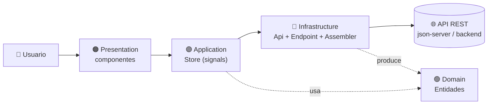
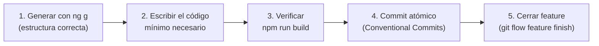
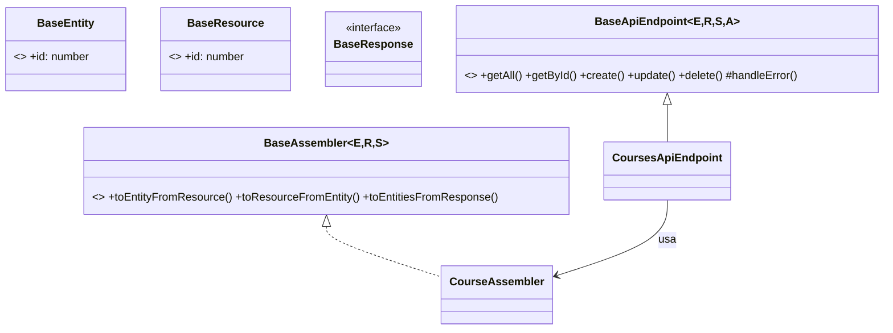
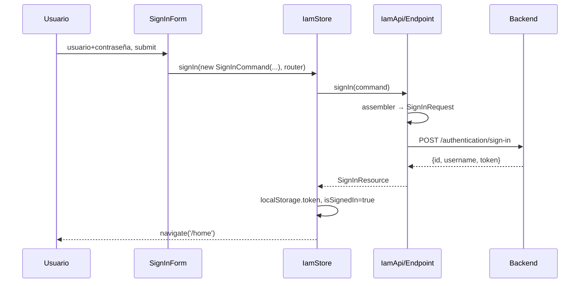
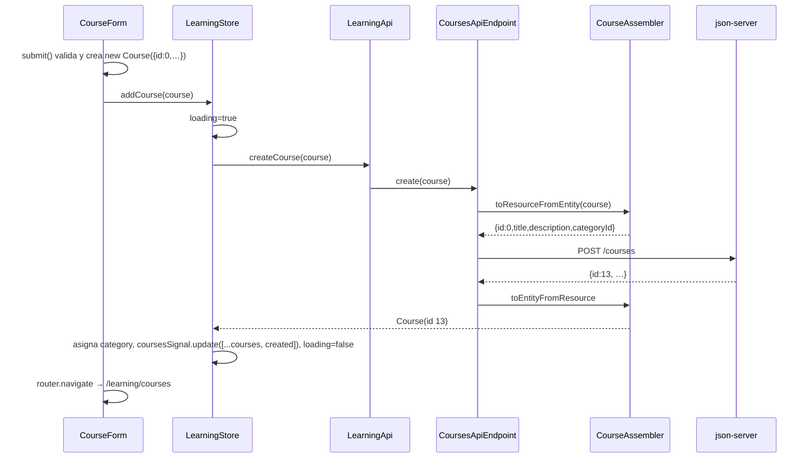

# 🧠 Guía de Explicación — Learning Center

## El "porqué" de cada pieza: arquitectura, funciones y ciclo de desarrollo

---

> [!IMPORTANT]
> Este documento es el compañero de [`learning-center-development-guide-claude.md`](./learning-center-development-guide-claude.md).
> - La **guía de desarrollo** dice *qué comando ejecutar y qué código escribir*, paso a paso.
> - **Esta guía** explica *por qué existe cada archivo, para qué sirve cada función, por qué el orden de trabajo es ese* y cómo encaja todo.
>
> Léelas en paralelo: haz un paso en la guía de desarrollo y lee su sección aquí (cada paso lleva un 📖 que apunta a una sección de este documento).

---

## Índice

1. [Qué es esta aplicación y qué problema resuelve](#1-qué-es-esta-aplicación-y-qué-problema-resuelve)
2. [El ciclo de desarrollo: por qué este orden](#2-el-ciclo-de-desarrollo-por-qué-este-orden)
3. [Fase 0 — Configuración del proyecto](#3-fase-0--configuración-del-proyecto)
4. [Shared — los contratos base](#4-shared--los-contratos-base)
5. [Learning / Domain — el corazón del negocio](#5-learning--domain--el-corazón-del-negocio)
6. [Learning / Infrastructure — hablar con el mundo exterior](#6-learning--infrastructure--hablar-con-el-mundo-exterior)
7. [Learning / Application — el Store y el estado reactivo](#7-learning--application--el-store-y-el-estado-reactivo)
8. [Presentation — vistas, formularios, shell y rutas](#8-presentation--vistas-formularios-shell-y-rutas)
9. [IAM — autenticación](#9-iam--autenticación)
10. [Documentación como código](#10-documentación-como-código)
11. [Trazas end-to-end: qué pasa cuando…](#11-trazas-end-to-end-qué-pasa-cuando)
12. [Glosario de conceptos](#12-glosario-de-conceptos)
13. [Rarezas y errores del proyecto original](#13-rarezas-y-errores-del-proyecto-original)
14. [Receta para añadir una feature nueva (y ejercicios)](#14-receta-para-añadir-una-feature-nueva-y-ejercicios)
15. [Preguntas de repaso](#15-preguntas-de-repaso)

---

# 1. Qué es esta aplicación y qué problema resuelve

**Learning Center** es un cliente web (SPA) para que un *Learning Manager* / *Course Organizer* administre **categorías** y **cursos**: listarlos, crearlos, editarlos y borrarlos; cada curso pertenece a una categoría. Además: interfaz en **inglés/español**, navegación con **rutas**, y (opcional) **autenticación**.

No es un producto grande a propósito: es un **vehículo de aprendizaje**. Con muy poca funcionalidad de negocio te obliga a practicar todo lo que se pide en un frontend profesional:

| Habilidad | Dónde se practica |
|:--|:--|
| Arquitectura en capas / DDD | Carpetas `domain`, `infrastructure`, `application`, `presentation` |
| Consumir una API REST | `BaseApiEndpoint`, `LearningApi` |
| Estado reactivo | `LearningStore` con *signals* |
| UI con componentes de librería | Angular Material (tabla, formulario, toolbar) |
| Formularios reactivos y validación | `CategoryForm`, `CourseForm`, `BaseForm` |
| Rutas, carga perezosa, protección | `app.routes.ts`, `learning.routes.ts`, `iamGuard` |
| Internacionalización | ngx-translate + `public/i18n/*.json` |
| Seguridad básica del cliente | `iamInterceptor`, token en `localStorage` |
| Flujo de trabajo profesional | GitFlow + Conventional Commits |

### El mapa mental (tenlo presente todo el tiempo)



Idea central: **cada capa tiene una sola responsabilidad y solo puede "mirar hacia adentro"**.

| Capa | Responsabilidad | Puede depender de | NO puede depender de |
|:--|:--|:--|:--|
| **Domain** | Qué *son* las cosas del negocio (`Course`, `Category`) | (casi nada) | Angular, HTTP, UI |
| **Infrastructure** | Cómo *hablar* con sistemas externos (HTTP, formato JSON) | Domain | UI, Store |
| **Application** | Qué *casos de uso* existen y cuál es el *estado* actual | Domain, Infrastructure | Componentes |
| **Presentation** | Cómo se *ve* y cómo interactúa el usuario | Application, Domain | (HTTP directo) |

**Por qué importa:** si mañana la API cambia `categoryId` por `category_id`, solo tocas un *Assembler*. Si cambias Material por otra librería, solo tocas `presentation`. Si cambias `json-server` por Spring Boot, solo cambian variables de entorno. Cada cambio queda **aislado**.

### Bounded Contexts (contextos delimitados)

El código se divide primero por **área de negocio** y luego por **capa**:

| Contexto | Contenido | Por qué está separado |
|:--|:--|:--|
| `learning` | Categorías y cursos | Es el negocio principal |
| `iam` | Usuarios, sign-in, sign-up, token | Identidad y acceso es otro "tema" con su propio vocabulario |
| `shared` | Piezas genéricas reutilizables | Lo que usan varios contextos sin pertenecer a ninguno |

Un contexto **no** debe importar cosas internas de otro (por ejemplo, `learning` no importa nada de `iam`). Excepción práctica en este proyecto: `Layout` (shared) importa `AuthenticationSection` (iam) y `app.routes.ts` importa `iamGuard`; es el "pegamento" de la aplicación, aceptable en la capa más externa.

---

# 2. El ciclo de desarrollo: por qué este orden

## 2.1 El orden de las fases

```
Fase 0  Configuración      → que el proyecto exista, compile y tenga sus herramientas
Fase 1  Shared base        → contratos genéricos reutilizables
Fase 2  Learning Domain    → qué es un curso y una categoría
Fase 3  Learning Infra     → cómo se traen/guardan desde la API
Fase 4  Learning App       → estado + casos de uso (Store)
Fase 5  Learning Presentation → pantallas de negocio
Fase 6  Shared Presentation   → cascarón (menú, idioma, footer) que las contiene
Fase 7  IAM                → agregar seguridad encima de algo que ya funciona
Fase 8  Docs               → documentar lo construido
```

Este orden es **"de adentro hacia afuera"** (*inside-out*): empiezas por lo que **no depende de nada** (Domain) y terminas por lo que **depende de todo** (Presentation).

### ¿Por qué de adentro hacia afuera?

1. **Nunca escribes código que referencia algo que aún no existe.** Cada archivo nuevo importa solo cosas ya creadas → el proyecto compila en cada paso (`npm run build` es tu red de seguridad).
2. **Las decisiones más estables van primero.** Qué es un `Course` cambia poco; cómo se pinta una tabla cambia mucho. Lo estable se construye primero para que lo volátil se apoye en ello.
3. **Cada capa se puede probar sin la siguiente.** El dominio se puede probar sin HTTP; el store se puede probar con una API simulada; los componentes con un store simulado.
4. **Los commits quedan atómicos y con significado:** "entidades", "infraestructura", "store", "vistas".

> **Alternativa (outside-in):** empezar por la pantalla y ir "bajando" hasta el dominio. Sirve cuando el dominio es desconocido y quieres descubrirlo desde la UI. Aquí el dominio ya está claro (categoría/curso), por eso se hace *inside-out*.

## 2.2 El ciclo dentro de cada fase

Para cada pieza nueva repites este mini-ciclo:



| Paso del ciclo | Por qué |
|:--|:--|
| **Generar con `ng g`** | El CLI crea archivos con nombres/rutas/decoradores correctos y consistentes; menos errores manuales |
| **Código mínimo** | Solo lo que esta fase necesita; lo demás llega en su fase |
| **Verificar** | Detectas el error cuando aún sabes qué lo causó (el último cambio) |
| **Commit atómico** | Un commit = una idea. Facilita revertir, revisar y entender el historial |
| **Feature finish** | Integra a `develop` solo trabajo completo y verificado |

## 2.3 GitFlow y Conventional Commits, explicados

**GitFlow** organiza ramas por propósito:

| Rama | Contiene | Regla |
|:--|:--|:--|
| `main` | Lo entregable | Solo recibe releases estables |
| `develop` | Integración de todo lo terminado | Base de cualquier feature |
| `feature/*` | Una funcionalidad en curso | Nace de `develop`, vuelve a `develop` |
| `docs/*` | Documentación | Igual que feature |

`git flow feature start X` = crea `feature/X` desde `develop` y te cambia a ella.
`git flow feature finish X` = fusiona `feature/X` en `develop` y borra la rama.

**Conventional Commits** = `tipo(alcance): descripción`.

| Tipo | Uso en el proyecto |
|:--|:--|
| `chore` | Configuración, dependencias (`chore: add angular material…`) |
| `feat` | Funcionalidad nueva (`feat(learning): add …`) |
| `docs` | Solo documentación |
| `fix` | Corrección de bug |
| `refactor` | Cambio interno sin cambiar comportamiento |

El **alcance** (`learning`, `shared`, `iam`, `i18n`) indica el *bounded context* afectado. Beneficios: historial legible, changelog automático posible, versionado semántico.

---

# 3. Fase 0 — Configuración del proyecto

## 3.1 `ng new learning-center --defaults`

**Qué hace:** crea el esqueleto de una aplicación Angular lista para compilar.

| Archivo generado | Para qué sirve |
|:--|:--|
| `src/main.ts` | **Punto de entrada.** Llama a `bootstrapApplication(App, appConfig)`: arranca el componente raíz con la configuración global |
| `src/index.html` | La única página HTML real. Contiene `<app-root>`, donde Angular "monta" toda la app (por eso se llama *Single Page Application*) |
| `src/app/app.ts` | Componente raíz `App` |
| `src/app/app.config.ts` | **Providers globales** (router, HTTP, i18n…). Es el "panel de servicios" de la app |
| `src/app/app.routes.ts` | Tabla de rutas (URL → componente) |
| `angular.json` | Cómo se construye/sirve/prueba el proyecto (builders, assets, estilos, budgets, `fileReplacements`) |
| `tsconfig*.json` | Reglas del compilador TypeScript |
| `package.json` | Dependencias y scripts (`start`, `build`, `test`) |
| `public/` | Archivos estáticos copiados tal cual al build (favicon, logo, **traducciones**) |

**Decisiones que Angular 21 toma por ti:**
- **Standalone components:** no hay `NgModule`. Cada componente declara en `imports: []` lo que usa su plantilla. Menos ceremonia, más claridad.
- **Zoneless:** Angular ya no parchea el navegador con `zone.js` para detectar cambios; se re-renderiza cuando cambian *signals* o ocurren eventos de la plantilla. Por eso el proyecto usa signals para el estado.
- **Vitest** como test runner.
- **Nombres sin sufijo:** `app.ts`, no `app.component.ts`.

**`tsconfig.json` estricto — impacto real en el código:**

| Opción | Efecto que verás |
|:--|:--|
| `strict: true` | No puedes dejar tipos ambiguos ni usar valores posiblemente `null` sin tratarlos (por eso los `!` y `??`) |
| `noPropertyAccessFromIndexSignature` | Obliga a escribir `params['id']` y no `params.id` (por eso en los formularios se ve `params['id']`) |
| `noImplicitOverride` | Al sobrescribir un método heredado debes escribir `override` |
| `strictTemplates` (Angular) | Los `.html` se revisan con tipos: un typo en una plantilla es error de compilación |

## 3.2 Repositorio y GitFlow

`git flow init` crea `develop`. El primer commit `chore: initial project setup…` deja una base limpia para que cada feature posterior sea un *diff* mínimo y legible.

## 3.3 Angular Material (`ng add`)

`ng add` ≠ `npm install`: además de instalar, **ejecuta un *schematic*** que configura el proyecto.

| Resultado | Por qué es necesario |
|:--|:--|
| `@angular/material` + `@angular/cdk` | Componentes (Material) + utilidades de bajo nivel (CDK: overlays, a11y…) |
| `src/material-theme.scss` | Define el **tema** Material 3 con `mat.theme(...)`. Genera variables CSS `--mat-sys-*` |
| Entrada en `angular.json → styles` | Sin esto el tema no se carga |
| Roboto + Material Icons en `index.html` | Tipografía y fuente de iconos (`<mat-icon>edit</mat-icon>` es solo texto que la fuente convierte en icono) |

Líneas clave de `material-theme.scss`:

```scss
@include mat.core();          // estilos base compartidos de Material
:root { @include mat.toolbar-overrides((container-background-color: slategray, container-text-color: white)); }
html  { @include mat.theme((color: (primary: azure, tertiary: blue), typography: Roboto, density: 0)); }
body  { color-scheme: light; background-color: var(--mat-sys-surface); ... }
```

- `toolbar-overrides` cambia solo el aspecto de la barra superior (gris pizarra + texto blanco) sin tocar el tema entero.
- `density: 0` = tamaño estándar (valores negativos compactan).
- `color-scheme: light` fija tema claro (`light dark` seguiría al sistema).

`styles.css` añade solo lo global mínimo: altura 100%, fuente, y la clase utilitaria `.container-with-spacing` (margen de 10px) usada por Home/About/404.

## 3.4 Entornos (`ng g environments`)

**Problema:** la URL de la API es distinta en desarrollo y producción; no debe estar "escrita a fuego" en cada servicio.

**Solución:** dos archivos con la misma forma (`environment`) y un `fileReplacements` en `angular.json`: al compilar en configuración *development* Angular **sustituye** `environment.ts` por `environment.development.ts`. El código siempre importa `environment.ts`, y recibe el valor correcto según el modo.

| Variable | Uso |
|:--|:--|
| `platformProviderApiBaseUrl` | Base de la API (`http://localhost:3000/api/v1`) |
| `platformProvider…EndpointPath` | Rutas por recurso (`/categories`, `/courses`, `/authentication/sign-in`…) |

Separar *base* y *path* permite cambiar de servidor sin tocar rutas, y añadir recursos sin tocar la base. Los archivos de entorno terminan **dentro del bundle del navegador**: nunca pongas secretos reales aquí.

## 3.5 HttpClient e i18n en `app.config.ts`

```typescript
provideBrowserGlobalErrorListeners()   // captura errores globales del navegador para reportarlos
provideRouter(routes)                  // activa el router con la tabla de rutas
provideHttpClient(withFetch(), withInterceptors([iamInterceptor]))
provideTranslateService({ loader: provideTranslateHttpLoader({prefix:'./i18n/', suffix:'.json'}), fallbackLang:'en' })
```

| Provider | Qué habilita | Por qué |
|:--|:--|:--|
| `provideHttpClient` | Inyectar `HttpClient` | Sin él, `inject(HttpClient)` falla |
| `withFetch()` | Usa la API `fetch` del navegador en vez de XHR | Moderna y necesaria si algún día hay SSR |
| `withInterceptors([...])` | Encadena interceptores funcionales | Añadir el token a cada petición sin repetir código |
| `provideTranslateService` | Servicio de traducción | Cambiar idioma **en ejecución** sin recargar |
| `provideTranslateHttpLoader` | Carga `./i18n/<lang>.json` por HTTP | Los textos viven en `public/i18n/` |
| `fallbackLang: 'en'` | Si falta una clave en el idioma activo, usa inglés | Evita mostrar claves crudas |

**Cómo funciona ngx-translate:** en las plantillas escribes `{{ 'option.home' | translate }}`. El pipe busca la clave `option.home` en el JSON del idioma activo (`en.json`/`es.json`, con anidación por puntos). Al llamar `translate.use('es')` todos los pipes se actualizan. Las claves están agrupadas por pantalla (`categories.*`, `category.*`, `courses.*`, `course.*`, `footer.*`…) para encontrarlas fácilmente.

> Convención del proyecto: `categories`/`courses` (plural) = **lista**; `category`/`course` (singular) = **formulario**.

## 3.6 json-server: una API falsa

**Para qué:** desarrollar el frontend **sin esperar un backend**. `json-server` lee `db.json` y expone automáticamente un CRUD REST por cada colección (`categories`, `courses`).

| Archivo | Función |
|:--|:--|
| `server/db.json` | La "base de datos" (JSON). Cada POST/PUT/DELETE la modifica de verdad |
| `server/routes.json` | `"/api/v1/:*": "/:$1"` reescribe `/api/v1/courses` → `/courses`. Así la URL del frontend ya luce como la de un backend real |
| `--port 3000` | Puerto (por eso `platformProviderApiBaseUrl` apunta a `:3000`) |

Comportamiento clave para entender el código: **`GET /courses` devuelve un arreglo JSON directo** (`[ {...}, {...} ]`), no un objeto `{courses: [...]}`. Un backend real suele devolver un *envelope* (sobre). Por eso `BaseApiEndpoint.getAll()` soporta **ambos** formatos (ver 4.4).

---

# 4. Shared — los contratos base

**Idea:** categorías y cursos hacen las mismas 5 operaciones (listar, obtener, crear, actualizar, borrar). En vez de escribir HTTP cinco veces por recurso, se escribe **una vez** una versión genérica y cada recurso solo la "configura". Esto es el principio **DRY** aplicado con *generics* de TypeScript.



## 4.1 `BaseEntity` (Domain)

```typescript
export interface BaseEntity { id: number; }
```
Contrato mínimo: **toda entidad tiene identidad numérica**. Es lo que permite a `BaseApiEndpoint` escribir `${url}/${id}` sin saber si es un curso o una categoría. Vive en **domain** porque "tener identidad" es un concepto de dominio (una *Entity* en DDD se distingue por su id, no por sus atributos).

## 4.2 `BaseResource` y `BaseResponse` (Infrastructure)

| Tipo | Significado | Ejemplo |
|:--|:--|:--|
| `BaseResource` | **Un** registro tal como viaja por la red (JSON crudo tipado) | `{ id: 3, title: "…", categoryId: 2 }` |
| `BaseResponse` | El **sobre** completo de una respuesta de colección | `{ courses: [ …resources… ] }` |

`BaseResponse` es una interfaz **vacía** ("marcador"): solo etiqueta el tipo; cada contexto le añade sus campos. Son tipos de **infraestructura**, no de dominio: describen el formato de *ese* servidor. Por eso este proyecto **evita la palabra DTO** y usa *resource / request / response*: nombres más precisos sobre su rol.

## 4.3 `BaseAssembler<TEntity, TResource, TResponse>`

Interfaz con tres métodos de traducción:

| Método | Dirección | Cuándo se usa |
|:--|:--|:--|
| `toEntityFromResource(resource)` | API → Dominio | Al recibir un registro |
| `toResourceFromEntity(entity)` | Dominio → API | Al enviar (POST/PUT) |
| `toEntitiesFromResponse(response)` | API → Dominio (lista) | Al recibir un sobre de colección |

**Por qué existe:** el dominio no debería conocer el formato JSON. Si la API llama `category_id` a lo que tu dominio llama `categoryId`, el Assembler es el único lugar donde se resuelve. Es un **anti-corruption layer** ligero.

## 4.4 `BaseApiEndpoint<…>` — el CRUD genérico

Es una clase `abstract` (no se instancia directamente) con cuatro parámetros de tipo:

```typescript
BaseApiEndpoint<TEntity, TResource, TResponse, TAssembler extends BaseAssembler<TEntity, TResource, TResponse>>
```

Su constructor recibe tres cosas: `http`, `endpointUrl` y `assembler`. Cada método sigue el mismo patrón: **llamada HTTP → `map` con el assembler → `catchError`**.

| Método | HTTP | Qué hace |
|:--|:--|:--|
| `getAll()` | `GET /recurso` | Si la respuesta es **arreglo** → mapea cada elemento; si es **objeto** → `assembler.toEntitiesFromResponse`. Así funciona con json-server *y* con backends con envelope |
| `getById(id)` | `GET /recurso/:id` | Un registro → una entidad |
| `create(entity)` | `POST /recurso` | Convierte entidad→resource, envía, y devuelve la entidad **creada** (con el id asignado por el servidor) |
| `update(entity, id)` | `PUT /recurso/:id` | Igual, para actualizar |
| `delete(id)` | `DELETE /recurso/:id` | Sin cuerpo; devuelve `Observable<void>` |
| `handleError(op)` | — | **Fábrica** de manejadores: devuelve una función que traduce un `HttpErrorResponse` a un `Error` con mensaje legible (404 → "Resource not found", error de red → mensaje del evento, otro → código HTTP) |

Puntos de diseño importantes:
- **`protected constructor`**: solo las subclases pueden construirla.
- **`Observable`**: HTTP en Angular es asíncrono y "perezoso": no se ejecuta hasta que alguien hace `subscribe`. El endpoint solo *describe* la operación; el Store decide cuándo ejecutarla.
- **`pipe(map(...), catchError(...))`**: `map` transforma el valor cuando llega; `catchError` convierte errores HTTP crudos en `Error` propios. Los errores se **normalizan** aquí para que capas superiores no conozcan `HttpErrorResponse`.
- **`throwError(() => new Error(msg))`**: mantiene el flujo como error para que el `subscribe({error})` del Store lo reciba.

## 4.5 `BaseApi`

Clase abstracta **vacía** que sirve de *marcador de rol*: "esto es una fachada de infraestructura". No añade comportamiento; documenta la arquitectura y permite, si mañana hace falta, añadir lógica común (por ejemplo logging) en un solo lugar.

## 4.6 `ErrorHandlingEnabledBaseType` (se crea en la fase IAM)

Copia de la lógica de `handleError` para clases que **no** son CRUD genérico (sign-in y sign-up solo hacen un POST). Es una clase base con un único método protegido para no duplicar el manejo de errores. (Observación: existe duplicación con `BaseApiEndpoint.handleError`; una mejora sería que `BaseApiEndpoint` extendiera esta clase.)

---

# 5. Learning / Domain — el corazón del negocio

**Regla de oro:** esta capa es TypeScript puro. **No importa Angular, ni HTTP, ni Material.** Se podría copiar a un proyecto Node y funcionaría.

## 5.1 `Category` (entidad)

```typescript
export class Category implements BaseEntity {
  constructor(props: { id: number; name: string }) {...}
  get id() / set id(...) ; get name() / set name(...)
}
```

| Decisión | Porqué |
|:--|:--|
| `implements BaseEntity` | Declara y hace verificar por el compilador que cumple el contrato de identidad |
| Campos privados `_id`, `_name` + getters/setters | **Encapsulación**: hoy los setters no validan nada, pero es el punto donde mañana pondrías reglas ("nombre no vacío") sin romper a nadie |
| Constructor con objeto `props` | Parámetros con nombre: `new Category({id: 1, name: 'Java'})` es legible y evita confundir el orden |

## 5.2 `Course` (aggregate root)

Campos: `id`, `title`, `description`, `categoryId` **y** `category` (objeto `Category | null`).

**El detalle más importante del dominio:** la API solo envía `categoryId` (un número, como una clave foránea). Pero la UI quiere mostrar el *nombre* de la categoría. Por eso el curso tiene **dos** campos:

| Campo | Origen |
|:--|:--|
| `categoryId` | Viene del servidor (dato persistido) |
| `category` | **Se calcula en el cliente** (lo asigna el Store buscando el id entre las categorías cargadas). Por defecto `null` |

Es un **"join" en el cliente**. Por eso `category` es opcional en el constructor (`category?: Category | null`).

**¿Aggregate root?** En DDD, un *aggregate* es un grupo de objetos que se tratan como una unidad y tiene una raíz por la que se accede. Aquí `Course` referencia a `Category`, y el proyecto lo documenta como raíz. (Sé consciente: en sentido estricto, `Category` tiene su propio ciclo de vida y CRUD independiente, así que es un uso didáctico del término.)

---

# 6. Learning / Infrastructure — hablar con el mundo exterior

Esta capa contiene todo lo que sabe que existe **HTTP y JSON**. Sus archivos, de afuera hacia adentro:

```
LearningApi (fachada, @Injectable)
  ├── CategoriesApiEndpoint ──usa──> CategoryAssembler ──> categories-response.ts
  └── CoursesApiEndpoint   ──usa──> CourseAssembler   ──> courses-response.ts
        (ambos extienden BaseApiEndpoint)
```

## 6.1 `*-response.ts` — contratos de la API

Para cada recurso, dos interfaces:

```typescript
interface CourseResource extends BaseResource { id; title; description; categoryId }
interface CoursesResponse extends BaseResponse { courses: CourseResource[] }
```

- **Por qué interfaces y no clases:** solo describen datos que llegan por JSON; no tienen comportamiento. Desaparecen al compilar (cero coste).
- **Por qué existen aunque json-server devuelva un arreglo:** documentan el contrato con un backend real y satisfacen los parámetros genéricos de `BaseApiEndpoint`.
- Hay **dos formas de la misma cosa** (Resource vs Entity) a propósito: la Entity tiene getters, `category`, reglas; el Resource es el JSON tal cual.

## 6.2 `*Assembler` — el traductor

`CourseAssembler.toEntityFromResource` construye un `Course` a partir del JSON; `toResourceFromEntity` hace lo inverso. Fíjate en qué **no** envía: `category` (el objeto) — solo `categoryId`. Eso mantiene el payload igual al esquema del servidor.

Los assemblers **no llevan `@Injectable`**: son clases simples sin dependencias, que el endpoint crea con `new`. (En la guía CatchUp, en cambio, los assemblers sí usan `inject()` porque necesitan otro servicio.)

## 6.3 `*ApiEndpoint` — configurar el genérico

```typescript
export class CoursesApiEndpoint extends BaseApiEndpoint<Course, CourseResource, CoursesResponse, CourseAssembler> {
  constructor(http: HttpClient) { super(http, `${base}${path}`, new CourseAssembler()); }
}
```

Toda la clase es **configuración**: le dice al genérico *qué tipos* maneja, *qué URL* usa y *qué assembler* traduce. Con ~8 líneas obtienes un CRUD completo. Añadir un nuevo recurso (p. ej. `lessons`) = copiar este patrón.

La URL se calcula concatenando `environment.platformProviderApiBaseUrl + …EndpointPath`.

## 6.4 `LearningApi` — la fachada

```typescript
@Injectable({ providedIn: 'root' })
export class LearningApi extends BaseApi {
  constructor(http: HttpClient) { … new CoursesApiEndpoint(http) … }
  getCourses() { return this.coursesEndpoint.getAll(); }  …
}
```

| Aspecto | Explicación |
|:--|:--|
| **Fachada (Facade)** | Un solo punto de entrada para todo el contexto: el Store solo conoce `LearningApi`, no los endpoints ni los assemblers |
| **`@Injectable({providedIn:'root'})`** | Registra el servicio como *singleton* global; Angular lo crea la primera vez que alguien lo inyecta |
| **Recibe `HttpClient` en el constructor** | Angular lo inyecta; luego lo pasa a los endpoints (que no son inyectables) |
| **Nombres de dominio** | `getCourses`, `createCategory`… traducen el vocabulario del negocio a los métodos genéricos (`getAll`, `create`) |
| **`updateCourse(course)`** | Usa `course.id` como parámetro `id` de `update(entity, id)`, garantizando que la URL apunte al recurso correcto |

---

# 7. Learning / Application — el Store y el estado reactivo

## 7.1 ¿Qué es la capa Application?

Es el **orquestador**. No pinta pantallas (eso es Presentation) ni conoce HTTP (eso es Infrastructure). Responde a: *"el usuario quiere borrar un curso: ¿qué pasos hay que dar y cuál es el estado resultante?"*.

Aquí ese rol lo cumple `LearningStore`, un servicio singleton con **estado reactivo basado en signals**.

## 7.2 Signals en 60 segundos

| API | Qué es | Uso en el Store |
|:--|:--|:--|
| `signal(valor)` | Contenedor reactivo de un valor; se lee llamándolo: `s()`; se cambia con `.set()` / `.update(fn)` | `coursesSignal = signal<Course[]>([])` |
| `.asReadonly()` | Versión de solo lectura | Se exporta `courses`; solo el Store puede modificar `coursesSignal` |
| `computed(fn)` | Valor **derivado** que se recalcula solo cuando cambian los signals que lee | `courseCount = computed(() => courses().length)` |

Patrón **privado escribible / público de solo lectura** (`xSignal` / `x`): garantiza que **el estado solo cambia mediante métodos del Store** (flujo de datos unidireccional). Un componente no puede hacer `store.courses.set(...)`.

Como la app es *zoneless*, leer un signal dentro de una plantilla (`store.loading()`) hace que Angular sepa qué re-renderizar cuando cambia.

## 7.3 Estado que expone el Store

| Signal | Tipo | Para qué |
|:--|:--|:--|
| `courses` / `categories` | `Course[]` / `Category[]` | Las listas que muestran las tablas |
| `loading` | `boolean` | Mostrar el `mat-spinner` mientras hay operaciones |
| `error` | `string \| null` | Mostrar el mensaje de error en las listas |
| `courseCount`, `categoryCount` | `computed` | Contadores derivados (hoy no se usan en UI; ejemplo de `computed`) |

## 7.4 Carga inicial en el constructor

```typescript
constructor(private learningApi: LearningApi) {
  this.loadCategories();
  this.loadCourses();
}
```
Como el Store es `providedIn: 'root'`, se crea **una sola vez**, la primera vez que un componente lo inyecta. Al crearse, dispara la carga. Consecuencia: los datos quedan **en memoria** y sobreviven a la navegación entre pantallas — no se vuelve a pedir la lista cada vez que cambias de vista.

### `loadCourses()` / `loadCategories()` paso a paso
1. `loading = true`, `error = null` → la UI muestra el spinner.
2. `learningApi.getCourses()` → un `Observable`.
3. `.pipe(takeUntilDestroyed())` → cancela la suscripción si el contexto de inyección se destruye (evita fugas de memoria). Funciona porque se llama dentro del constructor (contexto de inyección).
4. `.subscribe({ next, error })`:
   - `next`: guarda la lista, `loading=false`, y (en cursos) llama `assignCategoriesToCourses()`.
   - `error`: guarda un mensaje legible y `loading=false`.

## 7.5 Operaciones de escritura (`add…`, `update…`, `delete…`)

Todas siguen el **mismo molde**:

```typescript
this.loadingSignal.set(true);
this.errorSignal.set(null);
this.learningApi.createCourse(course).pipe(retry(2)).subscribe({
  next: created => { /* actualizar la lista local */ loading=false },
  error: err => { error=formatError(err,…); loading=false }
});
```

| Pieza | Porqué |
|:--|:--|
| Poner `loading` y limpiar `error` al inicio | Estado consistente desde el primer instante |
| `retry(2)` | Si la petición falla, se **reintenta hasta 2 veces más** antes de propagar el error. Absorbe fallos de red transitorios. ⚠️ En operaciones **no idempotentes** (POST) puede crear duplicados si el servidor sí procesó la primera pero la respuesta se perdió |
| **Actualizar la lista local sin volver a pedirla** | `update(fn)` con `[...courses, created]` (añadir), `.map` (reemplazar) o `.filter` (quitar). Es una **actualización inmutable**: se crea un array nuevo → el signal detecta el cambio. Evita otro GET |
| `formatError` | Convierte cualquier error en `string` amigable; si el mensaje contiene "Resource not found" lo transforma en `"<fallback>: Not found"` |

## 7.6 Búsquedas por id como signals

```typescript
getCourseById(id: number): Signal<Course | undefined> {
  return computed(() => (id ? this.courses().find(c => c.id === id) : undefined));
}
```
Devuelve un **signal calculado**: al llamarlo `getCourseById(3)()` obtienes el curso o `undefined`. Los formularios lo usan para precargar datos al editar. `(id ? … : undefined)` evita buscar con `0`/`null`.

## 7.7 `assignCategoryToCourse` — el "join"

```typescript
course.category = categoryId ? (this.getCategoryById(categoryId)() ?? null) : null;
```
Completa el campo `category` del curso a partir de las categorías ya cargadas. Se ejecuta:
- Al cargar cursos (`assignCategoriesToCourses` los recorre todos).
- Al crear/actualizar un curso.

Por eso la tabla puede mostrar `course.category?.name`.

> ⚠️ **Condición de carrera:** `loadCategories()` y `loadCourses()` son peticiones paralelas. Si los cursos llegan **antes** que las categorías, `assignCategoriesToCourses()` no encuentra categorías y deja `category = null` (la tabla mostraría "None"). Con `json-server` local casi siempre llega bien por velocidad, pero no está garantizado. Solución robusta: `forkJoin`/`combineLatest`, o un `computed` que una ambas listas al leer.

---

# 8. Presentation — vistas, formularios, shell y rutas

Regla: **los componentes no tienen lógica de negocio ni saben de HTTP.** Inyectan el Store, leen signals, y llaman métodos del Store en respuesta a eventos del usuario.

## 8.1 Anatomía de un componente standalone

```typescript
@Component({
  selector: 'app-category-list',        // etiqueta HTML (no usada: se carga por ruta)
  imports: [MatTableModule, TranslatePipe, …],  // todo lo que su plantilla usa
  templateUrl: './category-list.html',
  styleUrl: './category-list.css'
})
export class CategoryList { readonly store = inject(LearningStore); }
```

- **`imports`**: si la plantilla usa `<mat-spinner>` o `| translate`, esa directiva/pipe debe estar aquí; si no, error de compilación (gracias a `strictTemplates`). Por eso las listas de imports son largas.
- **`inject(LearningStore)`**: la forma moderna de pedir dependencias (equivalente a un parámetro de constructor).
- **`.html` con control flow nuevo:** `@if (…) { }`, `@for (x of xs; track x.id) { }`. `track` ayuda a Angular a reutilizar elementos del DOM al cambiar la lista.
- **Estilos** (`.css`) encapsulados por componente.

## 8.2 `CategoryList` y `CourseList` — tablas Material

| Elemento | Qué hace |
|:--|:--|
| `store.loading()` / `store.error()` | `@if` para spinner y mensaje de error |
| `<table mat-table [dataSource]>` | Tabla Material. Cada columna se declara con `<ng-container matColumnDef="id">` con su celda de cabecera (`*matHeaderCellDef`) y de datos (`*matCellDef="let category"`) |
| `displayedColumns` | Lista ordenada de columnas a mostrar |
| `matSort` / `mat-sort-header` | Ordenar por columna al hacer clic en la cabecera |
| `<mat-paginator>` | Paginación (5/10/20 filas) |
| Botones `mat-icon-button` | Editar → `router.navigate([… , id, 'edit'])`; Borrar → `store.deleteX(id)` |
| `aria-label` traducido | Accesibilidad: lector de pantalla entiende iconos sin texto |
| Botón "Nueva…" | Navega a `/new` |

### El truco de `dataSource` + `AfterViewChecked`

```typescript
dataSource = computed(() => {
  const source = new MatTableDataSource(this.store.categories());
  source.sort = this.sort;
  source.paginator = this.paginator;
  return source;
});
ngAfterViewChecked() { /* si sort/paginator no coinciden, reasignarlos */ }
```

- `MatTableDataSource` es el objeto que sabe **ordenar y paginar en el cliente**.
- `computed` lo **reconstruye** cada vez que cambia la lista del Store → la tabla se actualiza sola tras crear/borrar.
- **Problema:** `@ViewChild(MatSort)` y `@ViewChild(MatPaginator)` solo existen **después** de que la vista se dibuja. La primera vez que corre el `computed`, valen `undefined`. `ngAfterViewChecked` (se ejecuta tras cada revisión de la vista) los **re-conecta** al data source cuando ya existen. Es una solución práctica a un problema de orden de inicialización.

## 8.3 `CategoryForm` y `CourseForm` — formularios reactivos

**Reactive forms:** el formulario se define **en TypeScript** (no en la plantilla), lo que lo hace testeable y tipado.

```typescript
form = this.fb.group({
  name: new FormControl<string>('', { nonNullable: true, validators: [Validators.required] })
});
```
- `FormBuilder.group` crea un `FormGroup`.
- `nonNullable: true` → al hacer `reset` vuelve a `''`, no a `null`, y el tipo es `string` (no `string | null`).
- `Validators.required` → el control es inválido si está vacío.
- En la plantilla: `[formGroup]="form"`, `formControlName="name"`, `(ngSubmit)="submit()"`.

### Un componente, dos modos (crear / editar)

Las rutas `courses/new` y `courses/:id/edit` cargan **el mismo componente**. Se distingue por el parámetro de ruta:

```typescript
this.route.params.subscribe(params => {
  this.courseId = params['id'] ? +params['id'] : null;   // "+" convierte string→number
  this.isEdit = !!this.courseId;
  if (this.isEdit) { …precargar con form.patchValue(store.getCourseById(id)()) }
});
```
- Si hay `id` → **modo edición**: precarga el formulario con `patchValue`.
- Si no → **modo creación**: formulario vacío.
- La plantilla cambia títulos y textos del botón con `isEdit` y traducción: `{{ (isEdit ? 'course.update' : 'course.create') | translate }}`.

### `submit()`
1. Si el formulario es inválido, sale sin hacer nada.
2. Construye una **entidad** (`new Course({...})`) — con `id = courseId ?? 0` (0 = "aún sin id").
3. Llama `store.updateCourse` o `store.addCourse`.
4. Navega a la lista con `router.navigate([...]).then()` (`.then()` sin argumentos solo marca la promesa como manejada).

En `CourseForm`, el `<mat-select>` se llena con `@for` sobre `categories()` (signal del Store) y tiene una opción "None" con `[value]="null"`. Al guardar, `categoryId ?? 0`.

Mensajes de error: `@if (control.touched && control.hasError('required')) { <mat-error>…</mat-error> }` — solo aparece **después** de que el usuario interactúa con el campo. El botón se deshabilita con `[disabled]="form.invalid"`.

## 8.4 Rutas y *lazy loading*

**`learning.routes.ts`** define las 6 rutas del contexto, cada una con `loadComponent: () => import('…').then(m => m.Clase)`.

| Concepto | Explicación |
|:--|:--|
| `import()` dinámico | El navegador descarga el código del componente **solo cuando se visita esa ruta**. El build lo separa en *chunks* → carga inicial más rápida |
| `loadComponent` | Carga perezosa de **un componente** |
| `loadChildren` | Carga perezosa de **un conjunto de rutas** (en `app.routes.ts`: `learning`, `iam`) |
| `path: 'courses/:id/edit'` | `:id` es un **parámetro de ruta**, accesible en `route.params` |
| Rutas hijas relativas | Como `learning` se monta bajo `/learning`, `courses` resulta `/learning/courses` |

**`app.routes.ts`** (tabla raíz):

| Ruta | Comportamiento |
|:--|:--|
| `home` | Componente cargado directamente (es la primera pantalla, va en el bundle inicial) |
| `about` | Lazy |
| `learning` | Lazy, con `canActivate: [iamGuard]` |
| `iam` | Lazy (sign-in / sign-up) |
| `''` → `/home` | `redirectTo` con `pathMatch: 'full'` (solo si la ruta es exactamente vacía) |
| `**` | *Comodín*: cualquier cosa desconocida → `PageNotFound`. **Debe ser la última**, porque el router evalúa en orden |

`title:` fija el título de la pestaña del navegador para cada ruta.

## 8.5 El shell: `App` → `Layout`

```
index.html <app-root>
   └─ App (app.ts)          → registra idiomas
        └─ <app-layout/>    → Layout
              ├─ <mat-toolbar> (título, enlaces, [auth], idioma)
              ├─ <router-outlet/>   ← aquí se inyecta la vista de la ruta actual
              └─ <app-footer-content/>
```

- **`App`**: en el constructor hace `translate.addLangs(['en','es'])` y `translate.use('en')`. Sin `use()`, no hay idioma activo y aparecerían claves crudas.
- **`Layout`**: el marco visual permanente. `<router-outlet/>` es el "hueco" donde el router pinta el componente de la ruta actual. `options` es un `signal` con `{link, label}`; `@for` genera un `<a mat-button [routerLink]>` por cada opción, y `routerLinkActive="active"` añade la clase CSS `active` al enlace de la ruta vigente. `label` es una **clave i18n**, traducida con el pipe.
- **`LanguageSwitcher`**: lee los idiomas registrados (`getLangs()`), pinta un `mat-button-toggle-group` y `useLanguage(lang)` llama a `translate.use(lang)`.
- **`FooterContent`**: texto legal traducido; CSS lo fija abajo (`position: absolute; bottom: 0`).
- **`Home` / `About` / `PageNotFound`**: vistas simples. `PageNotFound` lee la URL inválida con `route.snapshot.url` y la inserta en la traducción mediante interpolación (`translate: { invalid_path: invalidPath }`) y `[innerHTML]` (porque el texto trae `<strong>`). Y un botón que navega a `home`.

---

# 9. IAM — autenticación

Se hace **al final** porque es una capa transversal que se apoya en algo que ya funciona: primero pruebas todo con rutas públicas, luego proteges.



## 9.1 Domain: Commands y Entity

- **`SignInCommand` / `SignUpCommand`**: un **Command** representa una *intención* del usuario ("quiero iniciar sesión con estos datos"), no una cosa persistente. Por eso no tienen `id` ni son `BaseEntity`. En `learning` se usan entidades (CRUD sobre datos); aquí, comandos (acciones). Contrastar ambos enfoques es parte del aprendizaje.
- **`User`**: entidad con `id` y `username` (nunca guarda la contraseña).

## 9.2 Infrastructure

| Pieza | Rol |
|:--|:--|
| `SignInRequest` / `SignUpRequest` | Forma exacta del cuerpo que espera el servidor |
| `SignInResponse` / `SignUpResponse` (+ `Resource`) | Forma de lo que devuelve |
| `SignInAssembler` / `SignUpAssembler` | `toRequestFromCommand` (Dominio→API) y `toResourceFromResponse` (API→resource) |
| `SignInApiEndpoint` / `SignUpApiEndpoint` | Cada uno hace un `POST` y aplica `catchError`. **No** extienden `BaseApiEndpoint` porque no son CRUD |
| `IamApi` | Fachada, como `LearningApi` |
| `iamGuard` | Protege rutas |
| `iamInterceptor` | Añade el token a las peticiones |

### `iamGuard` (`CanActivateFn`)
Función que el router ejecuta **antes** de activar una ruta: devuelve `true` (dejar pasar) o `false` (bloquear). Si el usuario no está autenticado redirige a `/iam/sign-in`. Usa `inject()` dentro de la función (los guards funcionales corren en un contexto de inyección). Se aplica en `app.routes.ts` a `home` y `learning`.

### `iamInterceptor` (`HttpInterceptorFn`)
Se ejecuta en **cada** petición de `HttpClient`. Si hay token, **clona** la petición (las peticiones son inmutables) añadiendo `Authorization: Bearer <token>`; si no, la deja pasar. Así ningún servicio tiene que preocuparse de autenticación.

## 9.3 Application: `IamStore`

Guarda el estado de sesión en signals (`isSignedIn`, `currentUsername`, `currentUserId`) y el token en `localStorage`.

| Método | Éxito | Error |
|:--|:--|:--|
| `signIn` | Guarda token, marca sesión, va a `/home` | Limpia estado, vuelve a `/iam/sign-in` |
| `signUp` | Va a `/iam/sign-in` | Limpia estado, vuelve a `/iam/sign-up` |
| `signOut` | Borra token, limpia estado, va a `/iam/sign-in` | — |

`currentToken = computed(() => isSignedIn() ? localStorage.getItem('token') : null)`: el token solo se expone si hay sesión.

Recibe el `Router` como parámetro de los métodos (decisión del proyecto para que la navegación post-login viva en el Store); una alternativa es inyectarlo en el Store.

## 9.4 Presentation

- **`BaseForm`** (en *shared*): clase base con helpers de validación (`isInvalidControl`, `errorMessagesForControl`) reutilizables por cualquier formulario; `SignInForm` y `SignUpForm` la **extienden**. Los métodos son `protected`, accesibles desde la plantilla de la subclase.
- **`SignInForm` / `SignUpForm`**: `FormGroup` con `username` y `password` obligatorios; al enviar crean el Command y llaman al Store.
- **`AuthenticationSection`**: en el toolbar, `@if (store.isSignedIn())` muestra "Welcome, X | Sign-Out"; si no, "Sign-In | Sign-Up".
- **`iam.routes.ts`**: `sign-in` y `sign-up`, lazy.

---

# 10. Documentación como código

| Archivo | Para qué |
|:--|:--|
| `README.md` | Cómo instalar, correr y entender el proyecto; convenciones de nombres DDD |
| `docs/user-stories.md` | **Qué** debe hacer el sistema, en lenguaje del negocio (*As a… I want… so that…* + criterios Given/When/Then). US001 categorías, US002 cursos, US003 idioma, US004 errores, US005 navegación |
| `docs/class-diagram.puml` | Diagrama de clases PlantUML: versionable en Git, se regenera desde texto |
| `LICENSE.md` | Términos de uso (MIT) |

"Docs as code": la documentación vive en el repo, se revisa en PRs y evoluciona con el código. Convención de comentarios TSDoc del proyecto: describir *responsabilidad de capa*, *traducción entre fronteras* e *intención de negocio*; usar `Entity`, `Command`, `Assembler`, `Application Store`; llamar `resource/request/response` (no DTO) a los contratos de infraestructura.

---

# 11. Trazas end-to-end: qué pasa cuando…

## 11.1 Abro `/learning/courses`

1. El router hace match con `learning` (lazy) → descarga `learning.routes` → match `courses` → descarga `CourseList`.
2. (Con IAM activo, antes corre `iamGuard`.)
3. `CourseList` se instancia y hace `inject(LearningStore)`. Si es la **primera** vez: se crea el Store → constructor → `loadCategories()` + `loadCourses()`.
4. `loading=true` → la plantilla muestra el `mat-spinner`.
5. `HttpClient` hace `GET http://localhost:3000/api/v1/courses`; el **interceptor** añade el token si existe.
6. json-server responde `[ {…}, … ]` → `BaseApiEndpoint.getAll` detecta `Array.isArray` → cada elemento pasa por `CourseAssembler.toEntityFromResource` → `Course[]`.
7. El Store hace `coursesSignal.set(courses)`, `loading=false`, y asigna las categorías.
8. Los signals cambiaron → `dataSource` (computed) se recalcula → la tabla se re-renderiza.

## 11.2 Creo un curso


La lista ya contiene el nuevo curso porque el Store lo añadió localmente; no hace falta otro GET.

## 11.3 Edito un curso
`/learning/courses/5/edit` → `CourseForm` lee `params['id']=5` → `isEdit=true` → `store.getCourseById(5)()` → `patchValue` → el usuario cambia y envía → `store.updateCourse` → `PUT /courses/5` → el Store reemplaza el curso por `id` con `.map`.

## 11.4 Borro una categoría
Clic en 🗑 → `store.deleteCategory(id)` → `DELETE /categories/id` → en `next`, `.filter(c => c.id !== id)`.
⚠️ Los cursos que apuntaban a esa categoría **conservan** su `categoryId` (dato huérfano) y su objeto `category` en memoria; el proyecto no maneja la integridad referencial.

## 11.5 Cambio de idioma
Clic en "ES" → `useLanguage('es')` → `translate.use('es')` → el loader descarga `./i18n/es.json` (una vez) → todos los `| translate` se actualizan sin recargar.

## 11.6 Sin sesión visito `/learning/courses`
Router → `iamGuard` → `store.isSignedIn()` es `false` → `router.navigate(['/iam/sign-in'])` y devuelve `false` → se carga `SignInForm`.
Tras `signIn` exitoso: token en `localStorage`, `isSignedIn=true` → `/home`; a partir de ahí el interceptor adjunta `Authorization: Bearer …` a cada petición.

---

# 12. Glosario de conceptos

| Concepto | Definición corta | Dónde se ve |
|:--|:--|:--|
| **Bounded Context** | Subdominio con su propio modelo y vocabulario | `learning`, `iam`, `shared` |
| **Entity** | Objeto definido por su identidad (`id`) | `Category`, `Course`, `User` |
| **Value Object** | Objeto definido por sus valores, sin identidad | (No usado aquí; sí en CatchUp: `Url`, `DateTime`) |
| **Aggregate Root** | Entrada única a un grupo de objetos coherente | `Course` (didáctico) |
| **Command** | Objeto que expresa una intención de acción | `SignInCommand` |
| **Resource / Response / Request** | Contratos de datos de la red | `CourseResource`, `SignInRequest` |
| **Assembler** | Traduce entre contratos de red y entidades | `CourseAssembler` |
| **Facade** | Interfaz única que oculta varios subsistemas | `LearningApi`, `IamApi` |
| **Application Store** | Servicio que orquesta casos de uso y guarda estado | `LearningStore`, `IamStore` |
| **Standalone component** | Componente sin NgModule | Todos |
| **Signal** | Valor reactivo de lectura sincrónica | Estado de los Stores |
| **computed** | Signal derivado y memoizado | `courseCount`, `dataSource` |
| **Observable** | Flujo asíncrono perezoso (RxJS) | Retorno de `LearningApi` |
| **`pipe` / `map` / `catchError` / `retry`** | Operadores RxJS: transformar / manejar error / reintentar | Endpoints y Store |
| **`subscribe`** | Ejecuta el Observable y recibe resultados | Store |
| **`inject()`** | Obtiene una dependencia del inyector | Componentes, guards, interceptors |
| **`providedIn: 'root'`** | Singleton global de un servicio | Stores, APIs |
| **Lazy loading** | Descargar código solo cuando se necesita | `loadComponent`, `loadChildren` |
| **Guard** | Función que permite/bloquea una navegación | `iamGuard` |
| **Interceptor** | Función que intercepta cada petición HTTP | `iamInterceptor` |
| **Reactive Form** | Formulario definido en TS con `FormGroup/FormControl` | `CategoryForm` |
| **Generics** | Tipos parametrizados (`<T>`) | `BaseApiEndpoint<E,R,S,A>` |
| **i18n** | Internacionalización (varios idiomas) | ngx-translate |
| **GitFlow** | Modelo de ramas `main/develop/feature` | Flujo de trabajo |
| **Conventional Commits** | Formato estándar de mensajes de commit | Historial |

---

# 13. Rarezas y errores del proyecto original

Aprender a **leer código imperfecto** también es parte del oficio. Estos son los hallazgos al analizar el proyecto terminado (algunos ya corregidos en la guía de desarrollo):

| # | Hallazgo | Impacto | ¿Corregido en la guía? |
|:--|:--|:--|:--|
| 1 | Archivo `couse.entity.ts` (typo por `course`) | Solo estético; imports lo arrastran | Sí (`course.entity.ts`) |
| 2 | `addCourse` usa el curso **enviado** (`id: 0`) en vez del **creado** | Tras crear, la lista muestra un curso con id 0 (editar/borrar apuntaría a `/courses/0`) hasta recargar | Sí |
| 3 | `es.json` usa `{{ invalidPath }}`; `en.json` y el código usan `invalid_path` | En español el 404 no muestra la ruta | Sí |
| 4 | `sign-up-form.html` titula y rotula el botón "Sign-In" | Confuso para el usuario | Sí |
| 5 | `UsersResponse` tiene la propiedad `courses` | Copiar-pegar; debería ser `users` | Sí |
| 6 | En `BaseApiEndpoint.handleError`: `` `${error.status} || 'Unexpected error'` `` | El `||` queda como texto literal | Sí |
| 7 | Puerto/URL: env *development* → `localhost:8080`; README → `3000`; README dice que prod usa `8080` pero es MockAPI | Confusión al configurar | Parcial (se usa 3000 y se explica) |
| 8 | README dice que IAM "no está habilitado", pero `app.routes.ts` ya lo activa con `iamGuard` | Documentación desactualizada | Nota |
| 9 | Condición de carrera categorías/cursos (ver 7.7) | A veces `category` queda en `null` | No (se explica) |
| 10 | `isSignedIn` vive solo en memoria: al refrescar (F5) se pierde la sesión aunque el token siga en `localStorage` | El guard te manda a sign-in tras cada recarga | No (se explica) |
| 11 | `retry(2)` también en POST/DELETE | Posibles duplicados | No (se explica) |
| 12 | `app.spec.ts` espera "Hello, learning-center" | El test por defecto falla | Sí (se reemplaza) |
| 13 | `console.log` de depuración en varios archivos (`iam.guard`, `iam.interceptor` —imprime el token—, `learning.store`, assemblers, `iam.store`—imprime credenciales) | Fuga de información sensible en consola | Sí (omitidos) |
| 14 | `styles.css` importa `material-theme.scss` y `angular.json` también lo lista en `styles` | CSS del tema duplicado | Sí (no se duplica) |
| 15 | `logoProviderApiBaseUrl` no se usa | Código muerto (herencia de CatchUp) | Nota |
| 16 | Claves i18n `category.cancel` / `course.cancel` sin botón; textos "None" y "Sign-In/Welcome…" sin traducir | Traducción incompleta | No |
| 17 | Token en `localStorage` y contraseña enviada tal cual | `localStorage` es accesible por JS (riesgo XSS); usa HTTPS y considera cookies `HttpOnly` en producción | No |
| 18 | `Course` no declara `implements BaseEntity` | Funciona por tipado estructural, pero es menos explícito | Nota |
| 19 | `Layout` (shared) depende de `AuthenticationSection` (iam) | Acoplamiento entre contextos, aceptable en el shell | Nota |
| 20 | Footer con `position: absolute` | Puede solaparse con contenido largo | No |

---

# 14. Receta para añadir una feature nueva (y ejercicios)

## 14.1 Receta general (ejemplo: recurso `lessons`)

```
1.  git flow feature start lessons-domain
2.  Domain:          ng g cl learning/domain/model/lesson --type=entity      (implements BaseEntity)
3.  Infrastructure:  ng g i learning/infrastructure/lessons-response          (Resource + Response)
                     ng g cl learning/infrastructure/lesson-assembler         (implements BaseAssembler)
                     ng g cl learning/infrastructure/lessons-api-endpoint     (extends BaseApiEndpoint)
                     → agregar getLessons()/createLesson()… en LearningApi
                     → agregar path en environment*.ts y la colección en db.json
4.  Application:     ampliar LearningStore: lessonsSignal, load/add/update/delete
5.  Presentation:    ng g c learning/presentation/views/lesson-list / lesson-form
                     → rutas en learning.routes.ts; opción en Layout.options
6.  i18n:            claves en en.json y es.json
7.  Verificar (npm run build + probar en navegador) y commit por capa
8.  git flow feature finish …
```

## 14.2 Ejercicios sugeridos (de menor a mayor dificultad)

1. **Botón Cancelar** en los formularios usando las claves `category.cancel` / `course.cancel` ya existentes.
2. **Traducir** "None" y los textos de IAM (añade claves a los JSON).
3. **Filtro de texto** en `CourseList` (`MatTableDataSource.filter`).
4. **Contadores** en Home usando `courseCount` y `categoryCount`.
5. **Corregir la condición de carrera** (sección 7.7) con `forkJoin` o un `computed`.
6. **Persistir la sesión**: al crear `IamStore`, si hay `token` en `localStorage`, marcar `isSignedIn`.
7. **Confirmar antes de borrar** con `MatDialog`.
8. **Snackbar** de éxito/error con `MatSnackBar` en lugar de `<mat-error>`.
9. **Value Objects**: crea `Url` o `DateTime` (como en CatchUp) para un campo `imageUrl`/`createdAt` del curso.
10. **Tests**: prueba `CourseAssembler` (entidad↔resource) y `LearningStore` con un `LearningApi` simulado.
11. **Integridad referencial**: al borrar una categoría, impide o avisa si tiene cursos.
12. **Refactor**: haz que `BaseApiEndpoint` extienda `ErrorHandlingEnabledBaseType` y elimina la duplicación.

---

# 15. Preguntas de repaso

Si puedes responderlas sin mirar, entendiste el proyecto:

1. ¿Por qué `Domain` no puede importar nada de Angular? ¿Qué ganas con eso?
2. ¿Qué diferencia hay entre `CourseResource` y `Course`? ¿Quién los convierte?
3. ¿Por qué `BaseApiEndpoint.getAll()` comprueba `Array.isArray`?
4. ¿Por qué el Store expone `asReadonly()` en lugar del signal original?
5. ¿Qué pasa si quitas `takeUntilDestroyed()`? ¿Y `retry(2)`?
6. ¿Por qué `CourseList` necesita `ngAfterViewChecked`?
7. ¿Cómo distingue `CourseForm` entre crear y editar si es el mismo componente?
8. ¿Por qué `path: '**'` debe ir al final de las rutas?
9. ¿Qué hace `loadComponent` y qué beneficio da respecto a importar el componente directamente?
10. ¿Qué diferencia conceptual hay entre `Category` (entity) y `SignInCommand` (command)?
11. ¿En qué momento se añade el token a una petición y quién lo hace?
12. ¿Por qué se construye primero `shared` y `learning` y solo al final `iam`?
13. ¿Qué cambiarías (y en qué capa) si la API pasara a llamar `course_title` al título?
14. ¿Qué cambiarías si cambiaras de `json-server` a un backend con sobre `{ "courses": [...] }`? (pista: nada en el código de aplicación)
15. ¿Por qué cada commit es una "capa" y no "un archivo"?

---

> **Cierre.** Si sigues la guía de desarrollo en orden y lees aquí el "porqué" de cada paso, habrás repetido el mismo ciclo que usa un equipo profesional: **modelar → contratar con el exterior → orquestar → presentar → proteger → documentar**, verificando y haciendo commit en cada vuelta.
