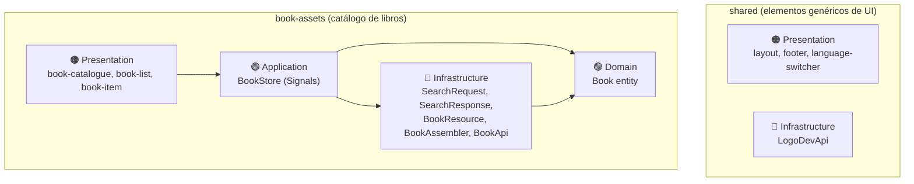

# 📘 Guía de Práctica — Open Library Explorer

## Aplicación de catálogo de libros con Angular, Angular Material y Domain-Driven Design (DDD)

---

> [!IMPORTANT]
> **Esto es material de práctica**, basado en el enunciado de la Práctica Calificada 1 del NRC 7800 (1ASI0729, ya rendida el 24/09/2026), para que repitas el ejercicio por tu cuenta y afiances los conceptos. No es una plantilla para entregar como examen. Sigue el mismo enfoque **DDD por capas** que usamos en CatchUp (Domain, Infrastructure, Application, Presentation), organizado en **sub-dominios** `shared` y `book-assets`, con **Angular Signals**, **Angular Material**, **HttpClient**, **ngx-translate**, **TSDoc**, y **GitFlow** con Conventional Commits, siguiendo las restricciones técnicas del enunciado original.

---

## Tabla de Contenidos

| Fase | Pasos | Descripción |
|:-----|:------|:------------|
| **Fase 0** | 1–4 | Configuración del proyecto, repositorio y dependencias |
| **Fase 1** | 5–6 | Shared — Infrastructure (LogoDevApi) |
| **Fase 2** | 7 | Book Assets — Domain (Book Entity) |
| **Fase 3** | 8–10 | Book Assets — Infrastructure (Request/Response/Resource, Assembler, API Gateway) |
| **Fase 4** | 11 | Book Assets — Application (BookStore — State Management) |
| **Fase 5** | 12–14 | Presentation (Shared y Book Assets) |
| **Fase 6** | 15–16 | Integración final, documentación y cierre |

---

## Convenciones de la Guía

| Icono | Significado |
|:------|:------------|
| 💻 | Ejecutar comando en terminal |
| 📁 | Archivo o directorio creado |
| ✏️ | Editar / Reemplazar contenido |
| 🔀 | Realizar commit |
| 🌿 | Operación de rama (branch) |
| 💡 | Explicación de por qué se hace así |
| ⚙️ | Lo que Angular CLI genera por defecto |
| ⚠️ | Restricción del enunciado que hay que respetar con cuidado |

---

## Prerrequisitos

| Herramienta | Versión | Verificación |
|:-----------|:--------|:-------------|
| Node.js | 20.x+ | `node --version` |
| npm | 10.x+ | `npm --version` |
| Angular CLI | 22.x+ | `ng version` |
| Git | 2.x+ | `git --version` |
| IDE | JetBrains WebStorm | — |

💻 Instalar Angular CLI si no lo tienes:
```bash
npm install -g @angular/cli
```

---

## Sobre el Enfoque DDD en este proyecto

A diferencia de CatchUp (bounded contexts `news`/`shared`), aquí el enunciado pide **sub-dominios**: `shared` (elementos genéricos de UI) y `book-assets` (todo lo relacionado a libros, como el Book Catalogue).



**Regla de dependencias:** `Presentation → Application → Domain ← Infrastructure`

---

# FASE 0 — Configuración del Proyecto

## Paso 1: Crear el Proyecto Angular

💻 Abre tu terminal, navega a tu directorio de trabajo y ejecuta:

```bash
npx --yes --package @angular/cli@latest ng new open-library-explorer-practice --defaults
cd open-library-explorer-practice
```

⚙️ **¿Qué hace `--defaults`?** Acepta las opciones por defecto sin preguntas interactivas — incluida la pregunta *"Do you want to create a 'zoneless' application without zone.js?"*, que con `--defaults` se responde **No**. Esto es importante para el siguiente paso.

### 1.1 Verificar `zone.js` en los polyfills

✏️ Abre `angular.json` y confirma que la sección `build` de tu proyecto luzca así:

```json
"build": {
  "builder": "@angular/build:application",
  "options": {
    "outputPath": "dist/open-library-explorer-practice",
    "index": "src/index.html",
    "browser": "src/main.ts",
    "polyfills": [
      "zone.js"
    ],
    ...
  }
}
```

💡 **¿Hace falta agregar `zone.js` a mano?** No, si generaste el proyecto con `ng new --defaults` (sin elegir la opción zoneless), Angular CLI v22 **ya lo incluye automáticamente** en `polyfills` — esta verificación es solo para confirmarlo, no un paso de edición. Solo tendrías que agregarlo tú mismo si en algún momento el schematic lo omitió (por ejemplo, si respondiste "Yes" a la pregunta zoneless, o si edita el archivo manualmente sin querer). Si trabajas *deliberadamente* con Zoneless Change Detection (`provideZonelessChangeDetection()` en `app.config.ts`, sin `zone.js`), entonces **no** debe aparecer en `polyfills` — ambos son válidos en Angular v22, pero no se mezclan.

⚙️ **Angular CLI genera por defecto:**
```
open-library-explorer-practice/
├── src/
│   ├── app/
│   │   ├── app.ts
│   │   ├── app.html
│   │   ├── app.css
│   │   ├── app.config.ts
│   │   ├── app.routes.ts
│   │   └── app.spec.ts
│   ├── index.html
│   ├── main.ts
│   └── styles.css
├── angular.json
├── package.json
├── tsconfig.json
└── .gitignore
```

---

## Paso 2: Configuración Inicial del Repositorio con GitFlow

💻
```bash
git flow init
```
> Acepta los valores por defecto. Esto crea la rama `develop` a partir de `main`.

🔀 **Commit en `develop`:**
```bash
git add .
git commit -m "chore: initial project setup with angular cli."
```

---

## Paso 3: Instalar Angular Material

🌿
```bash
git flow feature start add-angular-material
```

💻
```bash
ng add @angular/material
```

⚙️ **¿Qué hace `ng add @angular/material` automáticamente?**
1. Instala `@angular/material` y `@angular/cdk`
2. Crea `src/custom-theme.scss` con el tema Material 3
3. Agrega fuentes Roboto y Material Icons en `src/index.html`
4. Registra `src/custom-theme.scss` en `angular.json`

✏️ Verifica `src/custom-theme.scss` (Angular Material lo genera):

```scss
@use '@angular/material' as mat;

html {
  @include mat.theme((
    color: (
      primary: mat.$violet-palette,
      tertiary: mat.$blue-palette,
    ),
    typography: Roboto,
    density: 0,
  ));
}

body {
  color-scheme: light;
  background-color: var(--mat-sys-surface);
  color: var(--mat-sys-on-surface);
  font: var(--mat-sys-body-medium);
  margin: 0;
}
```

🔀 **Commit y cierre:**
```bash
git add .
git commit -m "chore: add angular material dependency."
git flow feature finish add-angular-material
```

---

## Paso 4: API Keys, Variables de Entorno e i18n

🌿
```bash
git flow feature start configure-environments
```

### 4.1 Obtener la Publishable Key de Logo.dev

1. Ve a [https://logo.dev/](https://logo.dev/) y regístrate
2. Copia tu publishable key (`pk_...`) — la usaremos para el logo de `openlibrary.org` en el toolbar

> [!NOTE]
> **Open Library API no requiere API key** — según [la documentación](https://openlibrary.org/dev/docs/api/search), el endpoint de búsqueda (`/search.json`) es de acceso público y anónimo.

### 4.2 Generar archivos de entorno

💻
```bash
ng g environments
```

⚙️ Genera `src/environments/environment.ts` (producción) y `environment.development.ts` (desarrollo), y configura `fileReplacements` en `angular.json`.

⚠️ **El enunciado prohíbe URLs/paths hardcodeados.** Aquí es donde centralizamos **todas** las URLs de las dos APIs externas (Open Library y Logo.dev), no solo la publishable key.

✏️ Reemplaza `src/environments/environment.development.ts`:

```typescript
/**
 * Development environment configuration.
 *
 * @remarks
 * Centralizes every external URL, path, and credential used by the app so
 * that no infrastructure class hardcodes them, per the assignment's
 * technical restrictions.
 *
 * @author Tu Nombre Apellido
 */
export const environment = {
  production: false,

  // Open Library Search API — ver: https://openlibrary.org/dev/docs/api/search
  // URLs literales tal como las da el enunciado, una por categoría.
  openLibrarySoftwareEngineeringBooksUrl: 'https://openlibrary.org/search.json?q=software+engineering&fields=key,title,author_name,first_publish_year,edition_count,cover_i&limit=12',
  openLibraryArtificialIntelligenceBooksUrl: 'https://openlibrary.org/search.json?q=artificial+intelligence&fields=key,title,author_name,first_publish_year,edition_count,cover_i&limit=12',
  // Base del sitio de Open Library, usada para construir el link de "Book Details" (base + key)
  openLibraryBaseUrl: 'https://openlibrary.org',

  // Open Library Covers CDN — ver ejemplo: https://covers.openlibrary.org/b/id/920018-L.jpg
  openLibraryCoversCdnBaseUrl: 'https://covers.openlibrary.org/b/id/',
  openLibraryCoversCdnImageSize: 'L',

  // Logo.dev — usado solo para el logo del toolbar (dominio fijo: openlibrary.org)
  logoProviderApiBaseUrl: 'https://img.logo.dev/',
  logoProviderPublishableKey: 'TU_PUBLISHABLE_KEY_AQUI',
  appLogoDomain: 'openlibrary.org'
};
```

✏️ Reemplaza `src/environments/environment.ts` con los mismos valores y `production: true`.

⚠️ **No commitees tu publishable key real.** Mantén `TU_PUBLISHABLE_KEY_AQUI` en lo que subas a un repositorio, o agrega los archivos de entorno a `.gitignore` con un `.example` de plantilla, igual que en CatchUp.

### 4.3 Configurar i18n con ngx-translate

💻
```bash
npm i @ngx-translate/core @ngx-translate/http-loader
```

📁 Crea `public/i18n/en.json`:

```json
{
  "app": {
    "title": "Open Library Explorer"
  },
  "book-catalogue": {
    "title": "Book Catalogue",
    "category": {
      "software-engineering": "Software Engineering",
      "artificial-intelligence": "Artificial Intelligence"
    }
  },
  "book": {
    "author": "Author",
    "first-published": "First published",
    "editions": "Editions",
    "unknown-author": "Unknown author",
    "details": "Book Details"
  },
  "footer": {
    "copyright": "Copyright © 2026 Open Library. All rights reserved.",
    "developed-by": "Developed by"
  }
}
```

📁 Crea `public/i18n/es.json`:

```json
{
  "app": {
    "title": "Open Library Explorer"
  },
  "book-catalogue": {
    "title": "Catálogo de Libros",
    "category": {
      "software-engineering": "Ingeniería de Software",
      "artificial-intelligence": "Inteligencia Artificial"
    }
  },
  "book": {
    "author": "Autor",
    "first-published": "Primera publicación",
    "editions": "Ediciones",
    "unknown-author": "Autor desconocido",
    "details": "Ficha del Libro"
  },
  "footer": {
    "copyright": "Copyright © 2026 Open Library. Todos los derechos reservados.",
    "developed-by": "Desarrollado por"
  }
}
```

✏️ Reemplaza `src/app/app.config.ts`:

```typescript
import {ApplicationConfig, provideBrowserGlobalErrorListeners, provideZoneChangeDetection} from '@angular/core';
import {provideHttpClient, withXhr} from '@angular/common/http';
import {provideTranslateService} from '@ngx-translate/core';
import {provideTranslateHttpLoader} from '@ngx-translate/http-loader';

/**
 * Root-level Angular providers for HTTP, i18n and global runtime behavior.
 *
 * @remarks
 * provideHttpClient(withXhr()) enables HttpClient for communicating with the
 * Open Library API, as required by the assignment's technical restrictions.
 * provideTranslateService() configures ngx-translate with a JSON file loader.
 *
 * @author Tu Nombre Apellido
 */
export const appConfig: ApplicationConfig = {
  providers: [
    provideBrowserGlobalErrorListeners(),
    provideZoneChangeDetection({eventCoalescing: true}),
    provideHttpClient(withXhr()),
    provideTranslateService({
      loader: provideTranslateHttpLoader({prefix: './i18n/', suffix: '.json'}),
      fallbackLang: 'en'
    })
  ]
};
```

🔀 **Commit y cierre:**
```bash
git add .
git commit -m "feat(i18n): configure environment variables and internationalization."
git flow feature finish configure-environments
```

---

# FASE 1 — Shared: Infrastructure Layer

🌿
```bash
git flow feature start shared-infrastructure
```

## Paso 5: Crear `LogoDevApi`

> [!NOTE]
> Igual que en CatchUp: `LogoDevApi` no hace peticiones HTTP, solo construye la URL del logo (`https://img.logo.dev/{dominio}?token={key}`). El navegador hace el GET al usar esa URL en un ``.

💻
```bash
ng g s shared/infrastructure/logo-dev-api
```

✏️ Reemplaza `src/app/shared/infrastructure/logo-dev-api.ts`:

```typescript
import {Injectable} from '@angular/core';
import {environment} from '../../../environments/environment';

/**
 * Infrastructure gateway for generating brand logo URLs using logo.dev.
 *
 * @remarks
 * Used by the shared Layout toolbar to resolve the Open Library logo from
 * its domain, without performing any HTTP request itself — the browser
 * fetches the image directly from the resolved URL.
 *
 * @author Tu Nombre Apellido
 */
@Injectable({
  providedIn: 'root'
})
export class LogoDevApi {
  private baseUrl = environment.logoProviderApiBaseUrl;
  private apiKey = environment.logoProviderPublishableKey;

  /**
   * Builds the logo URL for a given domain.
   *
   * @param domain - Bare domain name (e.g. "openlibrary.org"), no protocol.
   * @returns The fully-qualified logo image URL.
   */
  getUrlToLogo(domain: string): string {
    return `${this.baseUrl}${domain}?token=${this.apiKey}`;
  }
}
```

🔀 **Commit y cierre:**
```bash
git add .
git commit -m "feat(shared): add logo.dev api gateway to shared infrastructure."
git flow feature finish shared-infrastructure
```

---

# FASE 2 — Book Assets: Domain Layer

🌿
```bash
git flow feature start book-assets-domain
```

## Paso 7: Crear la Entidad `Book`

💻 Genera la clase con tipo `entity`:
```bash
ng g cl book-assets/domain/model/book --type=entity
```

⚙️ Genera `src/app/book-assets/domain/model/book.entity.ts` (clase vacía) + `.spec.ts`.

✏️ Reemplaza `src/app/book-assets/domain/model/book.entity.ts`:

```typescript
import {environment} from '../../../../environments/environment';

/**
 * The two book categories requested by the client for this catalogue.
 *
 * @remarks
 * Modeled as a union type rather than a string, so the Assembler and Store
 * can only ever tag a Book with one of these two valid categories.
 *
 * @author Tu Nombre Apellido
 */
export type BookCategory = 'software-engineering' | 'artificial-intelligence';

/**
 * Represents a book in the Book Assets sub-domain.
 *
 * @remarks
 * This entity intentionally uses domain-friendly, English, camelCase field
 * names, regardless of how Open Library names its JSON fields (e.g. its raw
 * `author_name` becomes this entity's `authors`). Translating between the
 * two naming conventions is the responsibility of {@link BookAssembler},
 * never of this class.
 *
 * @author Tu Nombre Apellido
 */
export class Book {
  /** Open Library work key (e.g. "/works/OL27258W"), used as this entity's identifier. */
  id: string;
  /** Book title, shown as the card's main heading. */
  title: string;
  /** Author names, already joined into a single human-readable string. */
  authors: string;
  /** Year of first publication, or undefined if Open Library did not report one. */
  firstPublishYear?: number;
  /** Number of known editions, or undefined if Open Library did not report one. */
  editionCount?: number;
  /** Resolved cover image URL, or an empty string if the book has no cover. */
  coverUrl: string;
  /** Category this book was fetched and grouped under. */
  category: BookCategory;

  /**
   * Creates an empty book placeholder.
   *
   * @remarks
   * The Infrastructure layer ({@link BookAssembler}) fills these fields in
   * after mapping a raw BookResource from the Open Library API.
   */
  constructor() {
    this.id = '';
    this.title = '';
    this.authors = '';
    this.coverUrl = '';
    this.category = 'software-engineering';
  }

  /**
   * Returns the absolute URL to this book's official Open Library page.
   *
   * @returns The details URL, built by concatenating the configured Open
   * Library base URL with this book's `id` (its Open Library work key).
   */
  get detailsUrl(): string {
    return `${environment.openLibraryBaseUrl}${this.id}`;
  }
}
```

💡 **¿Por qué `detailsUrl` es un getter y no un campo asignado por el Assembler?** Porque es un valor **derivado** (`openLibraryBaseUrl + id`), no un dato que venga de la API. Calcularlo en el getter evita que quede desincronizado si `id` cambiara, y evita que el Assembler tenga que conocer la regla de construcción de esa URL — la entidad la encapsula.

🔀 **Commit y cierre:**
```bash
git add .
git commit -m "feat(book-assets): add book domain entity and category type."
git flow feature finish book-assets-domain
```

---

# FASE 3 — Book Assets: Infrastructure Layer

🌿
```bash
git flow feature start book-assets-infrastructure
```

## Paso 8: Crear el `SearchRequest` (patrón Request)

> [!IMPORTANT]
> El enunciado exige explícitamente el patrón **Request/Response**, y ya te da las **dos URLs completas y literales** a usar (una por categoría, con `q`, `fields` y `limit` ya definidos). Por eso `SearchRequest` no reconstruye ninguna query: solo decide **cuál** de las dos URLs (guardadas en `environment`) corresponde según la categoría seleccionada.

💻
```bash
ng g cl book-assets/infrastructure/book-search-request
```

✏️ Reemplaza `src/app/book-assets/infrastructure/book-search-request.ts`:

```typescript
import {environment} from '../../../environments/environment';
import {BookCategory} from '../domain/model/book.entity';

/**
 * Maps each supported book category to the exact search URL given in the
 * assignment for that category.
 */
const CATEGORY_URLS: Record<BookCategory, string> = {
  'software-engineering': environment.openLibrarySoftwareEngineeringBooksUrl,
  'artificial-intelligence': environment.openLibraryArtificialIntelligenceBooksUrl
};

/**
 * Encapsulates the outgoing request for one Open Library search, per category.
 *
 * @remarks
 * Implements the assignment's required Request pattern. The two possible
 * URLs are already complete and literal (as given in the assignment), so
 * this class' only responsibility is selecting the correct one for the
 * requested category — it does not build or modify any query parameters.
 *
 * @author Tu Nombre Apellido
 */
export class BookSearchRequest {
  /**
   * @param category - The book category to search for.
   */
  constructor(private category: BookCategory) {
  }

  /**
   * Resolves the literal search URL for this request's category.
   *
   * @returns The complete Open Library search URL for the given category.
   */
  toUrl(): string {
    return CATEGORY_URLS[this.category];
  }
}
```

---

## Paso 9: Crear el `SearchResponse` y `BookResource` (patrón Resource/Response)

💻
```bash
ng g i book-assets/infrastructure/book-search-response
```

⚙️ Genera `src/app/book-assets/infrastructure/book-search-response.ts` con `export interface BookSearchResponse { }`.

✏️ Reemplaza el contenido:

```typescript
/**
 * Raw response contract for the Open Library search endpoint.
 * GET https://openlibrary.org/search.json?q=...&fields=...&limit=...
 *
 * @remarks
 * Reflects EXACTLY the JSON shape Open Library returns; it must never
 * contain domain logic. Only the fields requested via the `fields` query
 * parameter are declared, since Open Library omits everything else.
 *
 * @author Tu Nombre Apellido
 */
export interface BookSearchResponse {
  numFound: number;
  start: number;
  docs: BookResource[];
}

/**
 * Raw book resource returned by the Open Library search endpoint.
 *
 * @remarks
 * Field names intentionally mirror Open Library's own naming (snake_case
 * `author_name`, `first_publish_year`) rather than TypeScript conventions,
 * because this is a Resource — a literal contract with the external API —
 * not a domain object. Several fields are optional because not every book
 * in the catalogue reports every field.
 *
 * @author Tu Nombre Apellido
 */
export interface BookResource {
  key: string;
  title: string;
  author_name?: string[];
  first_publish_year?: number;
  edition_count?: number;
  cover_i?: number;
}
```

💡 **Sobre la nomenclatura `snake_case` en `BookResource`.** El enunciado es explícito: *"En caso de que la información de los JSON objects que proporciona el API provider [...] no cumplan con las convenciones de nomenclatura de objetos de TypeScript, ello no debe afectar la nomenclatura de los domain entities."* Aquí `BookResource` sí usa `snake_case` (`author_name`, `cover_i`) porque así llega literalmente de Open Library — y eso está permitido porque este archivo es infraestructura, no dominio. Lo que **no** sería aceptable es que `Book` (la entidad, Paso 7) heredara esos mismos nombres; por eso `Book.authors` (camelCase, en inglés, ya como texto legible) es un campo completamente distinto, traducido por el `BookAssembler` a continuación.

---

## Paso 10: Crear `BookAssembler` y `BookApi`

💻
```bash
ng g cl book-assets/infrastructure/book-assembler
```

✏️ Reemplaza `src/app/book-assets/infrastructure/book-assembler.ts`:

```typescript
import {Injectable} from '@angular/core';
import {Book, BookCategory} from '../domain/model/book.entity';
import {BookResource, BookSearchResponse} from './book-search-response';
import {environment} from '../../../environments/environment';

/**
 * Maps raw book resources from the Open Library API into Book domain entities.
 *
 * @remarks
 * Implements the assignment's required Assembler pattern: it is the single
 * place responsible for translating between Resource field names/shape and
 * Entity field names/shape, including joining `author_name` into a single
 * readable string and resolving the cover image URL through the Covers CDN.
 *
 * @author Tu Nombre Apellido
 */
@Injectable({providedIn: 'root'})
export class BookAssembler {

  /**
   * Converts a single raw resource into a Book domain entity.
   *
   * @param resource - Raw book resource returned by the Open Library API.
   * @param category - The category this resource was fetched under (Open
   * Library's search endpoint does not return a category itself).
   * @returns The assembled Book domain entity.
   */
  toEntityFromResource(resource: BookResource, category: BookCategory): Book {
    const book = new Book();
    book.id = resource.key;
    book.title = resource.title;
    book.authors = resource.author_name?.join(', ') ?? '';
    book.firstPublishYear = resource.first_publish_year;
    book.editionCount = resource.edition_count;
    book.coverUrl = resource.cover_i
      ? `${environment.openLibraryCoversCdnBaseUrl}${resource.cover_i}-${environment.openLibraryCoversCdnImageSize}.jpg`
      : '';
    book.category = category;
    return book;
  }

  /**
   * Converts a full search response into an array of Book domain entities.
   *
   * @param response - Raw search response from the Open Library API.
   * @param category - The category this response was fetched under.
   * @returns The assembled domain entities.
   */
  toEntitiesFromResponse(response: BookSearchResponse, category: BookCategory): Book[] {
    return response.docs.map(resource => this.toEntityFromResource(resource, category));
  }
}
```

💻
```bash
ng g s book-assets/infrastructure/book-api
```

✏️ Reemplaza `src/app/book-assets/infrastructure/book-api.ts`:

```typescript
import {inject, Injectable} from '@angular/core';
import {HttpClient} from '@angular/common/http';
import {map, Observable} from 'rxjs';
import {Book, BookCategory} from '../domain/model/book.entity';
import {BookSearchRequest} from './book-search-request';
import {BookSearchResponse} from './book-search-response';
import {BookAssembler} from './book-assembler';

/**
 * Infrastructure gateway to the Open Library search API.
 *
 * @remarks
 * The only class in the project that talks to Open Library directly. Uses
 * HttpClient (per the assignment's technical restrictions) and always
 * returns Book domain entities — the presentation layer never sees a raw
 * BookResource or BookSearchResponse.
 *
 * @author Tu Nombre Apellido
 */
@Injectable({providedIn: 'root'})
export class BookApi {
  private http = inject(HttpClient);
  private bookAssembler = inject(BookAssembler);

  /**
   * GET https://openlibrary.org/search.json?q=...&fields=...&limit=12
   * Fetches books for the given category, using the literal URL given in
   * the assignment, and assembles them into entities.
   *
   * @param category - The book category to search for.
   * @returns An Observable of Book entities tagged with the given category.
   */
  searchBooksByCategory(category: BookCategory): Observable<Book[]> {
    const request = new BookSearchRequest(category);
    return this.http.get<BookSearchResponse>(request.toUrl()).pipe(
      map(response => this.bookAssembler.toEntitiesFromResponse(response, category))
    );
  }
}
```

🔀 **Commit y cierre:**
```bash
git add .
git commit -m "feat(book-assets): add search request/response contracts, assembler, and api gateway."
git flow feature finish book-assets-infrastructure
```

---

# FASE 4 — Book Assets: Application Layer

🌿
```bash
git flow feature start book-assets-application
```

## Paso 11: Crear el `BookStore`

💡 **Patrón State Management, exigido por el enunciado.** Igual que `NewsStore` en CatchUp, `BookStore` usa **Angular Signals** para centralizar el estado reactivo por categoría, con caché para no repetir peticiones ya resueltas.

💻
```bash
ng g s book-assets/application/book --type=store
```

⚙️ `--type=store` produce `book.store.ts` (sufijo separado por punto), con la clase `export class BookStore { }`.

✏️ Reemplaza `src/app/book-assets/application/book.store.ts`:

```typescript
import {computed, inject, Injectable, signal} from '@angular/core';
import {Book, BookCategory} from '../domain/model/book.entity';
import {BookApi} from '../infrastructure/book-api';

/**
 * Application service (Store) for the Book Assets sub-domain.
 *
 * @remarks
 * Implements the assignment's required State Management pattern using
 * Angular Signals. Caches books per category so switching between
 * Software Engineering and Artificial Intelligence does not re-fetch data
 * that was already loaded. Presentation components only read computed
 * signals here — they never call BookApi directly.
 *
 * @author Tu Nombre Apellido
 */
@Injectable({providedIn: 'root'})
export class BookStore {
  /** Cache of books already loaded, indexed by category. */
  private booksByCategorySignal = signal<Record<BookCategory, Book[]>>({
    'software-engineering': [],
    'artificial-intelligence': []
  });
  /** Category currently selected in the Book Catalogue toggle buttons. */
  private currentCategorySignal = signal<BookCategory>('software-engineering');

  private bookApi = inject(BookApi);

  /** Currently selected category (read-only projection). */
  readonly currentCategory = computed(() => this.currentCategorySignal());
  /** Books belonging to the currently selected category (read-only projection). */
  readonly currentCategoryBooks = computed(() => this.booksByCategorySignal()[this.currentCategorySignal()]);

  /**
   * Selects a category and triggers loading its books if not cached yet.
   *
   * @param category - The category the user selected via the toggle buttons.
   */
  selectCategory(category: BookCategory): void {
    this.currentCategorySignal.set(category);
    this.loadCurrentCategoryBooks();
  }

  /**
   * Loads books for the currently selected category, unless already cached.
   *
   * @remarks
   * Mirrors the "singleton load" pattern used by NewsStore.loadArticlesForCurrentSource()
   * in the CatchUp project.
   */
  loadCurrentCategoryBooks(): void {
    const category = this.currentCategorySignal();
    const cached = this.booksByCategorySignal()[category];
    if (cached.length > 0) return;

    this.bookApi.searchBooksByCategory(category).subscribe(books => {
      this.booksByCategorySignal.set({
        ...this.booksByCategorySignal(),
        [category]: books
      });
    });
  }
}
```

🔀 **Commit y cierre:**
```bash
git add .
git commit -m "feat(book-assets): add book store as application service with signal-based state."
git flow feature finish book-assets-application
```

---

# FASE 5 — Presentation Layer (Shared y Book Assets)

🌿
```bash
git flow feature start presentation-components
```

## Paso 12: Crear `LanguageSwitcher`, `Footer` y `Layout` (Shared)

💻
```bash
ng g c shared/presentation/components/language-switcher
ng g c shared/presentation/components/footer
ng g c shared/presentation/components/layout
```

✏️ Reemplaza `language-switcher.ts`:

```typescript
import {ChangeDetectionStrategy, Component} from '@angular/core';
import {TranslateService} from '@ngx-translate/core';
import {MatButtonToggle, MatButtonToggleGroup} from '@angular/material/button-toggle';

/**
 * Presentation component that switches the active UI language.
 *
 * @remarks
 * A shared, generic UI element with no dependency on the Book Assets
 * sub-domain — it only talks to ngx-translate's TranslateService.
 *
 * @author Tu Nombre Apellido
 */
@Component({
  selector: 'app-language-switcher',
  imports: [MatButtonToggleGroup, MatButtonToggle],
  templateUrl: './language-switcher.html',
  changeDetection: ChangeDetectionStrategy.Eager,
  styleUrl: './language-switcher.css'
})
export class LanguageSwitcher {
  currentLang = 'en';
  languages = ['en', 'es'];

  constructor(private translate: TranslateService) {
    this.currentLang = translate.currentLang() || 'en';
  }

  /**
   * Changes the active application language.
   * @param language - Locale code to activate ("en" or "es").
   */
  useLanguage(language: string) {
    this.translate.use(language);
  }
}
```

✏️ Reemplaza `language-switcher.html`:

```html
<mat-button-toggle-group [value]="currentLang" appearance="standard" aria-label="Preferred Language" name="language">
  @for (language of languages; track language) {
    <mat-button-toggle (click)="useLanguage(language)"
                       [aria-label]="language"
                       [value]="language">{{ language.toUpperCase() }}
    </mat-button-toggle>
  }
</mat-button-toggle-group>
```

✏️ Reemplaza `footer.ts`:

```typescript
import {ChangeDetectionStrategy, Component} from '@angular/core';
import {TranslatePipe} from '@ngx-translate/core';

/**
 * Shared presentation component rendering the application footer.
 * @author Tu Nombre Apellido
 */
@Component({
  selector: 'app-footer',
  imports: [TranslatePipe],
  templateUrl: './footer.html',
  changeDetection: ChangeDetectionStrategy.Eager,
  styleUrl: './footer.css'
})
export class Footer {
  // TODO: reemplaza con tu código de estudiante y nombre completo
  protected readonly studentCode = 'UXXXXXXXXX';
  protected readonly studentFullName = 'Tu Nombre Apellido';
}
```

✏️ Reemplaza `footer.html`:

```html
<div class="footer-content">
  <p>{{ 'footer.copyright' | translate }}</p>
  <p>{{ 'footer.developed-by' | translate }} {{ studentFullName }} ({{ studentCode }})</p>
</div>
```

✏️ Reemplaza `footer.css`:

```css
.footer-content {
  width: 100%;
  background-color: var(--mat-sys-primary);
  color: var(--mat-sys-on-primary);
  text-align: center;
  margin: 0;
  padding: 12px;
}

.footer-content p {
  margin: 4px 0;
}
```

✏️ Reemplaza `layout.ts`:

```typescript
import {ChangeDetectionStrategy, Component, inject} from '@angular/core';
import {MatToolbar} from '@angular/material/toolbar';
import {LanguageSwitcher} from '../language-switcher/language-switcher';
import {Footer} from '../footer/footer';
import {LogoDevApi} from '../../../infrastructure/logo-dev-api';
import {environment} from '../../../../../environments/environment';
import {TranslatePipe} from '@ngx-translate/core';

/**
 * Main shell component: toolbar with logo/title/language switcher, a
 * content slot (via <ng-content>), and footer.
 *
 * @remarks
 * Deliberately unaware of the book-assets sub-domain — it only exposes an
 * <ng-content> slot, so App is the single place that wires both sub-domains
 * together, preserving the DDD dependency rule (shared never depends on
 * book-assets).
 *
 * @author Tu Nombre Apellido
 */
@Component({
  selector: 'app-layout',
  imports: [MatToolbar, LanguageSwitcher, Footer, TranslatePipe],
  templateUrl: './layout.html',
  changeDetection: ChangeDetectionStrategy.Eager,
  styleUrl: './layout.css'
})
export class Layout {
  private logoApi = inject(LogoDevApi);
  protected readonly logoUrl = this.logoApi.getUrlToLogo(environment.appLogoDomain);
}
```

✏️ Reemplaza `layout.html`:

```html
<mat-toolbar color="primary">
  
  <span>{{ 'app.title' | translate }}</span>
  <span class="spacer"></span>
  <app-language-switcher/>
</mat-toolbar>

<main class="layout-content">
  <ng-content/>
</main>

<app-footer/>
```

✏️ Reemplaza `layout.css`:

```css
.app-logo {
  width: 32px;
  height: 32px;
  margin-right: 8px;
  border-radius: 4px;
}

.spacer {
  flex: 1 1 auto;
}

.layout-content {
  padding: 16px;
  min-height: calc(100vh - 128px);
}
```

⚠️ **Nota sobre la ruta relativa a `environment` en `layout.ts`.** Como `Layout` vive en `shared/presentation/components/layout/`, necesita **cinco** niveles `../` para llegar a `src/environments/environment.ts`. Si tu IDE reorganiza el archivo o lo mueves, WebStorm ajusta este import automáticamente — pero si lo escribes a mano, cuenta los niveles con cuidado (es un error común de copiar-pegar entre archivos a distinta profundidad).

---

## Paso 13: Crear `BookItem` (card)

💻
```bash
ng g c book-assets/presentation/components/book-item
```

✏️ Reemplaza `book-item.ts`:

```typescript
import {ChangeDetectionStrategy, Component, input} from '@angular/core';
import {Book} from '../../../domain/model/book.entity';
import {
  MatCard,
  MatCardActions,
  MatCardContent,
  MatCardHeader,
  MatCardImage,
  MatCardTitle
} from '@angular/material/card';
import {MatButton} from '@angular/material/button';
import {TranslatePipe} from '@ngx-translate/core';

/**
 * Presentation component that renders a single book as a Material card.
 * @author Tu Nombre Apellido
 */
@Component({
  selector: 'app-book-item',
  imports: [MatCard, MatCardHeader, MatCardTitle, MatCardContent, MatCardActions, MatCardImage, MatButton, TranslatePipe],
  templateUrl: './book-item.html',
  changeDetection: ChangeDetectionStrategy.Eager,
  styleUrl: './book-item.css'
})
export class BookItem {
  /** The book entity to display, provided by BookList. */
  book = input.required<Book>();
}
```

✏️ Reemplaza `book-item.html`:

```html
<mat-card class="book-card">
  @if (book().coverUrl) {
    
  } @else {
    <div class="book-cover book-cover-placeholder" role="img" [attr.aria-label]="book().title"></div>
  }
  <mat-card-header>
    <mat-card-title>{{ book().title }}</mat-card-title>
  </mat-card-header>
  <mat-card-content>
    <p>
      <b>{{ 'book.author' | translate }}:</b>
      {{ book().authors || ('book.unknown-author' | translate) }}
    </p>
    @if (book().firstPublishYear) {
      <p><b>{{ 'book.first-published' | translate }}:</b> {{ book().firstPublishYear }}</p>
    }
    @if (book().editionCount) {
      <p><b>{{ 'book.editions' | translate }}:</b> {{ book().editionCount }}</p>
    }
  </mat-card-content>
  <mat-card-actions>
    <a mat-button [href]="book().detailsUrl" target="_blank" [attr.aria-label]="'book.details' | translate">
      {{ 'book.details' | translate }}
    </a>
  </mat-card-actions>
</mat-card>
```

✏️ Reemplaza `book-item.css`:

```css
.book-card {
  height: 100%;
  display: flex;
  flex-direction: column;
}

.book-cover {
  height: 220px;
  object-fit: contain;
  padding: 12px;
  box-sizing: border-box;
}

.book-cover-placeholder {
  background-color: var(--mat-sys-surface-variant);
}
```

💡 **Accesibilidad del cover faltante.** No todos los libros de Open Library tienen `cover_i` (Paso 9). En vez de mostrar un `` roto cuando `coverUrl` está vacío, se renderiza un `<div>` con `role="img"` y `aria-label` con el título — cumple el requisito de accesibilidad del enunciado (texto alternativo) incluso en el caso sin imagen.

---

## Paso 14: Crear `BookList` y `BookCatalogue`

💻
```bash
ng g c book-assets/presentation/components/book-list
```

✏️ Reemplaza `book-list.ts`:

```typescript
import {ChangeDetectionStrategy, Component, input} from '@angular/core';
import {Book} from '../../../domain/model/book.entity';
import {MatGridList, MatGridTile} from '@angular/material/grid-list';
import {BookItem} from '../book-item/book-item';

/**
 * Presentation component that renders a list of books as a 3-column grid.
 * @author Tu Nombre Apellido
 */
@Component({
  selector: 'app-book-list',
  imports: [MatGridList, MatGridTile, BookItem],
  templateUrl: './book-list.html',
  changeDetection: ChangeDetectionStrategy.Eager,
  styleUrl: './book-list.css'
})
export class BookList {
  /** Books to render, supplied by BookCatalogue from the store. */
  books = input.required<Book[]>();
}
```

✏️ Reemplaza `book-list.html`:

```html
<mat-grid-list cols="3" rowHeight="480px" gutterSize="16px">
  @for (book of books(); track book.id) {
    <mat-grid-tile>
      <app-book-item [book]="book"/>
    </mat-grid-tile>
  }
</mat-grid-list>
```

⚠️ **`cols="3"` fijo, tal como lo pide el enunciado.** *"Debe mostrar tres cards por fila"* — sin condicionarlo al tamaño de pantalla, así que `cols="3"` cumple la letra del enunciado sin necesidad de lógica adicional de breakpoints.

💻
```bash
ng g c book-assets/presentation/components/book-catalogue
```

✏️ Reemplaza `book-catalogue.ts`:

```typescript
import {ChangeDetectionStrategy, Component, inject, OnInit} from '@angular/core';
import {BookStore} from '../../../application/book.store';
import {BookCategory} from '../../../domain/model/book.entity';
import {MatButtonToggle, MatButtonToggleChange, MatButtonToggleGroup} from '@angular/material/button-toggle';
import {BookList} from '../book-list/book-list';
import {TranslatePipe} from '@ngx-translate/core';

/**
 * Main view of the Book Assets sub-domain: category toggle buttons plus the
 * resulting grid of book cards.
 *
 * @remarks
 * Injects BookStore directly (this is the composition point between
 * Application and Presentation for this sub-domain) and never talks to
 * BookApi or the Assembler itself.
 *
 * @author Tu Nombre Apellido
 */
@Component({
  selector: 'app-book-catalogue',
  imports: [MatButtonToggleGroup, MatButtonToggle, BookList, TranslatePipe],
  templateUrl: './book-catalogue.html',
  changeDetection: ChangeDetectionStrategy.Eager,
  styleUrl: './book-catalogue.css'
})
export class BookCatalogue implements OnInit {
  protected store = inject(BookStore);
  protected readonly currentCategory = this.store.currentCategory;
  protected readonly books = this.store.currentCategoryBooks;

  ngOnInit(): void {
    this.store.loadCurrentCategoryBooks();
  }

  /**
   * Handles a category toggle change and delegates to the store.
   * @param event - Toggle change event carrying the newly selected category.
   */
  onCategoryChange(event: MatButtonToggleChange): void {
    this.store.selectCategory(event.value as BookCategory);
  }
}
```

✏️ Reemplaza `book-catalogue.html`:

```html
<section aria-labelledby="book-catalogue-title">
  <h1 id="book-catalogue-title">{{ 'book-catalogue.title' | translate }}</h1>

  <mat-button-toggle-group
    [value]="currentCategory()"
    (change)="onCategoryChange($event)"
    aria-label="Book category"
    name="category">
    <mat-button-toggle value="software-engineering" aria-label="Software Engineering">
      {{ 'book-catalogue.category.software-engineering' | translate }}
    </mat-button-toggle>
    <mat-button-toggle value="artificial-intelligence" aria-label="Artificial Intelligence">
      {{ 'book-catalogue.category.artificial-intelligence' | translate }}
    </mat-button-toggle>
  </mat-button-toggle-group>

  <app-book-list [books]="books()"/>
</section>
```

✏️ Reemplaza `book-catalogue.css`:

```css
:host {
  display: block;
}

h1 {
  margin-bottom: 8px;
}

mat-button-toggle-group {
  margin-bottom: 16px;
}
```

🔀 **Commit y cierre:**
```bash
git add .
git commit -m "feat(book-assets): add book item, book list, and book catalogue components."
git flow feature finish presentation-components
```

> 💡 Si prefieres separar el commit de `shared` (Paso 12) del de `book-assets` (Pasos 13–14) como en CatchUp, haz `git add` solo de los archivos de cada capa antes de cada commit, en vez de `git add .` una sola vez al final.

---

# FASE 6 — Integración Final, Documentación y Cierre

## Paso 15: Ensamblar `App`

✏️ Reemplaza `src/app/app.ts`:

```typescript
import {ChangeDetectionStrategy, Component} from '@angular/core';
import {Layout} from './shared/presentation/components/layout/layout';
import {BookCatalogue} from './book-assets/presentation/components/book-catalogue/book-catalogue';

/**
 * Root application component.
 *
 * @remarks
 * The single place that composes both sub-domains: wraps BookCatalogue
 * (book-assets) inside Layout's content slot (shared).
 *
 * @author Tu Nombre Apellido
 */
@Component({
  selector: 'app-root',
  imports: [Layout, BookCatalogue],
  templateUrl: './app.html',
  changeDetection: ChangeDetectionStrategy.Eager,
  styleUrl: './app.css'
})
export class App {
}
```

✏️ Reemplaza `src/app/app.html`:

```html
<app-layout>
  <app-book-catalogue/>
</app-layout>
```

---

## Paso 16: Verificación, Documentación y Cierre

### 16.1 Verificación contra la Rúbrica

💻
```bash
ng serve
```

Abre `http://localhost:4200/` y verifica:

| ✅ | Funcionalidad |
|:--|:-------------|
| ☐ | Toolbar con logo de Open Library, título y toggle EN/ES |
| ☐ | "Book Catalogue" con toggle Software Engineering / Artificial Intelligence |
| ☐ | Grid de 3 cards por fila, con imagen/título/autor/año/ediciones |
| ☐ | "Book Details" abre `https://openlibrary.org{key}` en nueva pestaña |
| ☐ | Cambiar EN/ES traduce toda la interfaz, incluidas las categorías |
| ☐ | Footer con copyright y "Developed by" |
| ☐ | Libros sin `cover_i` muestran un placeholder accesible, no una imagen rota |

💻 Corre también el build y las pruebas antes de dar por cerrado el ejercicio:
```bash
ng test --watch=false
ng build
```

| Criterio | Qué revisar en esta guía |
|:---------|:--------------------------|
| **C01. Building** | `ng build` sin errores |
| **C02. User Interface** | Toolbar + Book Catalogue + grid responsivo (Pasos 12–14) |
| **C03. Features** | Datos reales desde `/search.json` por categoría (Paso 10); enlace a Book Details funcional |
| **C04. Code Organization** | `shared`/`book-assets` × `domain`/`infrastructure`/`application`/`presentation` |
| **C05. Code Quality** | Patrones Entity, Request/Response, Resource, Assembler, State Management todos presentes y con responsabilidad única |
| **C06. Naming Standards** | kebab-case en archivos, sufijos `.entity.ts`/`.store.ts`, nombres en inglés, `BookResource` en snake_case justificado (Paso 9) |
| **Accessibility** | `alt`/`aria-label` en imágenes, botones y toggle groups (Pasos 13–14) |

### 16.2 Documentación (`README.md`)

📁 Crea `README.md` en inglés:

```markdown
# Open Library Explorer (Practice Project)

An Angular 22 + Angular Material web application that lets users browse the
Open Library catalogue by topic (Software Engineering / Artificial
Intelligence), built as a Domain-Driven Design (DDD) practice exercise.

## Description

The app fetches books from the [Open Library Search API](https://openlibrary.org/dev/docs/api/search)
and renders them as a three-column grid of Material cards, with a category
toggle, an English/Spanish language switcher, and links to each book's
official Open Library page.

## Features

- Book catalogue fetched live from `GET /search.json`, filtered by category
- Software Engineering / Artificial Intelligence category toggle
- Three-column card grid (cover image, title, author, first publish year, edition count)
- "Book Details" link opening the official Open Library page in a new tab
- English/Spanish UI language switcher (ngx-translate), English by default
- Brand logo resolved dynamically through the Logo.dev Logo API
- Environment-based configuration (no hardcoded URLs, paths, or keys)
- ARIA attributes and alt text for accessibility, including for books without a cover image

## Architecture

Domain-Driven Design, organized by sub-domain (`shared`, `book-assets`) and
by layer (`domain`, `infrastructure`, `application`, `presentation`), using
the Entity, Request/Response, Resource, Assembler, and Signals-based State
Management design patterns.

## Dependencies

- [Angular 22](https://angular.dev/) — standalone components, Signals
- [Angular Material](https://material.angular.dev/) — UI components
- `@angular/common/http` — HttpClient
- [@ngx-translate/core](https://github.com/ngx-translate/core) + [@ngx-translate/http-loader](https://github.com/ngx-translate/http-loader) — internationalization

## Getting Started

\`\`\`bash
npm install
ng serve
\`\`\`

## Author

Tu Nombre Apellido — Universidad Peruana de Ciencias Aplicadas
```

---

## Estructura Final del Proyecto

```
open-library-explorer-practice/
├── public/
│   └── i18n/
│       ├── en.json
│       └── es.json
├── src/
│   ├── app/
│   │   ├── shared/                          ← 📦 SUB-DOMINIO SHARED
│   │   │   ├── infrastructure/
│   │   │   │   └── logo-dev-api.ts
│   │   │   └── presentation/
│   │   │       └── components/
│   │   │           ├── footer/
│   │   │           ├── language-switcher/
│   │   │           └── layout/
│   │   ├── book-assets/                     ← 📦 SUB-DOMINIO BOOK-ASSETS
│   │   │   ├── domain/
│   │   │   │   └── model/
│   │   │   │       └── book.entity.ts
│   │   │   ├── infrastructure/
│   │   │   │   ├── book-search-request.ts
│   │   │   │   ├── book-search-response.ts
│   │   │   │   ├── book-assembler.ts
│   │   │   │   └── book-api.ts
│   │   │   ├── application/
│   │   │   │   └── book.store.ts
│   │   │   └── presentation/
│   │   │       └── components/
│   │   │           ├── book-catalogue/
│   │   │           ├── book-list/
│   │   │           └── book-item/
│   │   ├── app.config.ts
│   │   ├── app.css
│   │   ├── app.html
│   │   ├── app.routes.ts
│   │   └── app.ts
│   ├── environments/
│   │   ├── environment.development.ts
│   │   └── environment.ts
│   ├── custom-theme.scss
│   ├── index.html
│   ├── main.ts
│   └── styles.css
├── angular.json
├── README.md
└── package.json
```

---

## Referencia Rápida: Patrones de Diseño Aplicados

| Patrón exigido por el enunciado | Dónde se aplica |
|:---------------------------------|:-----------------|
| **Entity** | `Book` (Paso 7) |
| **Request/Response** | `BookSearchRequest` (Paso 8) / `BookSearchResponse` (Paso 9) |
| **Resource** | `BookResource` (Paso 9) |
| **Assembler** | `BookAssembler` (Paso 10) |
| **State Management** | `BookStore` con Angular Signals (Paso 11) |

## Referencia: APIs Externas

### Open Library Search API — [https://openlibrary.org/dev/docs/api/search](https://openlibrary.org/dev/docs/api/search)

Las dos URLs son literales, tal como las da el enunciado — no se construyen dinámicamente:

| Categoría | URL |
|:----------|:----|
| Software Engineering | `https://openlibrary.org/search.json?q=software+engineering&fields=key,title,author_name,first_publish_year,edition_count,cover_i&limit=12` |
| Artificial Intelligence | `https://openlibrary.org/search.json?q=artificial+intelligence&fields=key,title,author_name,first_publish_year,edition_count,cover_i&limit=12` |

### Open Library Covers CDN

| Formato | Ejemplo |
|:--------|:--------|
| `https://covers.openlibrary.org/b/id/{cover_i}-L.jpg` | `https://covers.openlibrary.org/b/id/920018-L.jpg` |

### Logo.dev — [https://logo.dev/](https://logo.dev/)

| Endpoint | Formato | Ejemplo |
|:---------|:--------|:--------|
| `https://img.logo.dev/{dominio}` | `?token={pk_key}` | `https://img.logo.dev/openlibrary.org?token=pk_xxx` |
